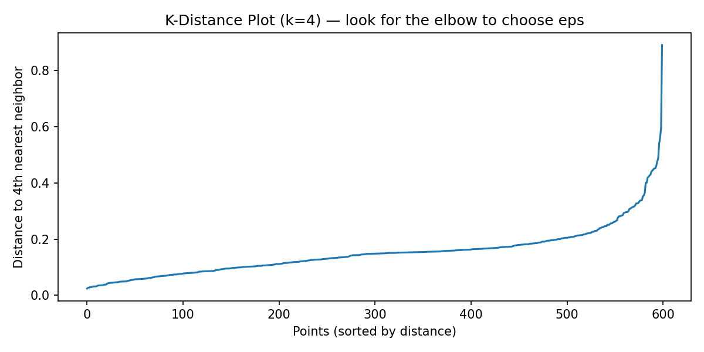
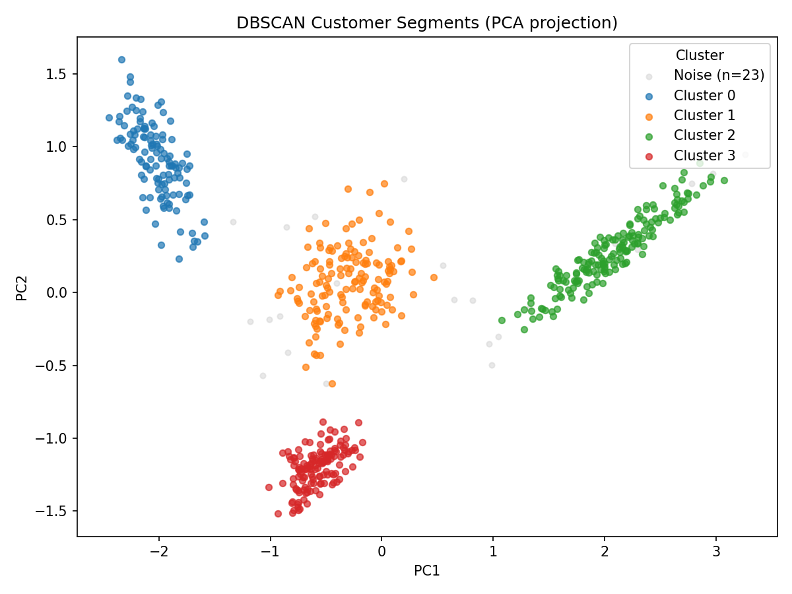

# DBSCAN Clustering: A Practical Guide (and How to Switch from K-Means)

K-Means is a great starting point for clustering, but it makes assumptions your data may not satisfy: that clusters are roughly spherical, roughly equal in size, and that every point belongs to *some* cluster. When those assumptions break down (non-convex shapes, wildly unequal densities, or a dataset full of noise), K-Means will quietly produce wrong answers. DBSCAN (Density-Based Spatial Clustering of Applications with Noise) is built for exactly these situations. It finds clusters of any shape, requires no upfront guess at K, and explicitly labels outliers as noise rather than forcing them into a cluster where they don't belong.

This post covers how DBSCAN works, how to tune it, and, concretely, how to swap it into code you already wrote for K-Means.

## What DBSCAN Does Differently

K-Means clusters by proximity to centroids. DBSCAN clusters by *density*: regions of space with many points close together are clusters; regions with few points are noise.

Every point in a DBSCAN run is classified as one of three types:

- **Core point**: has at least `min_samples` neighbors within distance `eps`. This point is "inside" a cluster.
- **Border point**: within `eps` of a core point, but doesn't have enough neighbors to be a core itself. It's on the edge of a cluster.
- **Noise point**: not within `eps` of any core point. It belongs to no cluster and receives the label `-1`.

The algorithm then groups connected core points (and their border points) into clusters. The result: any number of clusters of any shape, plus a set of explicitly identified outliers.

| Property | K-Means | DBSCAN |
|---|---|---|
| Number of clusters | Must specify K upfront | Determined automatically |
| Cluster shape | Spherical / convex | Arbitrary |
| Outlier handling | Forced into nearest cluster | Explicitly labeled as noise (`-1`) |
| Scaling sensitivity | Yes | Yes |
| Works with high-density variation | Poorly | Handles well |
| Speed on large datasets | Fast | Slower (tree-based index helps) |

## The Algorithm, Step by Step

DBSCAN has two parameters:

- **`eps`** (ε): the radius of the neighborhood around each point. Two points are "neighbors" if their distance is ≤ `eps`.
- **`min_samples`**: the minimum number of neighbors a point must have (within `eps`) to be classified as a core point.

The procedure:

1. For each unvisited point, compute its ε-neighborhood: all points within distance `eps`.
2. If the neighborhood has ≥ `min_samples` points, mark this as a core point and start a new cluster.
3. Expand the cluster: recursively add all density-reachable points (neighbors of core points, and their neighbors if they are also core points).
4. Non-core points within the neighborhood are added as border points but do not expand further.
5. Points that are never reached by any core point are labeled noise (`-1`).

Formally, the ε-neighborhood of a point $p$ is:

$$N_\varepsilon(p) = \{ q \in D \mid \text{dist}(p, q) \leq \varepsilon \}$$

where $D$ is the dataset. A point $p$ is a core point if $|N_\varepsilon(p)| \geq \text{min\_samples}$.

## Basic Implementation in Python

```python
import numpy as np
import pandas as pd
from sklearn.cluster import DBSCAN
from sklearn.preprocessing import StandardScaler
import matplotlib.pyplot as plt

# Load and scale your data (same as K-Means)
df = pd.read_csv("customers.csv")
features = ["recency_days", "frequency", "monetary_value"]

X = df[features].values
scaler = StandardScaler()
X_scaled = scaler.fit_transform(X)

# Fit DBSCAN
# eps and min_samples are the two knobs; see the next section for how to choose them
db = DBSCAN(eps=0.3, min_samples=5)
db.fit(X_scaled)

# Assign labels back to the dataframe
# Note: noise points receive label -1
df["cluster"] = db.labels_

# Quick summary
n_clusters = len(set(db.labels_)) - (1 if -1 in db.labels_ else 0)
n_noise = (db.labels_ == -1).sum()
print(f"Clusters found: {n_clusters}")
print(f"Noise points: {n_noise} ({n_noise / len(df) * 100:.1f}%)")
```

> **Always scale your features before running DBSCAN.** The `eps` parameter is a distance threshold. If features have different scales, `eps` has no consistent meaning: a value of 0.5 means something very different for income-in-dollars vs. age-in-years. `StandardScaler` puts all features on equal footing.

## Choosing `eps` and `min_samples`

This is the hardest part of using DBSCAN well. Unlike K-Means where you can run a grid search over integer values of K, DBSCAN parameters interact: a given `eps` is only sensible relative to the density of your data.

### Choosing `min_samples`

A good starting rule: set `min_samples` to at least the number of features + 1. For low-dimensional data (2–5 features), 5 is a reasonable default. For noisier or higher-dimensional data, use a higher value (10–20). Higher `min_samples` makes the algorithm more conservative: it requires denser neighborhoods to form clusters, which means more points get classified as noise.

```python
# Rule of thumb: start with min_samples = n_features + 1, minimum 5
min_samples = max(5, X_scaled.shape[1] + 1)
```

### Choosing `eps` with the K-Distance Plot

The standard technique is the **k-distance plot**. For each point, compute the distance to its kth nearest neighbor (where k = `min_samples - 1`). Sort these distances in ascending order and plot them. The "elbow" (where the curve bends sharply upward) is a good estimate for `eps`. Points above the elbow tend to become noise; points below tend to join clusters.

```python
import numpy as np
import pandas as pd
from sklearn.preprocessing import StandardScaler
from sklearn.neighbors import NearestNeighbors
import matplotlib.pyplot as plt

# Load and scale
df = pd.read_csv("customers.csv")
features = ["recency_days", "frequency", "monetary_value"]
X_scaled = StandardScaler().fit_transform(df[features].values)

# Compute k-distances (k = min_samples - 1)
min_samples = 5
k = min_samples - 1

nn = NearestNeighbors(n_neighbors=k)
nn.fit(X_scaled)

# distances shape: (n_samples, k); take the kth neighbor distance for each point
distances, _ = nn.kneighbors(X_scaled)
kth_distances = distances[:, -1]  # distance to the farthest of the k neighbors

# Sort in ascending order for the elbow plot
kth_distances_sorted = np.sort(kth_distances)

# Plot
plt.figure(figsize=(8, 4))
plt.plot(kth_distances_sorted)
plt.xlabel("Points (sorted by distance)")
plt.ylabel(f"Distance to {k}th nearest neighbor")
plt.title(f"K-Distance Plot (k={k}): look for the elbow to choose eps")
plt.axhline(y=0.3, color='red', linestyle='--', label='candidate eps = 0.3')
plt.legend()
plt.tight_layout()
plt.savefig("plots/dbscan_epsilon_plot.png", dpi=150)
plt.show()
plt.close()
```



> The elbow is where the sorted distances start curving sharply upward. Set `eps` just below that inflection point. There is no automatic method that always works; you need to look at the plot. If you see a very gentle curve with no clear elbow, your data may not have strong cluster structure suitable for DBSCAN.

---

## Handling Noise Points

Noise (`-1`) is a first-class output of DBSCAN, not an error or an edge case. How you handle it depends on your use case.

```python
import numpy as np
import pandas as pd
from sklearn.cluster import DBSCAN
from sklearn.preprocessing import StandardScaler

# Load, scale, fit
df = pd.read_csv("customers.csv")
features = ["recency_days", "frequency", "monetary_value"]
X_scaled = StandardScaler().fit_transform(df[features].values)

db = DBSCAN(eps=0.3, min_samples=5)
df["cluster"] = db.fit_predict(X_scaled)

# --- Option 1: Inspect noise points as potential anomalies ---
noise = df[df["cluster"] == -1]
print(f"Noise points: {len(noise)} ({len(noise)/len(df)*100:.1f}% of data)")
print(noise[features].describe())

# --- Option 2: Remove noise before profiling clusters ---
# Noise points would skew per-cluster statistics if left in
df_clean = df[df["cluster"] != -1].copy()
cluster_profiles = df_clean.groupby("cluster")[features].mean()
print(cluster_profiles.round(2))

# --- Option 3: Keep noise as its own labeled group ---
# Useful if you want to analyze the "anomaly" segment explicitly
df["segment"] = df["cluster"].apply(lambda x: "Anomaly" if x == -1 else f"Cluster {x}")
print(df["segment"].value_counts())
```

This is a meaningful difference from K-Means: with K-Means, outliers silently pull centroids toward them, distorting every cluster. DBSCAN surfaces them explicitly, letting you decide what to do with them. If the noise fraction is high (> 20%), your `eps` is probably too small; the algorithm is treating too many points as isolated.

## Swapping DBSCAN into K-Means Code

If you have existing code built around K-Means, the mechanical changes are small. The conceptual changes (handling noise, not assuming a fixed number of clusters) require a little more attention. Here is each step in full.

### Step 1: Replace the Model

**K-Means version (before):**
```python
import numpy as np
import pandas as pd
from sklearn.cluster import KMeans
from sklearn.preprocessing import StandardScaler

# Load and scale
df = pd.read_csv("customers.csv")
features = ["recency_days", "frequency", "monetary_value"]

scaler = StandardScaler()
X_scaled = scaler.fit_transform(df[features].values)

# Fit K-Means; must specify n_clusters
kmeans = KMeans(n_clusters=4, init='k-means++', n_init=10, random_state=42)
df["cluster"] = kmeans.fit_predict(X_scaled)

print(f"Clusters: {df['cluster'].nunique()}")
print(df["cluster"].value_counts())
```

**DBSCAN version (after):**
```python
import numpy as np
import pandas as pd
from sklearn.cluster import DBSCAN
from sklearn.preprocessing import StandardScaler

# Load and scale (identical to K-Means)
df = pd.read_csv("customers.csv")
features = ["recency_days", "frequency", "monetary_value"]

scaler = StandardScaler()
X_scaled = scaler.fit_transform(df[features].values)

# Fit DBSCAN: no n_clusters; tune eps and min_samples instead
db = DBSCAN(eps=0.3, min_samples=5)
df["cluster"] = db.fit_predict(X_scaled)

# Number of clusters does not include noise (-1)
n_clusters = len(set(db.labels_)) - (1 if -1 in db.labels_ else 0)
print(f"Clusters found: {n_clusters}")
print(df["cluster"].value_counts())  # -1 will appear if there are noise points
```

Key changes:
- Replace `KMeans(n_clusters=4, ...)` with `DBSCAN(eps=0.3, min_samples=5)`
- Remove `random_state` and `n_init`; DBSCAN is deterministic with no initialization randomness
- Count clusters excluding the noise label

### Step 2: Handle the Noise Label

**K-Means version (before):**
```python
import numpy as np
import pandas as pd
from sklearn.cluster import KMeans
from sklearn.preprocessing import StandardScaler

df = pd.read_csv("customers.csv")
features = ["recency_days", "frequency", "monetary_value"]
X_scaled = StandardScaler().fit_transform(df[features].values)

kmeans = KMeans(n_clusters=4, init='k-means++', n_init=10, random_state=42)
df["cluster"] = kmeans.fit_predict(X_scaled)

# K-Means always assigns every point to a cluster; no noise label to handle
# All values in df["cluster"] are integers in [0, K-1]
df_clean = df.copy()  # nothing to filter
```

**DBSCAN version (after):**
```python
import numpy as np
import pandas as pd
from sklearn.cluster import DBSCAN
from sklearn.preprocessing import StandardScaler

df = pd.read_csv("customers.csv")
features = ["recency_days", "frequency", "monetary_value"]
X_scaled = StandardScaler().fit_transform(df[features].values)

db = DBSCAN(eps=0.3, min_samples=5)
df["cluster"] = db.fit_predict(X_scaled)

# DBSCAN assigns -1 to noise points; handle explicitly before any downstream work
n_noise = (df["cluster"] == -1).sum()
print(f"Noise points: {n_noise} ({n_noise / len(df) * 100:.1f}%)")

# For profiling and labeling, work with clean (non-noise) points only
df_clean = df[df["cluster"] != -1].copy()

# Keep a separate dataframe for anomaly analysis if needed
df_noise = df[df["cluster"] == -1].copy()
```

### Step 3: Profile the Clusters

The profiling code is nearly identical; the only change is filtering out noise rows first.

**K-Means version (before):**
```python
import numpy as np
import pandas as pd
from sklearn.cluster import KMeans
from sklearn.preprocessing import StandardScaler
from scipy.stats import f_oneway

df = pd.read_csv("customers.csv")
features = ["recency_days", "frequency", "monetary_value"]
X_scaled = StandardScaler().fit_transform(df[features].values)

kmeans = KMeans(n_clusters=4, init='k-means++', n_init=10, random_state=42)
df["cluster"] = kmeans.fit_predict(X_scaled)

# Profile: all rows belong to a cluster, so no filter needed
profile = df.groupby("cluster")[features].agg(["mean", "median", "std"])
print(profile.round(2))

# ANOVA across clusters
for feature in features:
    groups = [df.loc[df["cluster"] == k, feature].values for k in df["cluster"].unique()]
    f_stat, p_val = f_oneway(*groups)
    print(f"{feature}: F={f_stat:.2f}, p={p_val:.4f}")
```

**DBSCAN version (after):**
```python
import numpy as np
import pandas as pd
from sklearn.cluster import DBSCAN
from sklearn.preprocessing import StandardScaler
from scipy.stats import f_oneway

df = pd.read_csv("customers.csv")
features = ["recency_days", "frequency", "monetary_value"]
X_scaled = StandardScaler().fit_transform(df[features].values)

db = DBSCAN(eps=0.3, min_samples=5)
df["cluster"] = db.fit_predict(X_scaled)

# Filter noise before profiling; noise points should not be included in cluster statistics
df_clean = df[df["cluster"] != -1].copy()
cluster_ids = sorted(df_clean["cluster"].unique())

# Profile: same pattern as K-Means, applied to df_clean
profile = df_clean.groupby("cluster")[features].agg(["mean", "median", "std"])
print(profile.round(2))

# ANOVA: iterate over discovered cluster IDs, not a fixed range
for feature in features:
    groups = [df_clean.loc[df_clean["cluster"] == k, feature].values for k in cluster_ids]
    f_stat, p_val = f_oneway(*groups)
    print(f"{feature}: F={f_stat:.2f}, p={p_val:.4f}")
```

### Step 4: Visualization

The PCA scatter is essentially the same. Add a separate pass to draw noise points in gray.

**K-Means version (before):**
```python
import numpy as np
import pandas as pd
from sklearn.cluster import KMeans
from sklearn.preprocessing import StandardScaler
from sklearn.decomposition import PCA
import matplotlib.pyplot as plt

df = pd.read_csv("customers.csv")
features = ["recency_days", "frequency", "monetary_value"]
X_scaled = StandardScaler().fit_transform(df[features].values)

kmeans = KMeans(n_clusters=4, init='k-means++', n_init=10, random_state=42)
df["cluster"] = kmeans.fit_predict(X_scaled)

# PCA to 2D for visualization
X_2d = PCA(n_components=2).fit_transform(X_scaled)

plt.figure(figsize=(8, 6))
# All points are cluster members; color by cluster label
scatter = plt.scatter(X_2d[:, 0], X_2d[:, 1], c=df["cluster"], cmap="tab10", alpha=0.6, s=20)
plt.colorbar(scatter, label="Cluster")
plt.xlabel("PC1")
plt.ylabel("PC2")
plt.title("K-Means Clusters (PCA projection)")
plt.tight_layout()
plt.savefig("plots/kmeans_customer_segments_pca.png", dpi=150)
plt.show()
plt.close()
```

**DBSCAN version (after):**
```python
import numpy as np
import pandas as pd
from sklearn.cluster import DBSCAN
from sklearn.preprocessing import StandardScaler
from sklearn.decomposition import PCA
import matplotlib.pyplot as plt

df = pd.read_csv("customers.csv")
features = ["recency_days", "frequency", "monetary_value"]
X_scaled = StandardScaler().fit_transform(df[features].values)

db = DBSCAN(eps=0.3, min_samples=5)
df["cluster"] = db.fit_predict(X_scaled)

# PCA to 2D (same as K-Means)
X_2d = PCA(n_components=2).fit_transform(X_scaled)

cluster_ids = sorted(df.loc[df["cluster"] != -1, "cluster"].unique())
colors = plt.cm.tab10.colors  # discrete colors, one per cluster

mask_noise = df["cluster"] == -1

plt.figure(figsize=(8, 6))
# Draw noise points first, in gray, so clusters render on top
plt.scatter(
    X_2d[mask_noise, 0], X_2d[mask_noise, 1],
    c="lightgray", s=15, alpha=0.5, label="Noise"
)
# Draw each cluster separately so legend entries are clean color swatches
for cid in cluster_ids:
    mask = df["cluster"] == cid
    plt.scatter(
        X_2d[mask, 0], X_2d[mask, 1],
        color=colors[cid % len(colors)], alpha=0.7, s=20, label=f"Cluster {cid}"
    )
plt.legend(loc="upper right", title="Cluster")
plt.xlabel("PC1")
plt.ylabel("PC2")
plt.title("DBSCAN Clusters (PCA projection)")
plt.tight_layout()
plt.savefig("plots/dbscan_clusters_pca.png", dpi=150)
plt.show()
plt.close()
```



## Interpreting DBSCAN Results

### Profile Each Cluster

Same approach as K-Means: look at the mean and median of each feature per cluster, identify which features vary most across clusters, and use those to write descriptive labels.

```python
import numpy as np
import pandas as pd
from sklearn.cluster import DBSCAN
from sklearn.preprocessing import StandardScaler

df = pd.read_csv("customers.csv")
features = ["recency_days", "frequency", "monetary_value"]
X_scaled = StandardScaler().fit_transform(df[features].values)

db = DBSCAN(eps=0.3, min_samples=5)
df["cluster"] = db.fit_predict(X_scaled)

# Work with clean data only
df_clean = df[df["cluster"] != -1].copy()

# Per-cluster statistics
print(df_clean.groupby("cluster")[features].mean().round(2))
print(f"\nPoints per cluster:\n{df_clean['cluster'].value_counts().sort_index()}")
```

### The Cluster Count Is Information

Unlike K-Means, you did not choose how many clusters to get. If DBSCAN returns 7 clusters from data you expected to have 3 groups, your `eps` may be too small; try increasing it. If it returns 1, `eps` may be too large; try decreasing it. The k-distance plot is your guide.

### The Noise Fraction Is Information

If 5% of points are noise, that is normal; those are genuine outliers. If 40% are noise, the algorithm is not finding structure and you should revisit your `eps`, your features, or whether DBSCAN is the right tool for this data.

### Assign Labels

Once you understand what each cluster represents, map integers to names using the same pattern as K-Means.

```python
# After inspecting profiles, assign meaningful labels
label_map = {
    0: "Champions",
    1: "At-Risk",
    2: "Promising",
}
df_clean["segment"] = df_clean["cluster"].map(label_map)
df.loc[df["cluster"] == -1, "segment"] = "Anomaly"
df.loc[df["cluster"] != -1, "segment"] = df_clean["segment"]
print(df["segment"].value_counts())
```

## A Full End-to-End Example

```python
import os
import numpy as np
import pandas as pd
from sklearn.cluster import DBSCAN
from sklearn.preprocessing import StandardScaler
from sklearn.neighbors import NearestNeighbors
from sklearn.decomposition import PCA
from scipy.stats import f_oneway
import matplotlib.pyplot as plt

# --- Output directory ---
os.makedirs("plots", exist_ok=True)

# --- Load data ---
# Same customers.csv used in the K-Means post; run both side-by-side to compare
df = pd.read_csv("customers.csv")
features = ["recency_days", "frequency", "monetary_value"]

# --- Scale ---
# Critical: eps is a distance threshold; unscaled features break it
scaler = StandardScaler()
X = scaler.fit_transform(df[features].values)

# --- Choose min_samples ---
# Rule of thumb: max(5, n_features + 1)
min_samples = max(5, X.shape[1] + 1)
k = min_samples - 1  # k-distance plot uses k = min_samples - 1

# --- K-distance plot to choose eps ---
nn = NearestNeighbors(n_neighbors=k)
nn.fit(X)
distances, _ = nn.kneighbors(X)
kth_distances = np.sort(distances[:, -1])  # sorted ascending

plt.figure(figsize=(8, 4))
plt.plot(kth_distances)
plt.xlabel("Points (sorted by distance)")
plt.ylabel(f"Distance to {k}th nearest neighbor")
plt.title(f"K-Distance Plot: choose eps at the elbow")
plt.tight_layout()
plt.savefig("plots/dbscan_epsilon_plot.png", dpi=150)
plt.show()
plt.close()

# --- Fit DBSCAN ---
# Adjust eps based on the elbow observed in the k-distance plot above
EPS = 0.3
db = DBSCAN(eps=EPS, min_samples=min_samples)
df["cluster"] = db.fit_predict(X)

# --- Report ---
n_clusters = len(set(db.labels_)) - (1 if -1 in db.labels_ else 0)
n_noise = (df["cluster"] == -1).sum()
print(f"Clusters found: {n_clusters}")
print(f"Noise points:   {n_noise} ({n_noise / len(df) * 100:.1f}%)")

# --- Separate noise from clusters ---
df_clean = df[df["cluster"] != -1].copy()
df_noise = df[df["cluster"] == -1].copy()
cluster_ids = sorted(df_clean["cluster"].unique())

# --- Profile each cluster ---
print("\nCluster profiles (mean):")
print(df_clean.groupby("cluster")[features].mean().round(2))
print(f"\nPoints per cluster:\n{df_clean['cluster'].value_counts().sort_index()}")

# --- Identify distinguishing features with ANOVA ---
print("\nANOVA: feature separation across clusters:")
for feature in features:
    groups = [df_clean.loc[df_clean["cluster"] == k, feature].values for k in cluster_ids]
    # Need at least 2 groups with >1 point each for ANOVA to be meaningful
    if len(groups) >= 2 and all(len(g) > 1 for g in groups):
        f_stat, p_val = f_oneway(*groups)
        significance = "***" if p_val < 0.001 else "**" if p_val < 0.01 else "*" if p_val < 0.05 else ""
        print(f"  {feature:20s}  F={f_stat:8.2f}  p={p_val:.4f}  {significance}")

# --- Visualize with PCA ---
X_2d = PCA(n_components=2).fit_transform(X)

mask_noise = df["cluster"] == -1
colors = plt.cm.tab10.colors  # discrete colors, one per cluster

plt.figure(figsize=(8, 6))
# Noise points in gray behind the clusters
plt.scatter(
    X_2d[mask_noise, 0], X_2d[mask_noise, 1],
    c="lightgray", s=15, alpha=0.5, label=f"Noise (n={n_noise})"
)
# Draw each cluster separately so legend entries are clean color swatches
for cid in cluster_ids:
    mask = df["cluster"] == cid
    plt.scatter(
        X_2d[mask, 0], X_2d[mask, 1],
        color=colors[cid % len(colors)], alpha=0.7, s=20, label=f"Cluster {cid}"
    )
plt.legend(loc="upper right", title="Cluster")
plt.xlabel("PC1")
plt.ylabel("PC2")
plt.title("DBSCAN Customer Segments (PCA projection)")
plt.tight_layout()
plt.savefig("plots/dbscan_clusters_pca.png", dpi=150)
plt.show()
plt.close()

# --- Assign labels based on cluster profiles ---
# Inspect the profile output above and adjust this map to match what you find
label_map = {
    0: "Champions",
    1: "At-Risk",
    2: "Promising",
}
df_clean["segment"] = df_clean["cluster"].map(label_map).fillna("Hibernating")
df.loc[df["cluster"] != -1, "segment"] = df_clean["segment"]
df.loc[df["cluster"] == -1, "segment"] = "Anomaly"

print(f"\nSegment counts:\n{df['segment'].value_counts()}")
```

The full working Jupyter notebook for this example, including all outputs and plots, is available here: [DBSCAN_Example.ipynb](../code_examples/DBSCAN_Example.ipynb)

The synthetic RFM dataset used throughout this example is available here: [customers.csv](../code_examples/customers.csv)

## When to Use DBSCAN vs. K-Means

| Question | K-Means | DBSCAN |
|---|---|---|
| Do you know K upfront? | Required | Not needed |
| Are clusters round/convex? | Best fit | Works but not necessary |
| Are clusters arbitrary shapes? | Poor | Best fit |
| Do you need explicit outlier detection? | No | Yes (label -1) |
| Is the data noisy? | Sensitive | Handles well |
| Do clusters have equal density? | Assumption | Not required |
| Large dataset (millions of rows)? | Fast | Slower; use `algorithm='ball_tree'` |

Use DBSCAN when:
- You do not know how many clusters to expect
- Your clusters may be irregular in shape or size
- Identifying outliers explicitly is useful (anomaly detection, fraud, sensor noise)

Stick with K-Means when:
- Your clusters are roughly spherical and similar in size
- You need a fast, interpretable baseline
- You are working with very high dimensionality (DBSCAN's distance measure degrades)

## Summary

| Parameter / Step | What it controls | How to choose it |
|---|---|---|
| `eps` | Neighborhood radius | K-distance plot: look for the elbow |
| `min_samples` | Minimum density for a core point | Start at `max(5, n_features + 1)` |
| Noise fraction | % of points labeled `-1` | > 20%: increase `eps`; < 1%: decrease `eps` |
| Number of clusters | Returned automatically | Verify it matches domain expectations |
| Scaling | Required before fitting | Use `StandardScaler` (same as K-Means) |
| Profiling | `groupby` on `df_clean` | Exclude noise (`cluster != -1`) first |

DBSCAN surfaces what K-Means hides: the points that do not fit. Whether those are genuine anomalies, data quality issues, or the most interesting records in your dataset depends on the domain, but at least you know they exist.
