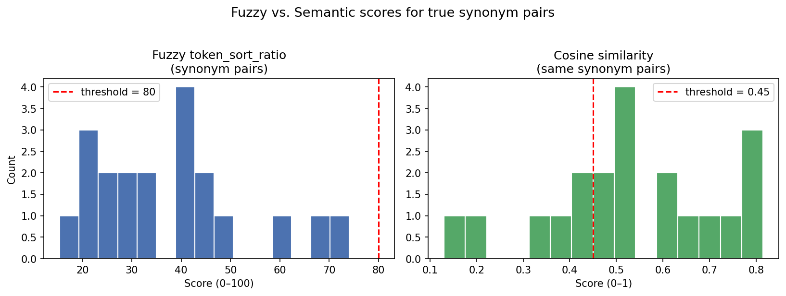

# Cleaning Messy String Columns with Fuzzy and Semantic Matching

Every data professional has run into this problem. You join two tables on a shared column — say, a product name or a city — and the result is half empty. Or you run a `value_counts()` and see that `"San Francisco"`, `"san francisco"`, `"San Fran"`, and `"SF"` are all being counted as separate values when they should all be the same thing. The data was entered by different people, at different times, using different conventions. No one was wrong, exactly — they all just had their own way of writing the same thing.

This is a string inconsistency problem, and it is one of the most common obstacles in real-world data work. Fixing it by hand is tedious and error-prone. Regular expressions can catch simple patterns like case differences, but they fall apart quickly when you are dealing with typos, abbreviations, or phrasing variations.

This post covers two techniques that automate the fix. **Fuzzy string matching** handles the cases where two strings refer to the same thing but differ in spelling, punctuation, abbreviation, or word order. **Semantic matching** handles the harder cases where the strings use completely different words but mean the same thing — think `"Ergonomic Seating"` versus `"Comfortable Chairs"`. We will apply both to a simulated retail operations database, measure how accurate each method is, and combine them into a two-pass cleaning pipeline.

---

## The Dataset: A Simulated Retail Operations Database

Imagine a regional retail chain that has three operational tables — orders, products, and suppliers — each maintained by a different team. Because there was no enforced naming standard, the same values got entered dozens of different ways over the years. We will simulate that scenario so we have full control over what the correct answer is, which will let us measure accuracy later.

The three tables are:
- **`orders_df`** — 500 rows of individual purchase orders. This is the "dirty" table: product names, city names, supplier names, and product categories were all entered freehand.
- **`products_df`** — 20 rows listing the canonical (correct) product names. This is the master reference.
- **`suppliers_df`** — 12 rows listing the canonical supplier names and their regions.

The `orders_df` table has four columns with inconsistencies: `city`, `product_name`, `supplier_name`, and `product_category`. We also store the original dirty values in separate `_raw` columns — that is what lets us compare the cleaner's output against the ground truth once we are done.

```python
import random
import numpy as np
import pandas as pd

random.seed(42)
np.random.seed(42)

# ── Canonical reference lists ────────────────────────────────────────────────

CANONICAL_CITIES = [
    "San Francisco", "Los Angeles", "New York", "Chicago",
    "Seattle", "Denver", "Austin", "Miami",
]

CITY_VARIANTS = {
    "San Francisco": ["San Francisco", "san francisco", "San Fransisco", "S.F.", "SF", "San Fran"],
    "Los Angeles":   ["Los Angeles", "los angeles", "L.A.", "LA", "Los Angles", "Los Angeles CA"],
    "New York":      ["New York", "new york", "New York City", "NYC", "N.Y.C.", "New Yrok"],
    "Chicago":       ["Chicago", "chicago", "Chicaago", "CHI", "Chicago IL"],
    "Seattle":       ["Seattle", "seattle", "Seatle", "SEA", "Seattle WA"],
    "Denver":        ["Denver", "denver", "Denvar", "DEN", "Denver CO"],
    "Austin":        ["Austin", "austin", "Auston", "ATX", "Austin TX"],
    "Miami":         ["Miami", "miami", "Miamii", "MIA", "Miami FL"],
}

CANONICAL_PRODUCTS = [
    "Office Chair", "Standing Desk", "Whiteboard", "Desk Lamp", "Filing Cabinet",
    "Bookshelf", "Monitor Stand Series 2", "Conference Table Type 1",
    "Keyboard Tray", "Cable Management Box", "Printer Stand", "Footrest",
    "Wall Clock", "Coat Rack", "Recycling Bin", "Paper Shredder",
    "Surge Protector", "Desk Organizer", "Task Light", "Noise Machine",
]

PRODUCT_VARIANTS = {
    "Office Chair":             ["Office Chair", "office chair", "Ofice Chair", "Office Chari", "Ofc. Chair"],
    "Standing Desk":            ["Standing Desk", "standing desk", "Stand Desk", "Standig Desk", "Stndg Desk"],
    "Whiteboard":               ["Whiteboard", "whiteboard", "Whteboard", "Whtebrrd", "White-Board"],
    "Desk Lamp":                ["Desk Lamp", "desk lamp", "Desk Lmp", "DeskLamp", "Dsk Lamp"],
    "Filing Cabinet":           ["Filing Cabinet", "filing cabinet", "Filing Cabnet", "File Cabinet", "Filng Cabinet"],
    "Bookshelf":                ["Bookshelf", "bookshelf", "Book Shelf", "Bookshlf", "Bookshef"],
    "Monitor Stand Series 2":   ["Monitor Stand Series 2", "Monitor Stand Series II", "Mtr Stand Ser. 2", "monitor stand series 2", "Mon Stand Ser 2"],
    "Conference Table Type 1":  ["Conference Table Type 1", "Conference Table Type I", "Cnf. Table Type 1", "Conf. Table Type 1", "Conferance Table Type 1"],
    "Keyboard Tray":            ["Keyboard Tray", "keyboard tray", "Keybord Tray", "Kyboard Tray", "Kbd Tray"],
    "Cable Management Box":     ["Cable Management Box", "cable management box", "Cable Mgmt Box", "Cble Mgmt Box", "Cable Mgmnt Box"],
    "Printer Stand":            ["Printer Stand", "printer stand", "Prnter Stand", "Printer Stnd", "Prtr Stand"],
    "Footrest":                 ["Footrest", "footrest", "Foot Rest", "Footrst", "Foot-Rest"],
    "Wall Clock":               ["Wall Clock", "wall clock", "Wal Clock", "Wall Clck", "Wll Clock"],
    "Coat Rack":                ["Coat Rack", "coat rack", "Cot Rack", "Coat Rak", "Coat-Rack"],
    "Recycling Bin":            ["Recycling Bin", "recycling bin", "Recyclng Bin", "Recycling Bn", "Rcycling Bin"],
    "Paper Shredder":           ["Paper Shredder", "paper shredder", "Papr Shredder", "Paper Shredr", "Ppr Shredder"],
    "Surge Protector":          ["Surge Protector", "surge protector", "Srge Protector", "Surge Protctr", "Surg Protector"],
    "Desk Organizer":           ["Desk Organizer", "desk organizer", "Desk Orgnizer", "Dsk Organizer", "Desk Organizr"],
    "Task Light":               ["Task Light", "task light", "Tsk Light", "Task Lght", "Tsk Lght"],
    "Noise Machine":            ["Noise Machine", "noise machine", "Noise Machne", "Nois Machine", "Noise Machin"],
}

CANONICAL_SUPPLIERS = [
    "Apex Office Solutions", "Pacific Rim Imports", "Great Lakes Supply Co.",
    "Mountain West Distributors", "Atlantic Wholesale Group",
    "Heartland Office Depot", "Southern Supply Chain", "Northwest Trade Co.",
    "Midwest Equipment Group", "Gulf Coast Vendors", "New England Furnishings", "Desert Sun Supply",
]

SUPPLIER_VARIANTS = {
    "Apex Office Solutions":       ["Apex Office Solutions", "apex office solutions", "Apex Office Sol.", "Apex Office Sols", "Apex Office Soln"],
    "Pacific Rim Imports":         ["Pacific Rim Imports", "pacific rim imports", "Pacific Rim Import", "Pac. Rim Imports", "Pacfic Rim Imports"],
    "Great Lakes Supply Co.":      ["Great Lakes Supply Co.", "great lakes supply", "Great Lakes Supply Company", "Grt Lakes Supply Co", "Great Lks Supply"],
    "Mountain West Distributors":  ["Mountain West Distributors", "Mountain West Dist.", "Mtn. West Distributors", "Mountan West Distributors", "Mountain West Distr."],
    "Atlantic Wholesale Group":    ["Atlantic Wholesale Group", "Atlantic Wholesale Grp", "Atl. Wholesale Group", "Atlantic Whol. Group", "Atlantic Whls Group"],
    "Heartland Office Depot":      ["Heartland Office Depot", "heartland office depot", "Heartland Off. Depot", "Heartland Office Dpt", "Hrtland Office Depot"],
    "Southern Supply Chain":       ["Southern Supply Chain", "southern supply chain", "Southern Supply", "S. Supply Chain", "Sthern Supply Chain"],
    "Northwest Trade Co.":         ["Northwest Trade Co.", "northwest trade co", "Northwest Trade", "Nrthwest Trade Co.", "Northwst Trade Co."],
    "Midwest Equipment Group":     ["Midwest Equipment Group", "midwest equipment group", "Midwest Equip. Group", "Midwst Equipment Group", "Midwest Equip Grp"],
    "Gulf Coast Vendors":          ["Gulf Coast Vendors", "gulf coast vendors", "Gulf Cst Vendors", "Gulf Coast Vndrs", "Guf Coast Vendors"],
    "New England Furnishings":     ["New England Furnishings", "new england furnishings", "New Eng. Furnishings", "New Englnd Furnishings", "N. England Furnishings"],
    "Desert Sun Supply":           ["Desert Sun Supply", "desert sun supply", "Desert Sun Sup.", "Desrt Sun Supply", "Desert Sun Suppl"],
}

CANONICAL_CATEGORIES = [
    "Ergonomic Seating",
    "Work Surface",
    "Storage Solution",
    "Lighting",
    "Communication Equipment",
]

CATEGORY_VARIANTS = {
    "Ergonomic Seating":        ["Ergonomic Seating", "Comfortable Chairs", "Back-Friendly Furniture", "Posture Support Seating", "Seating Solutions"],
    "Work Surface":             ["Work Surface", "Desktop", "Tabletop Unit", "Writing Surface", "Workspace Desk"],
    "Storage Solution":         ["Storage Solution", "Filing System", "Organizational Unit", "Cabinet and Drawer Set", "Office Storage"],
    "Lighting":                 ["Lighting", "Illumination", "Lamp and Light Fixture", "Workspace Illumination", "Office Lighting"],
    "Communication Equipment":  ["Communication Equipment", "Phone and Headset", "Voice Devices", "Telecom Hardware", "Office Comms Gear"],
}

# ── Product → supplier and category mapping ──────────────────────────────────

PRODUCT_TO_SUPPLIER = {p: random.choice(CANONICAL_SUPPLIERS) for p in CANONICAL_PRODUCTS}
PRODUCT_TO_CATEGORY = {
    "Office Chair": "Ergonomic Seating", "Standing Desk": "Work Surface",
    "Whiteboard": "Work Surface", "Desk Lamp": "Lighting",
    "Filing Cabinet": "Storage Solution", "Bookshelf": "Storage Solution",
    "Monitor Stand Series 2": "Work Surface", "Conference Table Type 1": "Work Surface",
    "Keyboard Tray": "Work Surface", "Cable Management Box": "Storage Solution",
    "Printer Stand": "Work Surface", "Footrest": "Ergonomic Seating",
    "Wall Clock": "Communication Equipment", "Coat Rack": "Storage Solution",
    "Recycling Bin": "Storage Solution", "Paper Shredder": "Storage Solution",
    "Surge Protector": "Communication Equipment", "Desk Organizer": "Storage Solution",
    "Task Light": "Lighting", "Noise Machine": "Communication Equipment",
}

# ── Build orders_df ───────────────────────────────────────────────────────────

def pick_dirty(variants_dict, canonical):
    """Randomly pick one dirty variant for a canonical value."""
    return random.choice(variants_dict[canonical])

rows = []
for i in range(500):
    product = random.choice(CANONICAL_PRODUCTS)
    supplier = PRODUCT_TO_SUPPLIER[product]
    category = PRODUCT_TO_CATEGORY[product]
    rows.append({
        "order_id":            f"ORD-{i+1:04d}",
        "product_name":        pick_dirty(PRODUCT_VARIANTS, product),
        "city":                pick_dirty(CITY_VARIANTS, random.choice(CANONICAL_CITIES)),
        "supplier_name":       pick_dirty(SUPPLIER_VARIANTS, supplier),
        "product_category":    pick_dirty(CATEGORY_VARIANTS, category),
        "quantity":            random.randint(1, 20),
        "unit_price":          round(random.uniform(10, 500), 2),
        # Ground-truth labels stored alongside — used for accuracy evaluation later
        "_gt_product":         product,
        "_gt_city":            random.choice(CANONICAL_CITIES),  # placeholder; set properly below
        "_gt_supplier":        supplier,
        "_gt_category":        category,
    })

# Fix _gt_city to match the dirty city we actually generated
# Re-derive it from the dirty value via the CITY_VARIANTS inverse map
city_inverse = {v: k for k, variants in CITY_VARIANTS.items() for v in variants}
for row in rows:
    row["_gt_city"] = city_inverse[row["city"]]

orders_df = pd.DataFrame(rows)

# ── Build products_df and suppliers_df ───────────────────────────────────────

products_df = pd.DataFrame([
    {"product_id": f"P{i+1:03d}", "product_name": p,
     "category": PRODUCT_TO_CATEGORY[p], "supplier_name": PRODUCT_TO_SUPPLIER[p]}
    for i, p in enumerate(CANONICAL_PRODUCTS)
])

suppliers_df = pd.DataFrame([
    {"supplier_id": f"S{i+1:02d}", "supplier_name": s, "region": random.choice(["West", "East", "Central", "South"])}
    for i, s in enumerate(CANONICAL_SUPPLIERS)
])

print("orders_df shape:", orders_df.shape)
print(orders_df[["order_id", "product_name", "city", "supplier_name", "product_category"]].head())
print("\nproducts_df:")
print(products_df.head())
print("\nsuppliers_df:")
print(suppliers_df.head())
```

Let's also take a quick look at the scope of the problem before we try to fix anything. The code below counts how many distinct values each messy column contains — compared to the number of canonical values we know should exist.

```python
print("=== Before Cleaning ===")
print(f"city            — {orders_df['city'].nunique():3d} unique dirty values  (should be {len(CANONICAL_CITIES)})")
print(f"product_name    — {orders_df['product_name'].nunique():3d} unique dirty values  (should be {len(CANONICAL_PRODUCTS)})")
print(f"supplier_name   — {orders_df['supplier_name'].nunique():3d} unique dirty values  (should be {len(CANONICAL_SUPPLIERS)})")
print(f"product_category— {orders_df['product_category'].nunique():3d} unique dirty values  (should be {len(CANONICAL_CATEGORIES)})")

print("\nSample dirty city values:")
print(orders_df["city"].value_counts().head(12).to_string())
```

You will see roughly 35–40 unique city values where there should be 8, around 80–90 product name variants where there should be 20, and so on. That is the problem we need to solve.

---

## What Fuzzy Matching Is (and When to Use It)

When two strings differ only in small surface-level ways — a typo, an extra period, a lowercase letter — they are still very *similar* in terms of the characters they contain. Fuzzy matching quantifies that similarity with a score from 0 to 100, where 100 means the strings are identical and 0 means they share nothing.

The most common underlying measure is called **edit distance** (also known as Levenshtein distance): the minimum number of single-character insertions, deletions, or substitutions needed to turn one string into the other. `"Chicaago"` is one deletion away from `"Chicago"`, so its edit distance is 1 and its similarity score is very high. `"SF"` is several characters away from `"San Francisco"`, so a naive character-level score would be low — but we can work around that with smarter scoring modes.

We will use the **RapidFuzz** library, which provides several scoring functions. Two are especially useful here:

- `fuzz.ratio(a, b)` — the basic character-level score. Great for typos and casing differences. Struggles when the strings have the same words in a different order.
- `fuzz.token_sort_ratio(a, b)` — splits both strings into words, sorts the words alphabetically, then runs the character-level comparison on the sorted result. This means `"Filing Cabinet Metal"` and `"Metal Filing Cabinet"` score 100, even though the raw character order is completely different.

```python
# pip install rapidfuzz
from rapidfuzz import fuzz, process

# Basic character similarity
print(fuzz.ratio("Chicago", "Chicaago"))              # 93 — one extra 'a'
print(fuzz.ratio("San Francisco", "San Fransisco"))   # 96 — one transposition
print(fuzz.ratio("SF", "San Francisco"))              # 22 — abbreviation, bad score

# token_sort_ratio handles word-order variants
print(fuzz.ratio("Filing Cabinet Metal", "Metal Filing Cabinet"))           # 52 — bad
print(fuzz.token_sort_ratio("Filing Cabinet Metal", "Metal Filing Cabinet"))# 100 — perfect

# ratio vs token_sort_ratio on our actual data
print(fuzz.ratio("Conf Table Mk1", "Conference Table Type 1"))              # 61
print(fuzz.token_sort_ratio("Conf Table Mk1", "Conference Table Type 1"))   # 64
```

**Where fuzzy matching excels:** typos, abbreviations, punctuation differences, case differences, trailing suffixes (e.g., `"Chicago IL"`), Roman/Arabic numeral variants (e.g., `"Type I"` vs `"Type 1"`), and word-order variants with `token_sort_ratio`.

**Where it struggles:** when two strings mean the same thing but use completely different words. No amount of character comparison will tell you that `"Comfortable Chairs"` and `"Ergonomic Seating"` are the same category. For that, you need semantic matching — which we will cover after we finish with fuzzy.

**Pros:**
- Extremely fast — RapidFuzz's C++ backend can score millions of string pairs per second
- Works completely offline, no model download required
- The 0–100 score is intuitive and easy to threshold
- Transparent: you can always see exactly which characters caused the score to be what it is

**Cons:**
- Completely blind to meaning — two strings that mean the same thing but look different will score low
- Can confuse similar-looking but different canonical values (e.g., `"Chicago IL"` and `"Chicago"` both score high, but only one is the target)
- Threshold is dataset-specific; there is no universal "right" value
- Short strings (2–3 characters) produce noisy scores because random character overlap inflates similarity

---

## Fixing City Names with Fuzzy Matching

The strategy is simple: for each dirty city value, find the canonical city it most closely resembles, and replace it. The `process.extractOne` function from RapidFuzz does this in one call — it takes a query string and a list of candidates, scores the query against every candidate, and returns the best match along with its score and index.

We wrap this in a helper function that also applies a **threshold**: if the best match scores below 80, we leave the value unchanged and flag it for manual review rather than silently replacing it with something potentially wrong. This is an important safety net — a confident wrong answer is worse than no answer.

```python
def standardize_fuzzy(raw, canonical_list, threshold=80, scorer=fuzz.ratio):
    """Return the best-matching canonical value, or raw if no match exceeds threshold."""
    if pd.isna(raw):
        return raw
    result = process.extractOne(raw, canonical_list, scorer=scorer)
    if result is None or result[1] < threshold:
        return None   # signals a below-threshold value for review
    return result[0]

# Apply to city column
orders_df["city_clean"] = orders_df["city"].apply(
    lambda x: standardize_fuzzy(x, CANONICAL_CITIES, threshold=80)
)

# Check results
n_unmatched = orders_df["city_clean"].isna().sum()
print(f"City: {orders_df['city'].nunique()} unique dirty → {orders_df['city_clean'].nunique()} unique clean")
print(f"Unmatched (below threshold): {n_unmatched}")

if n_unmatched > 0:
    print("Unmatched values:")
    print(orders_df.loc[orders_df["city_clean"].isna(), "city"].value_counts())
else:
    assert orders_df["city_clean"].nunique() == len(CANONICAL_CITIES)
    print("All cities standardized successfully.")
```

Once you have verified the results look correct, you can promote the cleaned column to replace the dirty one:

```python
orders_df["city"] = orders_df["city_clean"].fillna(orders_df["city"])
orders_df.drop(columns=["city_clean"], inplace=True)
```

---

## Fixing Product Names with Fuzzy Matching

Product names present a harder challenge than city names. Some variants are pure typos (`"Ofice Chair"`), but others involve abbreviations (`"Ofc. Chair"`) or word-order differences (`"Monitor Stand Series II"` vs `"Monitor Stand Series 2"`). For this column, `fuzz.token_sort_ratio` is the better scorer because it neutralizes word order — always try both and pick the one with higher scores on your hardest cases.

The canonical list here comes directly from `products_df`, so the two tables stay in sync automatically.

```python
canonical_products = products_df["product_name"].tolist()

orders_df["product_name_clean"] = orders_df["product_name"].apply(
    lambda x: standardize_fuzzy(x, canonical_products, threshold=75, scorer=fuzz.token_sort_ratio)
)

n_unmatched = orders_df["product_name_clean"].isna().sum()
print(f"Product: {orders_df['product_name'].nunique()} unique dirty → {orders_df['product_name_clean'].nunique()} unique clean")
print(f"Unmatched (below threshold): {n_unmatched}")

# Show any below-threshold values for inspection
if n_unmatched > 0:
    print("\nBelow-threshold product names:")
    print(orders_df.loc[orders_df["product_name_clean"].isna(), "product_name"].value_counts())
else:
    assert orders_df["product_name_clean"].nunique() == len(CANONICAL_PRODUCTS)
    print("All product names standardized successfully.")

orders_df["product_name"] = orders_df["product_name_clean"].fillna(orders_df["product_name"])
orders_df.drop(columns=["product_name_clean"], inplace=True)
```

---

## Cross-Table Supplier Matching

The city and product cleaning above worked on a single column against a short candidate list. Now we want to link the dirty `supplier_name` values in `orders_df` to the canonical values in `suppliers_df` — a cross-table matching problem.

For this, `process.cdist` is the right tool. It computes the similarity score between every pair of strings from two lists simultaneously, returning a matrix where each row is a dirty string and each column is a canonical string. Think of it as a grid where each cell answers the question: "how similar is dirty string *i* to canonical string *j*?" We then pick the column with the highest score in each row.

```python
canonical_suppliers = suppliers_df["supplier_name"].tolist()
dirty_suppliers = orders_df["supplier_name"].tolist()

# Compute full pairwise score matrix — shape: (500, 12)
# workers=-1 uses all available CPU cores
score_matrix = process.cdist(
    dirty_suppliers, canonical_suppliers,
    scorer=fuzz.token_sort_ratio,
    workers=-1
)

# Show the score matrix for the first 5 orders
score_df = pd.DataFrame(score_matrix[:5], columns=canonical_suppliers)
print("Score matrix (first 5 rows):")
print(score_df.round(0).to_string())

# Pick the best canonical match for each row
best_idx = np.argmax(score_matrix, axis=1)
best_score = score_matrix[np.arange(len(dirty_suppliers)), best_idx]

orders_df["supplier_name_clean"] = [canonical_suppliers[i] for i in best_idx]
orders_df["supplier_match_score"] = best_score.astype(int)

# Flag low-confidence matches
threshold = 75
low_confidence = orders_df["supplier_match_score"] < threshold
print(f"\nLow-confidence supplier matches (score < {threshold}): {low_confidence.sum()}")

# Validate: try merging with suppliers_df before and after cleaning
pre_merge_size = orders_df.merge(
    suppliers_df.rename(columns={"supplier_name": "supplier_name_orig"}),
    left_on="supplier_name", right_on="supplier_name_orig", how="inner"
).shape[0]

post_merge_size = orders_df.merge(
    suppliers_df, left_on="supplier_name_clean", right_on="supplier_name", how="inner"
).shape[0]

print(f"\nMerge rows matched BEFORE cleaning: {pre_merge_size} / {len(orders_df)}")
print(f"Merge rows matched AFTER cleaning:  {post_merge_size} / {len(orders_df)}")

orders_df["supplier_name"] = orders_df["supplier_name_clean"]
orders_df.drop(columns=["supplier_name_clean", "supplier_match_score"], inplace=True)
```

After this step, every row in `orders_df` has a supplier name that exactly matches a row in `suppliers_df`, so a join will return all 500 rows instead of zero.

---

## Evaluating Fuzzy Matching Accuracy

Because we generated this dataset ourselves, we know the ground truth for every row — the `_gt_city`, `_gt_product`, and `_gt_supplier` columns we stored during data creation. That lets us measure exactly how well the fuzzy cleaner performed using standard classification metrics.

Three numbers matter here:

- **Precision** — of all the rows the cleaner assigned to canonical value X, what fraction actually belong to X? A cleaner with low precision is making a lot of wrong substitutions.
- **Recall** — of all the rows that actually belong to canonical value X, what fraction did the cleaner successfully fix? A cleaner with low recall is leaving many problems uncorrected.
- **F1 score** — the harmonic mean of precision and recall. It is the single number that balances both concerns. A spell-checker that flags every word as misspelled has perfect recall but terrible precision; one that never flags anything has perfect precision but zero recall. F1 captures that trade-off.

```python
from sklearn.metrics import precision_score, recall_score, f1_score

def evaluate_cleaning(predicted: pd.Series, ground_truth: pd.Series, label: str):
    """
    Compare predicted canonical values against ground truth.
    Prints precision, recall, F1, and a misclassification table.
    """
    # Drop rows where prediction is NaN (below-threshold, uncleaned)
    mask = predicted.notna()
    y_pred = predicted[mask]
    y_true = ground_truth[mask]

    labels = sorted(y_true.unique())

    p = precision_score(y_true, y_pred, labels=labels, average="weighted", zero_division=0)
    r = recall_score(y_true, y_pred, labels=labels, average="weighted", zero_division=0)
    f = f1_score(y_true, y_pred, labels=labels, average="weighted", zero_division=0)

    print(f"\n── {label} ──")
    print(f"  Rows evaluated : {mask.sum()} / {len(predicted)}")
    print(f"  Precision      : {p:.4f}")
    print(f"  Recall         : {r:.4f}")
    print(f"  F1 Score       : {f:.4f}")

    # Misclassification table — where did the cleaner go wrong?
    wrong = mask & (y_pred.values != y_true.values)
    if wrong.sum() == 0:
        print("  Misclassifications: none")
    else:
        mismatches = pd.DataFrame({
            "dirty":      orders_df.loc[wrong, label.lower().replace(" ", "_") + "_raw"] if label.lower().replace(" ", "_") + "_raw" in orders_df.columns else "—",
            "predicted":  y_pred[wrong].values,
            "ground_truth": y_true[wrong].values,
        })
        print(f"  Misclassifications ({wrong.sum()} rows):")
        print(mismatches.value_counts().head(10).to_string())

    return f

# Store the post-cleaning values in separate columns for evaluation
orders_df["city_pred"]     = orders_df["city"]
orders_df["product_pred"]  = orders_df["product_name"]
orders_df["supplier_pred"] = orders_df["supplier_name"]

f1_city     = evaluate_cleaning(orders_df["city_pred"],     orders_df["_gt_city"],     "City")
f1_product  = evaluate_cleaning(orders_df["product_pred"],  orders_df["_gt_product"],  "Product Name")
f1_supplier = evaluate_cleaning(orders_df["supplier_pred"], orders_df["_gt_supplier"], "Supplier Name")

print(f"\n=== Fuzzy Cleaning Summary ===")
print(f"  City F1         : {f1_city:.4f}")
print(f"  Product Name F1 : {f1_product:.4f}")
print(f"  Supplier Name F1: {f1_supplier:.4f}")
```

You should see F1 scores at or above 0.95 for all three columns. Any misclassifications that do appear are instructive: they usually involve very short abbreviations like `"CHI"` or `"ATX"` that are close in character count to a different canonical value, or edge cases where two canonical values are themselves similar to each other. This is a good signal to raise the threshold or add those specific cases to a manual override dictionary.

---

## When Fuzzy Matching Fails: The Synonym Problem

Now consider the `product_category` column. The categories in our orders table were entered using whatever words made sense to the person filling in the form: `"Comfortable Chairs"`, `"Filing System"`, `"Workspace Illumination"`. Each of those is a perfectly reasonable description of what is meant — but none of them contain the exact words of the canonical category names.

Let's see what fuzzy matching does with these pairs:

```python
synonym_pairs = [
    ("Ergonomic Seating",       "Comfortable Chairs"),
    ("Ergonomic Seating",       "Back-Friendly Furniture"),
    ("Work Surface",            "Desktop"),
    ("Work Surface",            "Tabletop Unit"),
    ("Storage Solution",        "Filing System"),
    ("Storage Solution",        "Organizational Unit"),
    ("Lighting",                "Illumination"),
    ("Lighting",                "Lamp and Light Fixture"),
    ("Communication Equipment", "Phone and Headset"),
    ("Communication Equipment", "Telecom Hardware"),
]

print(f"{'Canonical':<28} {'Variant':<30} {'ratio':>7} {'token_sort':>10}")
print("-" * 78)
for canonical, variant in synonym_pairs:
    r  = fuzz.ratio(canonical, variant)
    ts = fuzz.token_sort_ratio(canonical, variant)
    print(f"{canonical:<28} {variant:<30} {r:>7} {ts:>10}")
```

The scores are dismal — mostly in the 20–45 range. `"Comfortable Chairs"` and `"Ergonomic Seating"` share almost no characters in common. A fuzzy threshold of 80 would correctly refuse to match these, but that also means the synonym problem goes completely unsolved. We need a different approach entirely.

---

## What Semantic Matching Is (and When to Use It)

Fuzzy matching is purely visual — it compares the shapes of strings. Semantic matching is conceptual — it compares the *meaning* of strings.

The way it works is through **embeddings**. An embedding is a list of numbers (a vector) that represents a piece of text. The clever part is that these vectors are computed by a neural network trained on enormous amounts of text, and the training objective was specifically to place text with similar meaning *near* each other in the vector space. That means `"Ergonomic Seating"` and `"Comfortable Chairs"` will produce vectors that are relatively close together, while `"Ergonomic Seating"` and `"Telecom Hardware"` will produce vectors that are far apart.

To measure how close two vectors are, we use **cosine similarity** — a number from -1 to 1, where 1 means the vectors point in exactly the same direction (maximally similar) and 0 means they are perpendicular (unrelated). In practice, most text pairs from the same general domain score between 0.3 and 0.9.

We will use the `sentence-transformers` library with the `all-MiniLM-L6-v2` model. This model was specifically designed to produce good sentence-level embeddings for semantic similarity tasks. It is compact (~22 MB), fast on CPU, and consistently outperforms simpler approaches like TF-IDF on paraphrase and synonym matching.

```python
# pip install sentence-transformers
from sentence_transformers import SentenceTransformer
from sklearn.metrics.pairwise import cosine_similarity

# Downloads ~22 MB on first run; cached locally after that
model = SentenceTransformer("all-MiniLM-L6-v2")

# Quick demo — encode two phrases and check their cosine similarity
vec_a = model.encode(["Ergonomic Seating"])
vec_b = model.encode(["Comfortable Chairs"])
vec_c = model.encode(["Telecom Hardware"])

sim_ab = cosine_similarity(vec_a, vec_b)[0][0]
sim_ac = cosine_similarity(vec_a, vec_c)[0][0]

print(f"'Ergonomic Seating' vs 'Comfortable Chairs': {sim_ab:.4f}")
print(f"'Ergonomic Seating' vs 'Telecom Hardware':   {sim_ac:.4f}")
```

You will see that `"Ergonomic Seating"` vs `"Comfortable Chairs"` scores around 0.55–0.70 — a clear signal of relatedness — while the unrelated pair scores below 0.25. This is the behavior fuzzy matching cannot replicate.

**Pros:**
- Understands meaning: synonyms, paraphrases, and domain jargon all score high even when they share zero characters
- Embeddings are language-aware — the model has read billions of sentences and learned how words relate
- The canonical embedding matrix can be computed once and reused for many queries at no extra cost

**Cons:**
- Requires a model download; heavier tasks may need larger (slower) models
- Slower than fuzzy on large datasets — encoding 100K strings takes tens of seconds on CPU
- The score is a "black box": hard to explain exactly *why* two phrases scored 0.68
- Does not handle pure typos well — `"Strage Solution"` is an unknown token sequence and may embed poorly
- Threshold tuning still required; a low threshold can cause wrong matches between loosely related categories

---

## Fixing Synonym Inconsistencies Semantically

The workflow mirrors the fuzzy approach, but instead of computing character similarity we compute vector similarity. We encode the canonical categories once, encode all the dirty category values, then pick the canonical with the highest cosine similarity to each dirty value.

```python
# Encode canonical categories (do this once; reuse for all queries)
canonical_embeddings = model.encode(CANONICAL_CATEGORIES, show_progress_bar=False)

# Encode all dirty category values in one batch (much faster than one by one)
dirty_categories = orders_df["product_category"].tolist()
query_embeddings = model.encode(dirty_categories, show_progress_bar=False)

# Compute cosine similarity: shape (500, 5)
# Each row = one order; each column = one canonical category
sim_matrix = cosine_similarity(query_embeddings, canonical_embeddings)

# Pick the best canonical match for each row
best_idx = np.argmax(sim_matrix, axis=1)
best_score = sim_matrix[np.arange(len(dirty_categories)), best_idx]

SEMANTIC_THRESHOLD = 0.45

orders_df["category_clean"] = [
    CANONICAL_CATEGORIES[i] if best_score[j] >= SEMANTIC_THRESHOLD else None
    for j, i in enumerate(best_idx)
]
orders_df["category_score"] = best_score.round(4)

n_unmatched = orders_df["category_clean"].isna().sum()
print(f"Category: {orders_df['product_category'].nunique()} unique dirty → {orders_df['category_clean'].nunique()} unique clean")
print(f"Below threshold ({SEMANTIC_THRESHOLD}): {n_unmatched}")

if n_unmatched == 0:
    assert orders_df["category_clean"].nunique() == len(CANONICAL_CATEGORIES)
    print("All categories standardized successfully.")

orders_df["product_category"] = orders_df["category_clean"].fillna(orders_df["product_category"])
orders_df.drop(columns=["category_clean", "category_score"], inplace=True)
```

---

## Evaluating Semantic Matching Accuracy

We can reuse the same `evaluate_cleaning()` function from the fuzzy evaluation, applied to the `product_category` column. More revealing is the visual comparison: plotting the distribution of fuzzy scores and semantic scores for the same synonym pairs side by side.

```python
import matplotlib.pyplot as plt

# ── Per-row accuracy evaluation ──────────────────────────────────────────────

orders_df["category_pred"] = orders_df["product_category"]
f1_category = evaluate_cleaning(
    orders_df["category_pred"], orders_df["_gt_category"], "Product Category"
)
print(f"\nSemantic cleaning F1: {f1_category:.4f}")

# ── Score distribution comparison plot ───────────────────────────────────────

all_pairs = [
    (canonical, variant)
    for canonical, variants in CATEGORY_VARIANTS.items()
    for variant in variants
    if variant != canonical
]

fuzzy_scores  = [fuzz.token_sort_ratio(c, v) for c, v in all_pairs]
dirty_texts   = [v for _, v in all_pairs]
canonical_texts = [c for c, _ in all_pairs]

dirty_vecs     = model.encode(dirty_texts, show_progress_bar=False)
canonical_vecs = model.encode(canonical_texts, show_progress_bar=False)
semantic_scores = [
    cosine_similarity([d], [c])[0][0]
    for d, c in zip(dirty_vecs, canonical_vecs)
]

fig, axes = plt.subplots(1, 2, figsize=(11, 4))

axes[0].hist(fuzzy_scores, bins=15, color="#4C72B0", edgecolor="white")
axes[0].axvline(80, color="red", linestyle="--", linewidth=1.5, label="threshold = 80")
axes[0].set_title("Fuzzy token_sort_ratio\n(synonym pairs)", fontsize=12)
axes[0].set_xlabel("Score (0–100)")
axes[0].set_ylabel("Count")
axes[0].legend()

axes[1].hist(semantic_scores, bins=15, color="#55A868", edgecolor="white")
axes[1].axvline(0.45, color="red", linestyle="--", linewidth=1.5, label="threshold = 0.45")
axes[1].set_title("Cosine similarity\n(same synonym pairs)", fontsize=12)
axes[1].set_xlabel("Score (0–1)")
axes[1].legend()

plt.suptitle("Fuzzy vs. Semantic scores for true synonym pairs", fontsize=13, y=1.02)
plt.tight_layout()
plt.savefig("semantic_vs_fuzzy_scores.png", dpi=150, bbox_inches="tight")
plt.show()
print("Plot saved to semantic_vs_fuzzy_scores.png")
```

The left histogram shows fuzzy scores concentrated in the 20–50 range — almost entirely *below* the threshold line, meaning a fuzzy cleaner set to threshold 80 would correctly refuse to match these pairs, but would also leave all the synonym inconsistencies in place. The right histogram shows semantic scores concentrated in the 0.50–0.80 range — almost entirely *above* the threshold line. The semantic model correctly identifies these as related, while the fuzzy model sees them as strangers.



---

## A Two-Pass Cleaning Pipeline

Now that we understand both techniques independently, we can combine them into a single reusable function. The strategy is:

1. **Fuzzy pass first.** It is fast and handles the vast majority of inconsistencies — typos, abbreviations, case, punctuation, word order. Any match that scores below the fuzzy threshold is flagged.
2. **Semantic pass second**, but only on the columns (or rows) where fuzzy was not adequate — specifically the `product_category` column where synonyms are the problem.

This two-pass design keeps the pipeline efficient: most of the work is done by the cheap fuzzy step; the more expensive semantic step runs on a targeted subset.

```python
def clean_orders_df(orders, products, suppliers, fuzzy_threshold=75, semantic_threshold=0.45):
    """
    Full two-pass cleaning pipeline.
    Returns a cleaned copy of orders with a cleaning_log column.
    """
    df = orders.copy()
    log = []

    canonical_cities    = CANONICAL_CITIES
    canonical_products  = products["product_name"].tolist()
    canonical_suppliers = suppliers["supplier_name"].tolist()

    # ── Pass 1: Fuzzy ────────────────────────────────────────────────────────

    for col, canonical_list, scorer in [
        ("city",          canonical_cities,    fuzz.ratio),
        ("product_name",  canonical_products,  fuzz.token_sort_ratio),
        ("supplier_name", canonical_suppliers, fuzz.token_sort_ratio),
    ]:
        cleaned = df[col].apply(
            lambda x: standardize_fuzzy(x, canonical_list, fuzzy_threshold, scorer)
        )
        n_fixed   = (cleaned.notna() & (cleaned != df[col])).sum()
        n_skipped = cleaned.isna().sum()
        df[col]   = cleaned.fillna(df[col])
        log.append(f"{col}: fuzzy fixed {n_fixed}, skipped {n_skipped} (below threshold)")

    # ── Pass 2: Semantic (product_category only) ─────────────────────────────

    sem_model = SentenceTransformer("all-MiniLM-L6-v2")
    canon_emb = sem_model.encode(CANONICAL_CATEGORIES, show_progress_bar=False)
    query_emb = sem_model.encode(df["product_category"].tolist(), show_progress_bar=False)
    sim       = cosine_similarity(query_emb, canon_emb)

    best_idx   = np.argmax(sim, axis=1)
    best_score = sim[np.arange(len(df)), best_idx]

    cleaned_cat = [
        CANONICAL_CATEGORIES[i] if best_score[j] >= semantic_threshold else None
        for j, i in enumerate(best_idx)
    ]
    n_fixed   = sum(1 for old, new in zip(df["product_category"], cleaned_cat) if new and new != old)
    n_skipped = sum(1 for new in cleaned_cat if new is None)
    df["product_category"] = [new if new else old for old, new in zip(df["product_category"], cleaned_cat)]
    log.append(f"product_category: semantic fixed {n_fixed}, skipped {n_skipped} (below threshold)")

    df["cleaning_log"] = "; ".join(log)

    return df


# ── Run the pipeline ─────────────────────────────────────────────────────────

# Start from a fresh copy of the original dirty data
raw_orders = pd.DataFrame(rows)   # original unmodified rows from data creation

cleaned = clean_orders_df(raw_orders, products_df, suppliers_df)

# Final validation: merge all three tables
merged = (
    cleaned
    .merge(products_df[["product_name", "product_id"]],  on="product_name",  how="inner")
    .merge(suppliers_df[["supplier_name", "supplier_id"]], on="supplier_name", how="inner")
)

print(f"\n=== Final Pipeline Results ===")
print(f"Original orders : {len(raw_orders)}")
print(f"After merge     : {len(merged)}  (should equal {len(raw_orders)})")
assert len(merged) == len(raw_orders), "Merge lost rows — some values were not cleaned correctly."
print("Assertion passed: all rows survived the three-table merge.\n")

# Summary table
summary = pd.DataFrame([
    {"column": "city",             "method": "fuzzy (ratio)",             "dirty_unique": raw_orders["city"].nunique(),             "clean_unique": cleaned["city"].nunique()},
    {"column": "product_name",     "method": "fuzzy (token_sort_ratio)",  "dirty_unique": raw_orders["product_name"].nunique(),     "clean_unique": cleaned["product_name"].nunique()},
    {"column": "supplier_name",    "method": "fuzzy (token_sort_ratio)",  "dirty_unique": raw_orders["supplier_name"].nunique(),    "clean_unique": cleaned["supplier_name"].nunique()},
    {"column": "product_category", "method": "semantic (cosine sim.)",    "dirty_unique": raw_orders["product_category"].nunique(), "clean_unique": cleaned["product_category"].nunique()},
])
print(summary.to_string(index=False))
```

---

## Conclusion

String inconsistencies are a fact of life in real-world data. The two techniques covered in this post complement each other well:

| Problem type | Best tool | Why |
|---|---|---|
| Typos, transpositions | Fuzzy (`fuzz.ratio`) | Edit distance catches single-character errors |
| Abbreviations, trailing words | Fuzzy (`fuzz.ratio`) | Still character-similar to the full form |
| Word-order variants | Fuzzy (`fuzz.token_sort_ratio`) | Sort before comparing neutralizes order |
| Roman vs. Arabic numerals | Fuzzy (`fuzz.ratio`) | `"Type I"` vs `"Type 1"` differ by only one char |
| True synonyms, paraphrases | Semantic (`cosine similarity`) | Meaning is captured in the embedding vector |
| Domain jargon | Semantic | Model learned domain relationships from text |

**Fuzzy matching** is the right default. It is fast, requires no setup, and handles the majority of real-world inconsistencies. Use `fuzz.ratio` for simple typos and abbreviations, and `fuzz.token_sort_ratio` for columns that may have word-order variation.

**Semantic matching** is the right upgrade when fuzzy fails. If your score distribution plot shows a bimodal pattern — true matches clustered low and true mismatches clustered high, with no clear gap — that is a sign the problem is conceptual rather than textual. Reach for `sentence-transformers` in those cases.

**Always evaluate with ground truth when you have it.** Building a simulated dataset where you control the dirty variants gives you a free test set. Precision, recall, and F1 tell you not just whether the cleaning worked, but *how much* to trust the cleaner's output on rows it confidently matched versus rows it flagged. The misclassification table is particularly useful for threshold tuning: if you see the same dirty string consistently mapped to the wrong canonical, raising the threshold or adding a manual override for that string is usually the fix.

---

The full working Jupyter notebook for this example — including all outputs and plots — is available here: [Fuzzy_Semantic_Matching_Example.ipynb](../code_examples/Fuzzy_Semantic_Matching_Example.ipynb)
