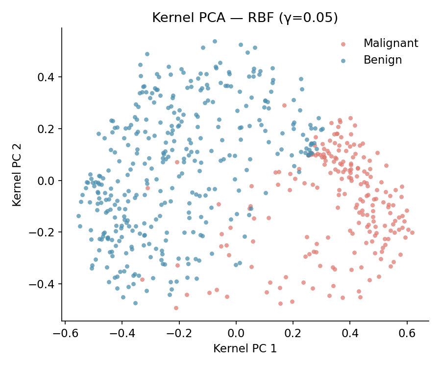
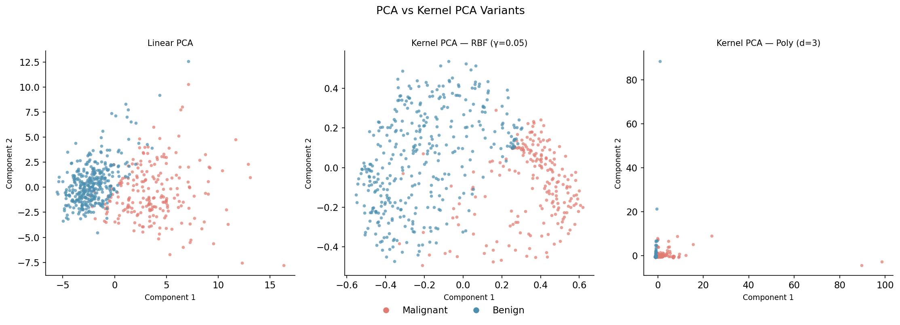
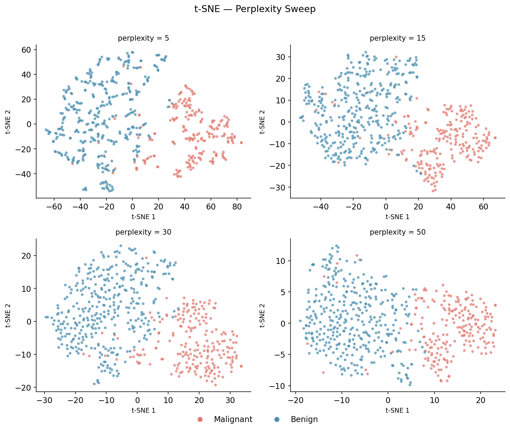
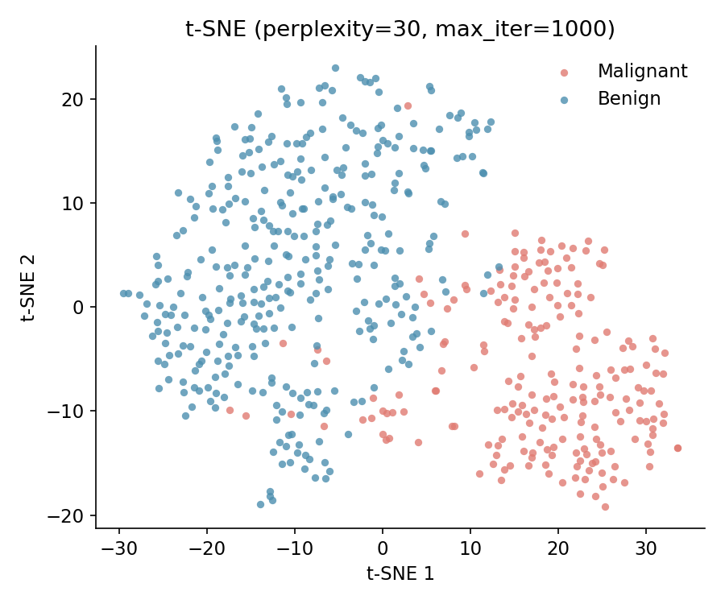
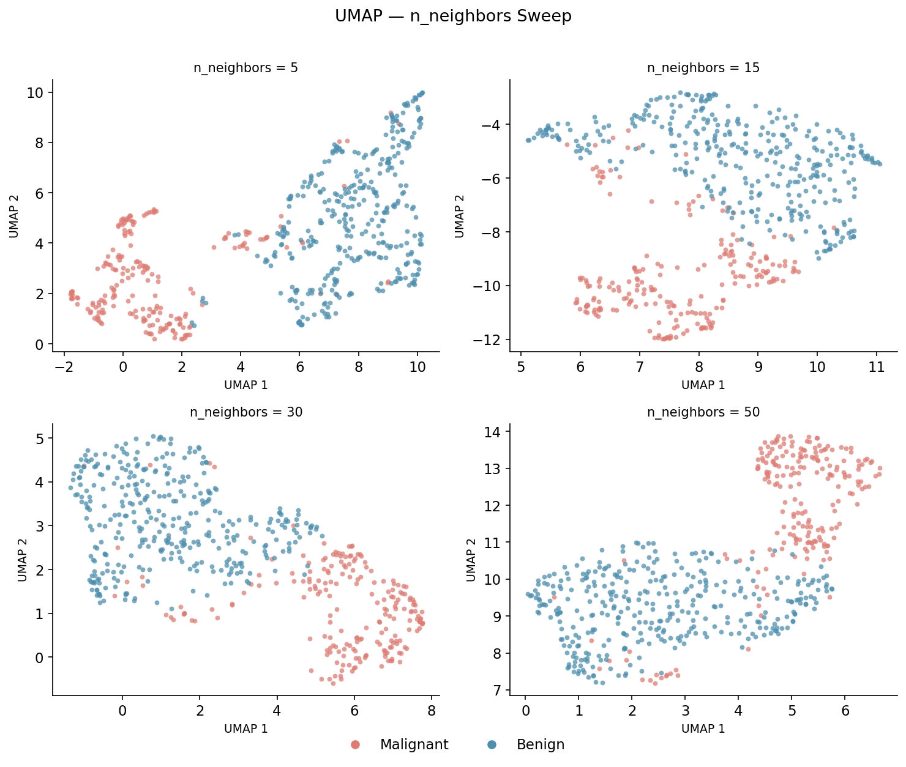
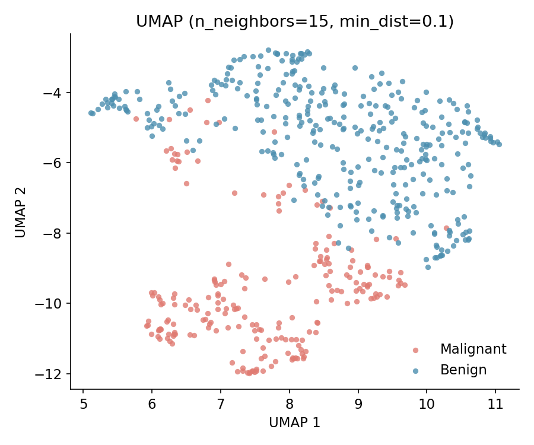
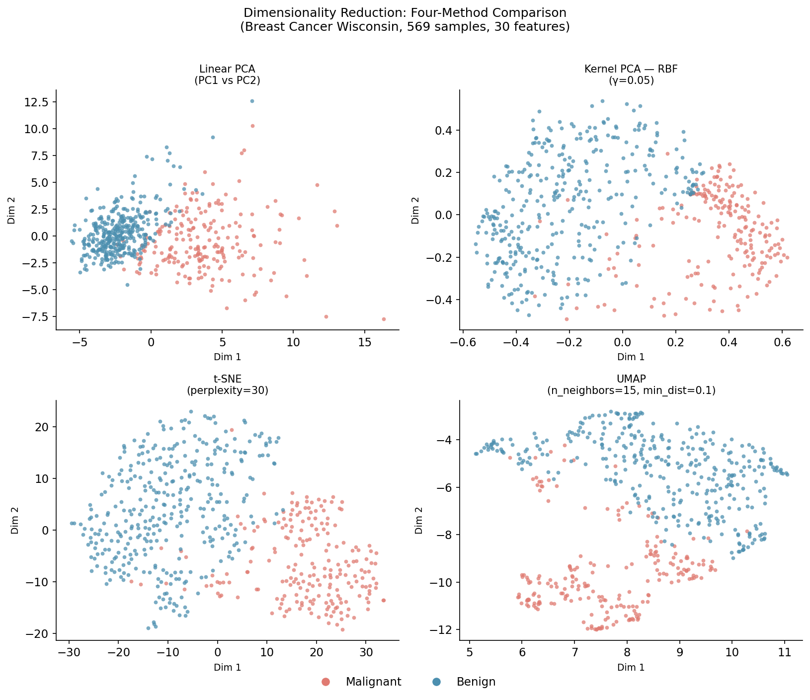

# Beyond Linear PCA: Kernel PCA, t-SNE, and UMAP

[Last week's post](blog_pca_2026-03-20.md) showed that linear PCA can compress the 30-feature Breast Cancer Wisconsin dataset into 6 principal components while retaining 88.8% of the total variance. The separation between malignant and benign tumours was already visible in just the first two PCs — a straight-line boundary nearly captures it.

That worked because the relevant structure in this dataset is largely linear. But most datasets are not that cooperative. Consider a Swiss roll: a 2D manifold coiled through 3D space. The Euclidean distance between two points on opposite sides of the roll is small, but the *geodesic* distance along the manifold is large. Linear PCA sees only Euclidean distances and will fold the roll flat in a way that mixes up nearby and far-away points. To unroll it correctly, you need a method that understands the local geometry.

This post covers three such methods — Kernel PCA, t-SNE, and UMAP — each with a different answer to the question: *what structure should a good low-dimensional embedding preserve?*

The dataset is the same: 569 tumour samples, 30 standardized features, binary malignant/benign outcome. The goal here is purely visualization (2D projections), not building a pipeline for a downstream classifier.

---

## The Dataset

Same data as last week. Load and standardize with:

```python
from sklearn.datasets import load_breast_cancer
from sklearn.preprocessing import StandardScaler

bc = load_breast_cancer()
X_raw = bc.data        # (569, 30)
y     = bc.target      # 0 = malignant, 1 = benign

scaler   = StandardScaler()
X_scaled = scaler.fit_transform(X_raw)
```

After `StandardScaler`, every feature has mean 0 and variance 1. All three methods below operate on `X_scaled`.

---

## Kernel PCA

### The Intuition

Linear PCA finds directions of maximum variance in the original feature space. If the decision boundary is curved — or if the clusters live on a nonlinear manifold — a straight-line rotation can never fully separate them.

The kernel trick offers an elegant escape: *implicitly* map the data into a higher-dimensional (possibly infinite-dimensional) feature space $\mathcal{F}$ via a mapping $\phi : \mathbb{R}^p \to \mathcal{F}$, and run PCA there. In this lifted space, nonlinear structure in the original space may become linear — just as a bent wire looks straight when viewed along the right axis in 3D.

The trick is that you never compute $\phi(x)$ explicitly. Instead, you compute only inner products in $\mathcal{F}$:

$$k(x_i, x_j) = \langle \phi(x_i),\, \phi(x_j) \rangle_{\mathcal{F}}$$

This is the *kernel function*. As long as $k$ satisfies Mercer's condition (positive semi-definiteness), there exists some $\phi$ that realizes it — even if you never write it down.

### The Math

**Step 1 — Build the kernel matrix.**
Evaluate $k$ at every pair of training samples. The result is the $n \times n$ *kernel matrix* (also called the Gram matrix):

$$K_{ij} = k(x_i, x_j), \quad K \in \mathbb{R}^{n \times n}$$

$K$ is symmetric and positive semi-definite by construction.

**Step 2 — Centre in feature space.**
PCA requires zero-mean data. The mean of the $\phi$-images is $\mu_\phi = \frac{1}{n}\sum_i \phi(x_i)$, which you cannot compute directly. Instead, subtract the mean in kernel space via:

$$\tilde{K} = K - \mathbf{1}_n K - K \mathbf{1}_n + \mathbf{1}_n K \mathbf{1}_n$$

where $\mathbf{1}_n \in \mathbb{R}^{n \times n}$ is the matrix with every entry $1/n$. This is the kernel analogue of subtracting the column means from $X^*$.

**Step 3 — Eigendecomposition of $\tilde{K}$.**
The covariance in feature space is $C_\phi = \frac{1}{n} \sum_i \phi(x_i)\phi(x_i)^T$. Its eigenvectors can be expressed as linear combinations of the $\phi(x_i)$, which means the PCA problem in $\mathcal{F}$ reduces to an eigenvalue problem on the $n \times n$ centred kernel matrix:

$$\tilde{K} \alpha_k = n \lambda_k \alpha_k$$

Each $\alpha_k \in \mathbb{R}^n$ is the $k$th eigenvector of $\tilde{K}$, normalized so that $\lambda_k \|\alpha_k\|^2 = 1$.

**Step 4 — Project.**
The projection of a sample onto the $k$th kernel principal component is:

$$z_{ik} = \sum_{j=1}^{n} \alpha_{kj}\, \tilde{K}_{ij}$$

In matrix form, $Z = \tilde{K} A$ where $A$ has the $\alpha_k$ as columns. $Z \in \mathbb{R}^{n \times k}$ is the kernel PCA embedding.

Note what is absent: there is no concept of "explained variance ratio" analogous to linear PCA, because $\tilde{K}$'s eigenvalues reflect variance in the implicit feature space, not in the original $p$-dimensional input space. You also cannot project new (out-of-sample) points without computing their kernel values against all training samples, which costs $O(n)$ per new point.

### Common Kernels

| Kernel | Formula | Hyperparameters |
|--------|---------|----------------|
| RBF (Gaussian) | $\exp(-\gamma \|x_i - x_j\|^2)$ | $\gamma$ |
| Polynomial | $(\gamma\, x_i \cdot x_j + r)^d$ | $\gamma$, degree $d$, coef0 $r$ |
| Sigmoid | $\tanh(\gamma\, x_i \cdot x_j + r)$ | $\gamma$, coef0 $r$ |

The RBF kernel is the default starting point. Small $\gamma$ makes the Gaussian wide — every pair of points looks similar and the result resembles linear PCA. Large $\gamma$ makes it narrow — only immediate neighbours are similar, producing tight local clusters that may or may not reflect global class structure.

### Implementation

```python
from sklearn.decomposition import KernelPCA

# RBF kernel, γ = 0.05
kpca_rbf = KernelPCA(n_components=2, kernel='rbf', gamma=0.05, random_state=42)
Z_kpca_rbf = kpca_rbf.fit_transform(X_scaled)

# Polynomial kernel, degree = 3
kpca_poly = KernelPCA(n_components=2, kernel='poly', degree=3,
                      gamma=0.05, coef0=1, random_state=42)
Z_kpca_poly = kpca_poly.fit_transform(X_scaled)
```

Always sweep $\gamma$ (or degree) before committing. For the breast cancer dataset, $\gamma \approx 0.05$ gives clean separation; larger values start to shatter clusters.

### Results

The RBF kernel at $\gamma = 0.05$ produces a 2D embedding where the two classes are well separated:



Across kernels, the separation quality is similar, but the geometry of the boundary differs:



### Limitations

- **Memory:** The kernel matrix $K$ is $n \times n$. At $n = 10{,}000$ that is 100M entries — about 800 MB for float64. At $n = 100{,}000$ it is completely intractable.
- **No explained variance:** You cannot compute an EVR to decide how many components to keep.
- **Out-of-sample cost:** Projecting new points costs $O(n)$ per point (kernel evaluations against all training samples), unlike linear PCA's $O(p)$ matrix multiplication.
- **Kernel selection:** There is no principled way to choose the kernel without domain knowledge or cross-validation.

---

## t-SNE

### The Intuition

t-SNE (t-Distributed Stochastic Neighbour Embedding, van der Maaten & Hinton 2008) has a different objective than PCA: instead of preserving variance or distance globally, it preserves *local neighbourhood structure*. Points that are close in the high-dimensional space should be close in the low-dimensional space; distant points need not be faithfully represented.

The method defines a probability distribution over pairs of high-dimensional points (where nearby pairs have high probability) and a second distribution over pairs in the 2D embedding. It then moves the 2D points until the two distributions match as closely as possible. The name comes from the Student-$t$ distribution used for the low-dimensional affinities — a key design choice that prevents the "crowding problem" that plagued earlier SNE.

### The Math

**Step 1 — High-dimensional affinities.**
For each sample $x_i$, define the conditional probability that $x_i$ would pick $x_j$ as its neighbour:

$$p_{j|i} = \frac{\exp\!\left(-\|x_i - x_j\|^2 / 2\sigma_i^2\right)}{\displaystyle\sum_{k \neq i} \exp\!\left(-\|x_i - x_k\|^2 / 2\sigma_i^2\right)}$$

and set $p_{ii} = 0$. The bandwidth $\sigma_i$ is chosen separately for each $x_i$ by binary search so that the perplexity of $P_i$ equals the user-specified target:

$$\text{Perp}(P_i) = 2^{H(P_i)} = 2^{-\sum_j p_{j|i} \log_2 p_{j|i}}$$

Perplexity is the effective number of neighbours. Setting `perplexity=30` means each point's Gaussian is tuned so that it has about 30 effective neighbours — the bandwidth $\sigma_i$ will be larger in sparse regions and smaller in dense regions.

Symmetrize to get joint probabilities:

$$p_{ij} = \frac{p_{j|i} + p_{i|j}}{2n}$$

**Step 2 — Low-dimensional affinities.**
In the 2D embedding $\{y_i\}$, use a Student-$t$ distribution with one degree of freedom (a Cauchy distribution) instead of a Gaussian:

$$q_{ij} = \frac{\left(1 + \|y_i - y_j\|^2\right)^{-1}}{\displaystyle\sum_{k \neq l}\left(1 + \|y_k - y_l\|^2\right)^{-1}}$$

The heavy tails of the Student-$t$ allow dissimilar points to be modelled far apart in 2D without needing to map them exactly. This solves the crowding problem: in 2D there is not enough room to faithfully represent all moderate-distance neighbours, so the method lets them drift to the periphery instead of crowding every point into the centre.

**Step 3 — Minimise KL divergence.**
Find the 2D coordinates $\{y_i\}$ that minimise the total KL divergence between $P$ and $Q$:

$$C = \sum_i KL(P_i \| Q_i) = \sum_{i \neq j} p_{ij} \log \frac{p_{ij}}{q_{ij}}$$

This is minimised by gradient descent. The gradient for $y_i$ is:

$$\frac{\partial C}{\partial y_i} = 4 \sum_j (p_{ij} - q_{ij})(y_i - y_j)\!\left(1 + \|y_i - y_j\|^2\right)^{-1}$$

The $(p_{ij} - q_{ij})$ term acts as a spring constant: if $p_{ij} > q_{ij}$ (nearby in high-dim but far in low-dim), the gradient pulls $y_i$ toward $y_j$. If $p_{ij} < q_{ij}$ (close in low-dim but distant in high-dim), it pushes them apart.

The algorithm uses early exaggeration (multiplying all $p_{ij}$ by a constant for the first ~250 iterations) to form well-separated clusters before settling into the final layout.

### Key Hyperparameters

**Perplexity (5–50):** Controls the neighbourhood size. Low perplexity captures fine local structure; high perplexity produces a more globally consistent layout. *Always sweep before using a result.* The commonly cited default of 30 is a reasonable starting point, but the right value depends on your data.

**n_iter:** More iterations → more refined layout. 1000 is usually sufficient; 2000 helps on noisier data.

**learning_rate:** sklearn supports `learning_rate='auto'`, which sets it to $\max(n / \text{early\_exag\_factor},\, 200)$. Use this unless you have a reason not to.

**init='pca':** Initialize the 2D positions using linear PCA scores rather than random noise. This produces more reproducible and often better results.

### Perplexity Sweep

Before accepting any t-SNE result, sweep the perplexity:

```python
from sklearn.manifold import TSNE

for perp in [5, 15, 30, 50]:
    Z = TSNE(n_components=2, perplexity=perp, n_iter=1000,
             learning_rate='auto', init='pca',
             random_state=42).fit_transform(X_scaled)
```



At `perplexity=5` the embedding fragments into many small tight islands. At `perplexity=50` the two classes merge into a diffuse blob. `perplexity=30` gives the clearest two-cluster structure for this dataset.

### Final Result

```python
Z_tsne = TSNE(n_components=2, perplexity=30, n_iter=1000,
              learning_rate='auto', init='pca',
              random_state=42).fit_transform(X_scaled)
```



The two classes are well separated with a clear gap. The *relative distances between clusters* are not meaningful — t-SNE does not preserve global distances, only local neighbourhood structure. The size of a cluster and the gaps between clusters carry no quantitative information.

### Limitations

- **Distances are not interpretable:** Cluster sizes and inter-cluster gaps are artefacts, not signal.
- **Non-deterministic:** Different random seeds produce topologically similar but geometrically different layouts (use `random_state`; `init='pca'` also helps).
- **Slow:** $O(n^2)$ naively, $O(n \log n)$ with the Barnes-Hut approximation (used by sklearn above $n \approx 300$). Remains slow on very large datasets.
- **No out-of-sample projection:** You cannot call `transform()` on new points. Every new dataset requires a full refit.
- **Tuning required:** Results depend heavily on perplexity; blind use produces misleading visualizations.

---

## UMAP

### The Intuition

UMAP (Uniform Manifold Approximation and Projection, McInnes et al. 2018) is grounded in Riemannian geometry and algebraic topology, but the practical intuition is similar to t-SNE: preserve the local topology of the data, then find a 2D layout that matches it.

The key difference is in *what structure is modelled*. t-SNE uses a fixed Gaussian over Euclidean distances. UMAP models the data as a fuzzy topological graph, using a locally adaptive metric that corrects for varying data density. The result tends to preserve more global structure than t-SNE while being significantly faster and supporting out-of-sample projection via `transform()`.

### The Math

**Step 1 — Local metric.**
For each point $x_i$, find its $k$ nearest neighbours. Let $\rho_i$ be the distance to the *closest* neighbour (used to anchor the local scale). Define the membership strength of each edge $(x_i, x_j)$ in the high-dimensional fuzzy graph:

$$v_{j|i} = \exp\!\left(\frac{-(d(x_i, x_j) - \rho_i)}{\sigma_i}\right)$$

where $\sigma_i$ is chosen by binary search so that:

$$\sum_{j=1}^{k} v_{j|i} = \log_2 k$$

Subtracting $\rho_i$ ensures that the nearest neighbour always has membership strength 1 regardless of local density. Points in sparse regions get wider Gaussians (large $\sigma_i$); points in dense regions get narrow ones. This corrects for uneven density in a way that raw Euclidean distances cannot.

**Step 2 — Symmetrize.**
Combine the directed affinities into an undirected graph using the fuzzy union:

$$b_{ij} = v_{j|i} + v_{i|j} - v_{j|i} \cdot v_{i|j}$$

This is the probability that *at least one* of the directed edges $(i \to j)$ or $(j \to i)$ exists — the union rule for independent probabilities.

**Step 3 — Low-dimensional similarity.**
In the 2D embedding, model the similarity between points as:

$$w_{ij} = \left(1 + a\, \|y_i - y_j\|^{2b}\right)^{-1}$$

The constants $a$ and $b$ are fit so that the curve reaches approximately $0.5$ at distance `min_dist`. Larger `min_dist` → points spread out more; smaller `min_dist` → tighter clusters.

**Step 4 — Minimise cross-entropy.**
Find 2D coordinates that minimise the fuzzy set cross-entropy between the high-dim graph $B$ and the low-dim graph $W$:

$$\mathcal{L} = \sum_{i \neq j} \left[ b_{ij} \log \frac{b_{ij}}{w_{ij}} + (1 - b_{ij}) \log \frac{1 - b_{ij}}{1 - w_{ij}} \right]$$

This is minimised via stochastic gradient descent with *negative sampling*: for each positive edge (high $b_{ij}$), sample several random negative pairs to push apart. This keeps optimization at $O(n \log n)$ — much faster than t-SNE's full $O(n^2)$ pairwise computation.

### Key Hyperparameters

**n_neighbors:** The $k$ in "k nearest neighbours." Small values (5–10) capture tight local structure at the cost of global coherence; large values (30–50) emphasise global layout. Analogous to t-SNE's perplexity.

**min_dist:** Controls cluster tightness in the low-dimensional space. `min_dist=0.1` is a reasonable default.

**metric:** Euclidean by default, but any sklearn-compatible metric works — enabling UMAP on text or other non-Euclidean data.

### n_neighbors Sweep

```python
import umap

for nn in [5, 15, 30, 50]:
    Z = umap.UMAP(n_components=2, n_neighbors=nn, min_dist=0.1,
                  random_state=42).fit_transform(X_scaled)
```



At `n_neighbors=5`, the embedding fragments into many small local clusters. At `n_neighbors=50`, the global two-class structure is clear but local sub-clusters merge together. `n_neighbors=15` balances both.

### Final Result

```python
reducer = umap.UMAP(n_components=2, n_neighbors=15, min_dist=0.1, random_state=42)
Z_umap  = reducer.fit_transform(X_scaled)

# Project new samples without refitting:
# Z_new = reducer.transform(X_new_scaled)
```



UMAP produces tight, well-separated clusters. The malignant cluster shows internal sub-structure that t-SNE also suggests but that linear PCA obscures. Notably, `transform()` is available — you can project new, unseen samples into the same 2D space without a full refit.

---

## Four-Method Comparison

The same 569 tumours, four views:



- **Linear PCA:** Reasonable separation, interpretable axes (loadings on 30 original features), some overlap at the boundary.
- **Kernel PCA (RBF):** Slightly better separation via a nonlinear boundary. Axes lose interpretability.
- **t-SNE:** Most visually striking — two distinct blobs with a clear gap. But axes are arbitrary and inter-cluster distances are meaningless. Use only for exploration.
- **UMAP:** Tight clusters, faster than t-SNE, `transform()` support. A better default for both visualization and downstream use.

---

## When to Use Which

| Method | Use When |
|--------|----------|
| **Linear PCA** | Linear structure; need interpretable axes or explained variance; preprocessing for a downstream model |
| **Kernel PCA** | Suspected nonlinear structure; moderate $n$ (< 5K); need to project new points |
| **t-SNE** | Pure 2D/3D visualization; exploring cluster structure; $n$ < 50K; not for downstream ML |
| **UMAP** | Visualization *and* downstream tasks; large $n$; need `transform()` on new data; faster + more reproducible than t-SNE |

The single most important rule: **never use a t-SNE or UMAP plot as evidence that two groups are separable.** These methods will produce visually clean clusters even from random data if you tune the hyperparameters. Always validate with a quantitative measure (classification accuracy, silhouette score) on held-out data.

---

## Summary

| Property | PCA | Kernel PCA | t-SNE | UMAP |
|----------|-----|-----------|-------|------|
| Linear | Yes | No | No | No |
| Out-of-sample projection | $O(p)$ | $O(n)$ | No | Yes |
| Explained variance ratio | Yes | No | No | No |
| Interpretable axes | Yes | No | No | No |
| Cluster distances meaningful | Yes | Yes | No | Partially |
| Speed at large $n$ | Fast | Slow ($O(n^2)$ memory) | Slow | Fast |
| Main hyperparameter | $k$ components | kernel, $\gamma$ | perplexity | n_neighbors, min_dist |

The full working Jupyter notebook for this post — including perplexity and n_neighbors sweeps, timing comparison, and all saved plots — is available here: [Kernel_PCA_tSNE_UMAP_Example.ipynb](../code_examples/Kernel_PCA_tSNE_UMAP_Example.ipynb)
