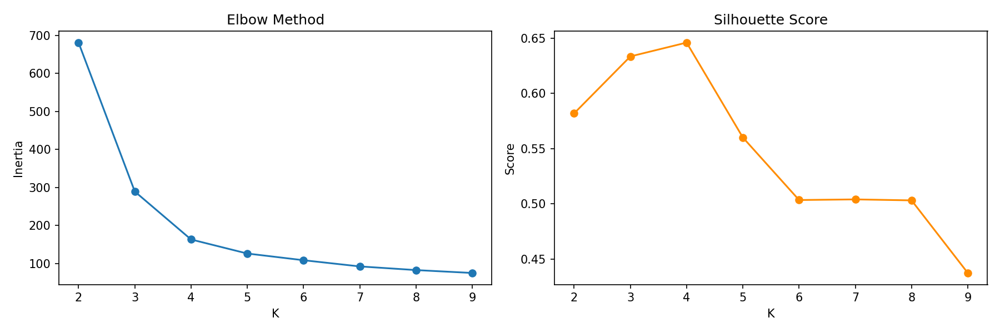

# A Practical Guide to K-Means Clustering

K-Means is one of the most widely used unsupervised machine learning algorithms, and for good reason: it is fast, interpretable, and conceptually straightforward. But "easy to run" does not mean "easy to use well." This post walks through how the algorithm works, how to initialize and tune it, how to apply it for classification tasks, and — critically — how to interpret what the resulting clusters actually mean.

---

## What K-Means Does (and Doesn't Do)

K-Means partitions a dataset into **K clusters** by minimizing the within-cluster sum of squared distances from each point to its cluster centroid. The key word is *unsupervised*: the algorithm has no knowledge of any true labels. It finds structure based purely on the geometry of the feature space.

This means K-Means does not "classify" in the supervised sense. It groups. The labels it produces are arbitrary integers (0, 1, 2, …) that have no inherent meaning until *you* assign them meaning by interpreting what each cluster represents.

---

## The Algorithm, Step by Step

1. Choose K (the number of clusters).
2. Initialize K centroids.
3. Assign each point to the nearest centroid (by Euclidean distance).
4. Recompute each centroid as the mean of all points assigned to it.
5. Repeat steps 3–4 until centroids stop moving (convergence).

The objective function being minimized is the **inertia** (within-cluster sum of squares, WCSS):

$$\text{Inertia} = \sum_{j=1}^{k} \sum_{x_i \in S_j} \| x_i - \mu_j \|^2$$

where:
- k is the number of clusters
- $S_j$ is the set of data points in cluster $j$
- $x_i$ is a specific data point
- $\mu_j$ is the centroid (mean) of cluster $S_j$.
- $\| x_i - \mu_j \|^2$ is the squared Euclidean distance between a point and its center.

---

## Basic Implementation in Python

```python
import numpy as np
import pandas as pd
from sklearn.cluster import KMeans
from sklearn.preprocessing import StandardScaler
import matplotlib.pyplot as plt
import seaborn as sns

# Load and scale your data
df = pd.read_csv("data.csv")
features = ["feature_1", "feature_2", "feature_3"]

X = df[features].values
scaler = StandardScaler()
X_scaled = scaler.fit_transform(X)

# Fit K-Means with K=4
kmeans = KMeans(n_clusters=4, random_state=42, n_init=10)
kmeans.fit(X_scaled)

# Assign cluster labels back to the dataframe
df["cluster"] = kmeans.labels_
```

> **Always scale your features before running K-Means.** Because the algorithm uses Euclidean distance, features with large numeric ranges (e.g., income in dollars vs. age in years) will dominate the distance calculation. `StandardScaler` centers each feature to mean 0, standard deviation 1.

---

## Initialization Methods

How centroids are seeded at the start matters enormously. Poor initialization can trap the algorithm in a local optimum.

### Random Initialization (`init='random'`)

K random data points are chosen as the starting centroids. This is fast but unreliable — you can end up with centroids clustered together, leaving large regions of the space with no centroid nearby.

```python
kmeans_random = KMeans(n_clusters=4, init='random', n_init=10, random_state=42)
kmeans_random.fit(X_scaled)
```

### K-Means++ (`init='k-means++'`) — The Default and the Right Choice

K-Means++ selects the first centroid at random, then selects each subsequent centroid with probability proportional to its squared distance from the nearest already-chosen centroid. This spreads the initial centroids out across the data, dramatically reducing the chance of a bad local minimum.

```python
# k-means++ is the sklearn default
kmeans_pp = KMeans(n_clusters=4, init='k-means++', n_init=10, random_state=42)
kmeans_pp.fit(X_scaled)
```

The `n_init` parameter controls how many times the algorithm is run with different seeds. The best result (lowest inertia) is kept. Set it to at least 10 — the sklearn default.

### Mini-Batch K-Means (for large datasets)

For datasets with millions of rows, standard K-Means becomes slow because each iteration requires computing distances from every point to every centroid. `MiniBatchKMeans` uses random subsets (mini-batches) for centroid updates, trading a small amount of accuracy for a large speedup.

```python
from sklearn.cluster import MiniBatchKMeans

kmeans_mb = MiniBatchKMeans(n_clusters=4, batch_size=1024, random_state=42)
kmeans_mb.fit(X_scaled)
```

---

## Choosing K: The Elbow Method and Silhouette Score

Selecting the right K is the hardest part. There is no universally correct answer, but two tools together give a strong signal.

### The Elbow Method

Plot inertia against K. As K increases, inertia always decreases (more clusters = tighter fit). Look for an "elbow" — a point where the rate of decrease sharply slows. That inflection point is a good candidate for K.

```python
inertias = []
k_range = range(2, 12)

for k in k_range:
    km = KMeans(n_clusters=k, init='k-means++', n_init=10, random_state=42)
    km.fit(X_scaled)
    inertias.append(km.inertia_)

plt.figure(figsize=(8, 4))
plt.plot(k_range, inertias, marker='o')
plt.xlabel("Number of clusters (K)")
plt.ylabel("Inertia (WCSS)")
plt.title("Elbow Method")
plt.xticks(k_range)
plt.tight_layout()
plt.show()
```

### Silhouette Score

The silhouette score measures how similar a point is to its own cluster compared to other clusters. It ranges from -1 (wrong cluster) to +1 (well-matched). Higher is better, and the peak across K values indicates the most cohesive, well-separated clustering.

```python
from sklearn.metrics import silhouette_score

silhouette_scores = []

for k in k_range:
    km = KMeans(n_clusters=k, init='k-means++', n_init=10, random_state=42)
    labels = km.fit_predict(X_scaled)
    score = silhouette_score(X_scaled, labels)
    silhouette_scores.append(score)

plt.figure(figsize=(8, 4))
plt.plot(k_range, silhouette_scores, marker='o', color='darkorange')
plt.xlabel("Number of clusters (K)")
plt.ylabel("Silhouette Score")
plt.title("Silhouette Analysis")
plt.xticks(k_range)
plt.tight_layout()
plt.show()
```

Use the elbow and silhouette plots together. If both point to K=4, that is strong evidence. If they disagree, consider domain knowledge to break the tie.



---

## Optimization Strategies

Beyond initialization and K selection, a few other levers improve results.

### 1. Feature Engineering and Selection

K-Means in high dimensions suffers from the *curse of dimensionality* — distances lose meaning when there are many features. Before clustering:

- Drop redundant or highly correlated features.
- Apply PCA to reduce dimensionality while preserving variance.

```python
from sklearn.decomposition import PCA

pca = PCA(n_components=0.95)  # retain 95% of variance
X_pca = pca.fit_transform(X_scaled)

kmeans = KMeans(n_clusters=4, init='k-means++', n_init=10, random_state=42)
kmeans.fit(X_pca)
```

### 2. Handling Outliers

K-Means is sensitive to outliers because they pull centroids toward them. Before clustering, identify and either remove or cap extreme values. `IQR`-based capping is a common approach.

```python
# Cap outliers at 1.5 * IQR
Q1 = df[features].quantile(0.25)
Q3 = df[features].quantile(0.75)
IQR = Q3 - Q1
df_clipped = df[features].clip(lower=Q1 - 1.5 * IQR, upper=Q3 + 1.5 * IQR, axis=1)
```

### 3. Multiple Runs and Convergence Tolerance

Set `n_init` high enough (10–20) and `tol` low enough that the algorithm converges fully rather than stopping early.

```python
kmeans = KMeans(
    n_clusters=4,
    init='k-means++',
    n_init=20,
    max_iter=500,
    tol=1e-5,
    random_state=42
)
kmeans.fit(X_scaled)
```

---

## Using K-Means for Classification

This is where practitioners get confused. K-Means is an unsupervised method — it does not use labels during training. But you can use it in a classification workflow in two distinct ways:

### Method 1: Cluster-Then-Label (Exploratory / Semi-Supervised)

Run K-Means on unlabeled data, then manually inspect each cluster and assign a meaningful label based on what the cluster represents. This is the most common use case for customer segmentation, anomaly detection, and market research.

```python
# After fitting, inspect cluster statistics
cluster_profiles = df.groupby("cluster")[features].mean()
print(cluster_profiles)
```

Once you have assigned human-readable names to the clusters, map them:

```python
cluster_names = {
    0: "High-value frequent buyers",
    1: "Occasional browsers",
    2: "Lapsed customers",
    3: "New users"
}
df["segment"] = df["cluster"].map(cluster_names)
```

### Method 2: Cluster Centroids as a Classifier (Nearest-Centroid Classification)

After fitting K-Means on training data, you can classify new, unseen points by assigning them to the nearest centroid. This is essentially what `kmeans.predict()` does.

```python
# Fit on training data
kmeans.fit(X_train_scaled)

# Predict cluster for new observations
new_data_scaled = scaler.transform(new_data[features].values)
predicted_clusters = kmeans.predict(new_data_scaled)
```

This is useful when you want to assign new customers, documents, or records to a pre-established segmentation scheme without re-running the full algorithm.

---

## Interpreting Cluster Results

Running the algorithm is the easy part. Knowing what the clusters *mean* is the whole point. Here is a systematic approach.

### Step 1: Profile Each Cluster

Compute the mean (and optionally median and standard deviation) of each feature by cluster. This tells you what the "average member" of each cluster looks like.

```python
profile = df.groupby("cluster")[features].agg(["mean", "median", "std"])
print(profile.round(2))
```

### Step 2: Identify Distinguishing Features

Not every feature will differ meaningfully across clusters. Use ANOVA or variance analysis to find which features drive the most separation.

```python
from scipy.stats import f_oneway

for feature in features:
    groups = [df.loc[df["cluster"] == k, feature].values for k in range(4)]
    f_stat, p_val = f_oneway(*groups)
    print(f"{feature}: F={f_stat:.2f}, p={p_val:.4f}")
```

Features with low p-values (< 0.05) differ significantly across clusters and are the most useful for labeling.

### Step 3: Visualize the Clusters

If you have more than two features, reduce to 2D with PCA or UMAP for visualization.

```python
from sklearn.decomposition import PCA

pca_viz = PCA(n_components=2)
X_2d = pca_viz.fit_transform(X_scaled)

plt.figure(figsize=(8, 6))
scatter = plt.scatter(X_2d[:, 0], X_2d[:, 1], c=df["cluster"], cmap="tab10", alpha=0.6, s=20)
plt.colorbar(scatter, label="Cluster")
plt.xlabel("PC1")
plt.ylabel("PC2")
plt.title("K-Means Clusters (PCA projection)")
plt.tight_layout()
plt.show()
```

A well-formed clustering will show clearly separated blobs. Overlapping or diffuse blobs suggest K may be wrong, or that K-Means is not the right algorithm for this data.


### Step 4: Assign Meaningful Labels

Based on the profiles and distinguishing features, write a plain-language description of each cluster. Good labels are:

- **Specific**: "High spenders with low recency" not just "good customers"
- **Based on data**: Derived from the actual centroid statistics, not wishful thinking
- **Actionable**: They should suggest what to *do* with that segment

```python
# Example label assignment informed by cluster profiles
label_map = {
    0: "Champions",         # high frequency, high spend, recent
    1: "At-Risk",           # previously active, now lapsed
    2: "Promising",         # recent, low spend so far
    3: "Hibernating"        # low recency, low frequency
}
df["label"] = df["cluster"].map(label_map)
```

---

## A Full End-to-End Example

```python
import os
import numpy as np
import pandas as pd
from sklearn.cluster import KMeans
from sklearn.preprocessing import StandardScaler
from sklearn.metrics import silhouette_score
from sklearn.decomposition import PCA
from scipy.stats import f_oneway
import matplotlib.pyplot as plt

# --- Output directory ---
os.makedirs("plots", exist_ok=True)

# --- Load data ---
df = pd.read_csv("customers.csv")
features = ["recency_days", "frequency", "monetary_value"]

# --- Scale ---
scaler = StandardScaler()
X = scaler.fit_transform(df[features])

# --- Select K ---
k_range = range(2, 10)
inertias, scores = [], []

for k in k_range:
    km = KMeans(n_clusters=k, init='k-means++', n_init=10, random_state=42)
    labels = km.fit_predict(X)
    inertias.append(km.inertia_)
    scores.append(silhouette_score(X, labels))

fig, axes = plt.subplots(1, 2, figsize=(12, 4))
axes[0].plot(k_range, inertias, marker='o')
axes[0].set_title("Elbow Method")
axes[0].set_xlabel("K")
axes[0].set_ylabel("Inertia")
axes[1].plot(k_range, scores, marker='o', color='darkorange')
axes[1].set_title("Silhouette Score")
axes[1].set_xlabel("K")
axes[1].set_ylabel("Score")
plt.tight_layout()
plt.savefig("plots/kmeans_k_selection.png", dpi=150)
plt.show()
plt.close()

# --- Fit final model with chosen K ---
K_FINAL = 4
kmeans = KMeans(n_clusters=K_FINAL, init='k-means++', n_init=20, random_state=42)
df["cluster"] = kmeans.fit_predict(X)

# --- Profile ---
print(df.groupby("cluster")[features].mean().round(2))

# --- Identify distinguishing features ---
print("\nANOVA — feature importance across clusters:")
for feature in features:
    groups = [df.loc[df["cluster"] == k, feature].values for k in range(K_FINAL)]
    f_stat, p_val = f_oneway(*groups)
    significance = "***" if p_val < 0.001 else "**" if p_val < 0.01 else "*" if p_val < 0.05 else ""
    print(f"  {feature:20s}  F={f_stat:8.2f}  p={p_val:.4f}  {significance}")

# --- Visualize ---
X_2d = PCA(n_components=2).fit_transform(X)
plt.figure(figsize=(8, 6))
plt.scatter(X_2d[:, 0], X_2d[:, 1], c=df["cluster"], cmap="tab10", alpha=0.6, s=20)
plt.title("Customer Segments (PCA)")
plt.tight_layout()
plt.savefig("plots/kmeans_customer_segments_pca.png", dpi=150)
plt.show()
plt.close()

# --- Label ---
label_map = {0: "Champions", 1: "At-Risk", 2: "Promising", 3: "Hibernating"}
df["segment"] = df["cluster"].map(label_map)
print(df["segment"].value_counts())
```

The full working Jupyter notebook for this example — including all outputs and plots — is available here: [K-Means_Example.ipynb](../code_examples/K-Means_Example.ipynb)

The synthetic RFM dataset used throughout this example can be downloaded here: [customers.csv](../code_examples/customers.csv)

---

## When K-Means Is Not the Right Tool

K-Means assumes clusters are:

- **Spherical** — similar variance in all directions
- **Roughly equal in size** — it tends to split large clusters and merge small ones
- **Linearly separable** — it cannot find clusters with complex, non-convex shapes

If your data has clusters that are elongated, crescent-shaped, or highly unequal in density, consider:

- **DBSCAN**: density-based, finds arbitrarily shaped clusters and explicitly marks outliers
- **Gaussian Mixture Models (GMM)**: soft assignments, handles elliptical clusters
- **Hierarchical clustering**: builds a dendrogram; no need to specify K upfront

---

## Summary

| Step | What to do |
|---|---|
| Preprocessing | Scale features; handle outliers; reduce dimensionality if needed |
| Initialization | Use `k-means++` with `n_init ≥ 10` |
| Choosing K | Elbow + silhouette + domain knowledge |
| Fitting | `KMeans.fit_predict()` |
| Profiling | `groupby("cluster").mean()` + ANOVA for feature importance |
| Visualization | PCA/UMAP scatter plot |
| Labeling | Write specific, data-driven, actionable names per cluster |

K-Means is a starting point, not a final answer. The value is not in the algorithm — it is in the interpretation. Run it, profile the clusters carefully, and let the data tell you what the segments mean.
