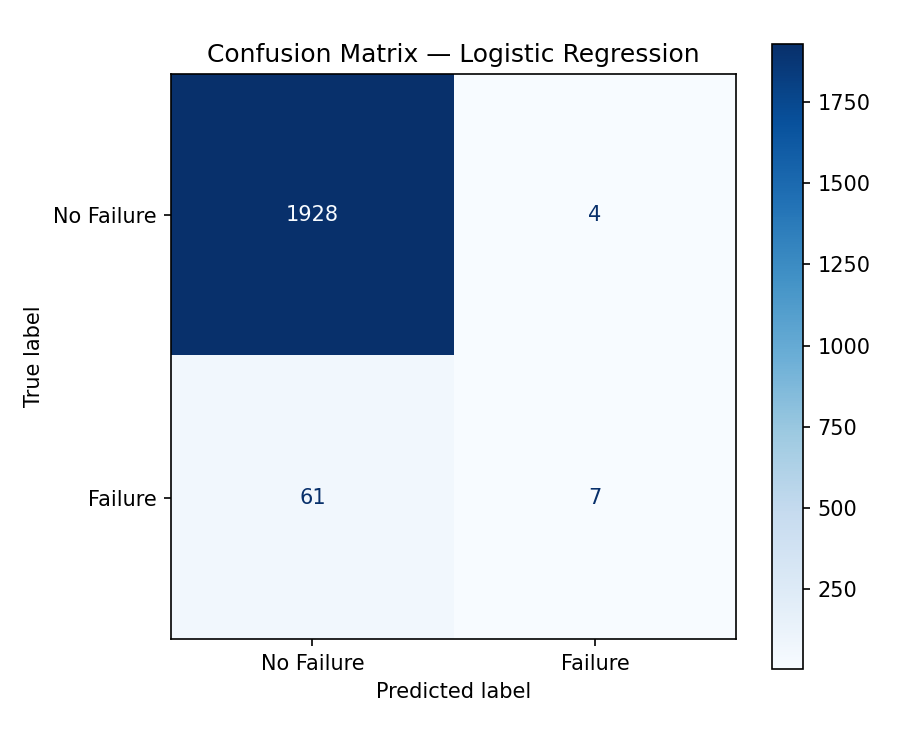
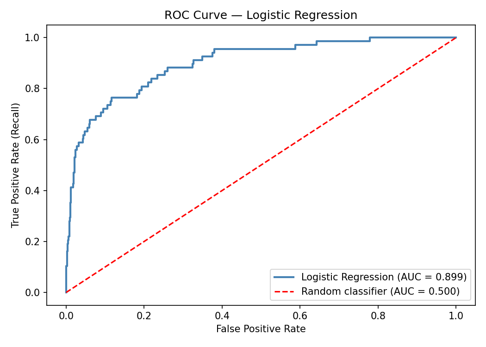
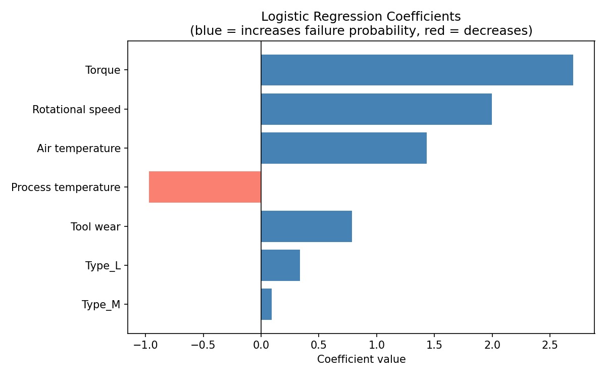
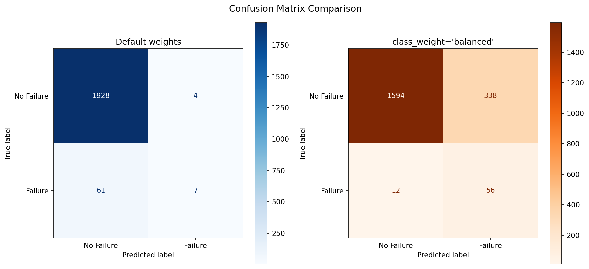

# Logistic Regression in Python: A Step-by-Step Guide

Logistic regression is one of the best algorithms to learn first in supervised machine learning. It is fast, interpretable, and mathematically principled — and despite its name, it is a *classification* algorithm, not a regression one. Given a set of input features, it predicts the probability that an observation belongs to one of two classes.

In this post, we will build a complete binary classification pipeline in Python using scikit-learn. We will predict **machine failure** from sensor readings using the [AI4I 2020 Predictive Maintenance Dataset](https://archive.ics.uci.edu/dataset/601/ai4i+2020+predictive+maintenance+dataset) published on the UCI Machine Learning Repository. Along the way, we will cover every step from raw data to a fully evaluated model, including a section on interpreting what the model actually learned.

---

## How Logistic Regression Works

Linear regression predicts a continuous value. Logistic regression wraps that linear combination in a function that squashes any real number into the range $(0, 1)$ — the **sigmoid function**:

$$\sigma(z) = \frac{1}{1 + e^{-z}}$$

where $z = \beta_0 + \beta_1 x_1 + \beta_2 x_2 + \cdots + \beta_n x_n$ is the familiar linear combination of input features. The output $\sigma(z)$ is interpreted as the probability that the observation belongs to the positive class.

To make a hard prediction, we apply a decision threshold (usually 0.5):

$$\hat{y} = 1 \text{ if } \sigma(z) \geq 0.5, \text{ else } 0$$

The model is trained by finding the coefficients $\beta$ that maximize the likelihood of the observed labels — a process called **maximum likelihood estimation**, solved iteratively by gradient descent.

---

## The Dataset: AI4I 2020 Predictive Maintenance

This dataset simulates a manufacturing environment where industrial machines produce parts at three quality levels: Low (L), Medium (M), and High (H). Each row records one production run with five sensor readings:

| Feature | Description |
|---|---|
| `Type` | Product quality level: L, M, or H |
| `Air temperature [K]` | Ambient air temperature in Kelvin |
| `Process temperature [K]` | Machine process temperature in Kelvin |
| `Rotational speed [rpm]` | Spindle rotation speed |
| `Torque [Nm]` | Torque applied during the operation |
| `Tool wear [min]` | Cumulative tool wear time in minutes |

The target variable is `Machine failure` — a binary label (0 = no failure, 1 = failure). About 3.4% of the 10,000 rows are failures, which is realistic for manufacturing data and will surface some important lessons about evaluation metrics.

---

## Step 1 — Loading the Dataset

We will use the `ucimlrepo` package to load the dataset directly — no manual download required.

```python
# pip install ucimlrepo
from ucimlrepo import fetch_ucirepo
import pandas as pd

# Fetch the AI4I 2020 Predictive Maintenance dataset (id=601)
dataset = fetch_ucirepo(id=601)

X_raw = dataset.data.features
y = dataset.data.targets["Machine failure"]

print(X_raw.shape)   # (10000, 6)
print(X_raw.head())
print(X_raw.dtypes)
```

The features DataFrame has 10,000 rows and 6 columns. Five columns are numeric; `Type` is a string column with values `'L'`, `'M'`, and `'H'` that we will need to encode.

---

## Step 2 — Preprocessing

### Check for Missing Values

```python
print(X_raw.isnull().sum())
```

This dataset has no missing values, so we can move straight to encoding and scaling.

### Encode the Categorical Column

Logistic regression cannot work with raw string values. We convert `Type` into numeric dummy variables using `pd.get_dummies`. The `drop_first=True` argument drops one of the three dummy columns to avoid the **dummy variable trap** (perfect multicollinearity):

```python
X_encoded = pd.get_dummies(X_raw, columns=["Type"], drop_first=True)
print(X_encoded.columns.tolist())
# ['Air temperature [K]', 'Process temperature [K]', 'Rotational speed [rpm]',
#  'Torque [Nm]', 'Tool wear [min]', 'Type_H', 'Type_L']
```

We now have two binary columns — `Type_H` and `Type_L` — with `Type_M` as the implicit baseline.

### Scale the Features

Logistic regression uses gradient descent internally. If features are on very different scales (e.g., temperature in the hundreds vs. a binary 0/1 flag), the gradient descent steps will be uneven and convergence will be slow or unstable. Feature scaling also makes the model's coefficients directly comparable in magnitude.

We use `StandardScaler`, which transforms each feature to have mean 0 and standard deviation 1:

```python
from sklearn.preprocessing import StandardScaler

scaler = StandardScaler()
X_scaled = scaler.fit_transform(X_encoded)

print(X_scaled.shape)  # (10000, 7)
```

> **Important:** We call `fit_transform` on the full feature set here for simplicity. In a production pipeline you would fit the scaler only on the training data and then `transform` the test data separately, to avoid data leakage.

---

## Step 3 — Separating Features and Target

```python
import numpy as np

X = X_scaled
y = y.values  # convert Series to numpy array

print("Feature matrix shape:", X.shape)   # (10000, 7)
print("Target distribution:")
print(pd.Series(y).value_counts())
# 0    9661
# 1     339
```

The target is binary: 0 means the machine ran without failure, 1 means a failure occurred. Only 339 out of 10,000 runs resulted in failure — roughly 3.4%. This imbalance is worth keeping in mind as we evaluate the model.

---

## Step 4 — Splitting into Training and Test Sets

We split the data into a training set (used to fit the model) and a test set (held out to evaluate it on unseen data). Using the test set for evaluation gives us an honest estimate of how the model will perform in the real world.

```python
from sklearn.model_selection import train_test_split

X_train, X_test, y_train, y_test = train_test_split(
    X, y,
    test_size=0.2,
    random_state=42,
    stratify=y
)

print("Training set size:", X_train.shape[0])   # 8000
print("Test set size:    ", X_test.shape[0])    # 2000
```

**Choosing a split ratio.** The 80/20 split is a common default. The right balance depends on dataset size:

- With a *small* dataset (a few hundred rows), you may want more test data (e.g., 70/30 or 60/40) to get a reliable estimate, and consider cross-validation.
- With a *large* dataset (tens of thousands of rows), you can afford a smaller test fraction (e.g., 90/10) because even 10% gives you plenty of samples to evaluate on.

At 10,000 rows, 80/20 is sensible.

**Why `stratify=y`?** With only 3.4% failures, a random split might accidentally give the test set very few — or very many — failure cases. `stratify=y` ensures the class distribution in both splits mirrors the original dataset. Without it, evaluation results could be misleadingly high or low depending on luck.

---

## Step 5 — Fitting the Model and Making Predictions

```python
from sklearn.linear_model import LogisticRegression
from sklearn.metrics import classification_report

model = LogisticRegression(max_iter=1000)
model.fit(X_train, y_train)

y_pred = model.predict(X_test)

print(classification_report(y_test, y_pred, target_names=["No Failure", "Failure"]))
```

**`max_iter=1000`** sets the maximum number of gradient descent iterations. The default is 100, which sometimes causes a convergence warning. Setting it higher lets the solver converge fully.

The `classification_report` prints a useful summary per class:

- **Precision** — of all predicted failures, what fraction actually failed?
- **Recall** — of all actual failures, what fraction did the model catch?
- **F1-score** — harmonic mean of precision and recall; useful when classes are imbalanced.

You will likely see high precision and moderate-to-low recall on the Failure class. This is common: when failures are rare, the model tends to be conservative about predicting them.

---

## Step 6 — Accuracy

Accuracy is the fraction of predictions the model got right:

$$\text{Accuracy} = \frac{TP + TN}{TP + TN + FP + FN}$$

where TP = True Positives, TN = True Negatives, FP = False Positives, and FN = False Negatives.

```python
from sklearn.metrics import accuracy_score

# Manual calculation
tp = ((y_pred == 1) & (y_test == 1)).sum()
tn = ((y_pred == 0) & (y_test == 0)).sum()
total = len(y_test)
manual_accuracy = (tp + tn) / total

# sklearn shorthand
sklearn_accuracy = accuracy_score(y_test, y_pred)

print(f"Manual accuracy:  {manual_accuracy:.4f}")
print(f"sklearn accuracy: {sklearn_accuracy:.4f}")
```

You will likely see an accuracy around 96–97%. Impressive — but misleading. A trivial model that predicts "no failure" for every single row would also achieve ~96.6% accuracy, because that is simply the proportion of non-failure rows in the dataset.

This is called the **accuracy paradox**, and it is exactly why we need the confusion matrix and ROC curve below.

---

## Step 7 — Confusion Matrix

The confusion matrix breaks predictions down into four cells:

|  | **Predicted: No Failure** | **Predicted: Failure** |
|---|---|---|
| **Actual: No Failure** | True Negative (TN) | False Positive (FP) |
| **Actual: Failure** | False Negative (FN) | True Positive (TP) |

For a predictive maintenance problem, **False Negatives are costly** — a machine fails without warning. **False Positives** trigger unnecessary maintenance but are less dangerous.

```python
import matplotlib.pyplot as plt
from sklearn.metrics import ConfusionMatrixDisplay

fig, ax = plt.subplots(figsize=(6, 5))
disp = ConfusionMatrixDisplay.from_predictions(
    y_test,
    y_pred,
    display_labels=["No Failure", "Failure"],
    cmap="Blues",
    ax=ax
)
ax.set_title("Confusion Matrix — Logistic Regression")
plt.tight_layout()
plt.savefig("../code_examples/plots/logistic_regression_confusion_matrix.png", dpi=150)
plt.show()
```



Look at how many actual failures (row "Failure") were predicted as "No Failure" — those False Negatives are the failures the model missed.

### Precision and Recall

Two metrics derived directly from the confusion matrix are especially useful when classes are imbalanced.

**Precision** answers: *of all the times the model predicted failure, how often was it right?*

$$\text{Precision} = \frac{TP}{TP + FP}$$

A low precision means the model is generating many false alarms — predicting failures that never happen.

**Recall** (also called **Sensitivity**) answers: *of all the actual failures, how many did the model catch?*

$$\text{Recall} = \frac{TP}{TP + FN}$$

A low recall means the model is missing real failures — the most dangerous outcome in a maintenance context.

These two metrics trade off against each other. Raising the decision threshold makes the model more conservative — it predicts fewer failures overall, so precision tends to rise but recall falls. Lowering the threshold does the opposite.

```python
from sklearn.metrics import precision_score, recall_score

precision = precision_score(y_test, y_pred)
recall = recall_score(y_test, y_pred)

# Manual equivalents from the confusion matrix
tp = ((y_pred == 1) & (y_test == 1)).sum()
fp = ((y_pred == 1) & (y_test == 0)).sum()
fn = ((y_pred == 0) & (y_test == 1)).sum()

manual_precision = tp / (tp + fp)
manual_recall    = tp / (tp + fn)

print(f"Precision — sklearn: {precision:.4f}  |  manual: {manual_precision:.4f}")
print(f"Recall    — sklearn: {recall:.4f}  |  manual: {manual_recall:.4f}")
```

> **Which matters more here?** For predictive maintenance, a missed failure (low recall) is typically worse than a false alarm (low precision). If your recall is unacceptably low, try `LogisticRegression(class_weight='balanced')` or lower the decision threshold using `predict_proba` rather than `predict`.

---

## Step 8 — ROC Curve and AUC

The ROC (Receiver Operating Characteristic) curve plots the **True Positive Rate** (recall) against the **False Positive Rate** as the decision threshold varies from 0 to 1. Instead of using the default 0.5 cutoff, we sweep through all possible thresholds and see how the trade-off between catching failures (TPR) and generating false alarms (FPR) changes.

The **AUC** (Area Under the Curve) is a single number summarizing this curve:

- **AUC = 0.5** — the model is no better than random guessing (diagonal line)
- **AUC = 1.0** — the model perfectly separates the two classes
- **AUC > 0.9** — generally considered excellent

```python
from sklearn.metrics import roc_curve, roc_auc_score

# Use predicted probabilities, not hard predictions
y_prob = model.predict_proba(X_test)[:, 1]

fpr, tpr, thresholds = roc_curve(y_test, y_prob)
auc_score = roc_auc_score(y_test, y_prob)

fig, ax = plt.subplots(figsize=(7, 5))
ax.plot(fpr, tpr, color="steelblue", lw=2, label=f"Logistic Regression (AUC = {auc_score:.3f})")
ax.plot([0, 1], [0, 1], color="red", linestyle="--", lw=1.5, label="Random classifier (AUC = 0.500)")
ax.set_xlabel("False Positive Rate")
ax.set_ylabel("True Positive Rate (Recall)")
ax.set_title("ROC Curve — Logistic Regression")
ax.legend(loc="lower right")
plt.tight_layout()
plt.savefig("../code_examples/plots/logistic_regression_roc_curve.png", dpi=150)
plt.show()

print(f"AUC Score: {auc_score:.4f}")
```



Note that we use `predict_proba` here, not `predict`. The ROC curve needs the *probability* of belonging to the positive class so it can sweep thresholds. `predict` only returns the hard 0/1 decision at the fixed 0.5 threshold.

---

## Step 9 — Interpreting the Coefficients

One of logistic regression's biggest advantages over more complex models is **interpretability**. Each coefficient $\beta_i$ tells us how much a one-unit increase in feature $x_i$ changes the log-odds of failure (holding all other features constant):

- **Positive coefficient** → the feature increases the probability of failure
- **Negative coefficient** → the feature decreases the probability of failure
- **Larger magnitude** → stronger influence on the prediction

Because we scaled our features, the coefficients are directly comparable in magnitude.

```python
feature_names = X_encoded.columns.tolist()
coefficients = model.coef_[0]

coef_df = pd.DataFrame({
    "Feature": feature_names,
    "Coefficient": coefficients
}).sort_values("Coefficient", key=abs, ascending=False)

print(coef_df.to_string(index=False))

fig, ax = plt.subplots(figsize=(8, 5))
colors = ["steelblue" if c > 0 else "salmon" for c in coef_df["Coefficient"]]
ax.barh(coef_df["Feature"], coef_df["Coefficient"], color=colors)
ax.axvline(0, color="black", linewidth=0.8)
ax.set_xlabel("Coefficient value")
ax.set_title("Logistic Regression Coefficients\n(blue = increases failure probability, red = decreases)")
ax.invert_yaxis()
plt.tight_layout()
plt.savefig("../code_examples/plots/logistic_regression_coefficients.png", dpi=150)
plt.show()
```



You will likely find **Torque** and **Tool wear** with the largest positive coefficients — physically sensible, since high torque stresses the machine and worn tools are more likely to fail. **Rotational speed** often carries a negative coefficient, meaning faster operations are correlated with *fewer* failures in this dataset (the machine may be running below failure-inducing load conditions at high speed).

> **Caveat:** Correlation is not causation. These coefficients describe linear relationships in the training data, not causal mechanisms. Domain knowledge is still essential for interpreting them correctly.

---

## Step 10 — Addressing Class Imbalance with Balanced Weights

Our dataset has roughly 29 non-failures for every failure. By default, logistic regression treats every misclassification equally — a missed failure and a false alarm cost the same. That is why our recall sits at just ~10%: the model learns that predicting "no failure" almost always pays off.

`class_weight='balanced'` corrects this by automatically weighting each class inversely proportional to its frequency. Rare classes (failures) receive a higher penalty for being missed, pushing the model to detect more of them at the cost of generating more false alarms.

```python
model_balanced = LogisticRegression(max_iter=1000, class_weight='balanced')
model_balanced.fit(X_train, y_train)

y_pred_balanced = model_balanced.predict(X_test)

print("=== Balanced model ===")
print(classification_report(y_test, y_pred_balanced, target_names=["No Failure", "Failure"]))

# Precision and Recall
from sklearn.metrics import precision_score, recall_score

prec_bal = precision_score(y_test, y_pred_balanced)
rec_bal  = recall_score(y_test, y_pred_balanced)
print(f"Precision: {prec_bal:.4f}")
print(f"Recall:    {rec_bal:.4f}")
```

```python
fig, axes = plt.subplots(1, 2, figsize=(12, 5))

ConfusionMatrixDisplay.from_predictions(
    y_test, y_pred,
    display_labels=["No Failure", "Failure"],
    cmap="Blues", ax=axes[0]
)
axes[0].set_title("Default weights")

ConfusionMatrixDisplay.from_predictions(
    y_test, y_pred_balanced,
    display_labels=["No Failure", "Failure"],
    cmap="Oranges", ax=axes[1]
)
axes[1].set_title("class_weight='balanced'")

plt.suptitle("Confusion Matrix Comparison", fontsize=13)
plt.tight_layout()
plt.savefig("../code_examples/plots/logistic_regression_balanced_comparison.png", dpi=150, bbox_inches="tight")
plt.show()
```



The side-by-side comparison makes the trade-off concrete. The balanced model pushes recall from **~10% to ~82%** — catching the vast majority of real failures — while precision drops from ~64% to ~14%, meaning more false alarms. Overall accuracy also drops from ~97% to ~82%, but that headline number was misleading to begin with. Whether the trade-off is acceptable depends entirely on the cost of each error type in your domain. For predictive maintenance, missing a real failure is almost always the worse outcome, so the balanced model is the more useful one here.

> **The key insight:** `class_weight='balanced'` does not make the model smarter. It tells the model which mistakes to *prioritize avoiding*. You are not getting better information — you are changing what "good" means during training.

---

## Conclusion

Here is what we covered end-to-end:

1. Loaded a real manufacturing dataset using `ucimlrepo`
2. Preprocessed it — encoding a categorical column, checking for nulls, and scaling features
3. Split the data into training and test sets with stratification to handle class imbalance
4. Fit a logistic regression model and generated predictions
5. Computed accuracy — and learned why it is misleading on imbalanced data
6. Visualized the confusion matrix and calculated precision and recall
7. Plotted the ROC curve and computed AUC for a threshold-independent evaluation
8. Interpreted the model's coefficients to understand what it learned
9. Retrained with `class_weight='balanced'` and compared the precision/recall trade-off

**Where to go from here:** You can push recall even further by lowering the decision threshold directly — use `model_balanced.predict_proba(X_test)[:, 1]` and apply a custom cutoff below 0.5 to catch more failures at the cost of more false alarms.

---

The full working Jupyter notebook for this example — including all outputs and plots — is available here: [Logistic_Regression_Example.ipynb](../code_examples/Logistic_Regression_Example.ipynb)
