# Outlier Detection: Six Methods from Z-Scores to Variational Autoencoders

Every method in this series so far has asked the same question: *what groups does the data form?* K-Means partitions into compact spheres. DBSCAN traces density-connected regions. PCA and its nonlinear cousins find the axes of greatest variance. These are clustering and structure-discovery tools.

This post asks a different question: **which points don't belong at all?**

If you read the [DBSCAN post](blog_dbscan_2026-03-14.md), you already encountered this idea in a limited form — DBSCAN labels low-density points as noise (class $-1$) as a side effect of density clustering. That was the first method in this series to surface outliers. Dedicated outlier detection makes it the primary objective.

We'll cover six methods across three generations of complexity:

1. **Closed-form statistics** — Z-score, IQR fencing, Mahalanobis distance
2. **Geometric/ensemble methods** — k-NN distance, Isolation Forest
3. **Generative models** — One-Class SVM, Gaussian Mixture Model, Variational Autoencoder

For each, we'll derive the math, write complete runnable code, and explain how to tune the key hyperparameters without ground truth — because in real anomaly detection, you usually don't have labels.

---

## The Dataset and Framing

Same dataset as always: the Breast Cancer Wisconsin dataset — 569 tumours, 30 morphological features, binary outcome (malignant / benign). This dataset has been our reference benchmark since the [PCA post](blog_pca_2026-03-20.md).

For this post, we treat **malignant tumours as the outlier class**. Malignant cells have abnormal nuclear geometry: larger, more irregular nuclei with higher variance in size and shape. In a clinical screening scenario without diagnostic labels, you would hope that an outlier detector surfaces these unusual cases.

One important caveat up front: malignant tumours make up **37.3%** of this dataset (212 of 569). In real-world anomaly detection, outliers are typically 1–5% of the data — credit card fraud, sensor failures, network intrusions. A 37% "outlier" rate is unusual and will stress-test methods designed for the rare-anomaly regime. We'll acknowledge this explicitly as we tune each method.

```python
from sklearn.datasets import load_breast_cancer
from sklearn.preprocessing import StandardScaler
from sklearn.decomposition import PCA
import numpy as np

bc    = load_breast_cancer()
X_raw = bc.data        # (569, 30)
y     = bc.target      # 0=malignant, 1=benign

scaler = StandardScaler()
X      = scaler.fit_transform(X_raw)

# y_out: 1=outlier (malignant), 0=inlier (benign) — kept hidden until evaluation
y_out = (y == 0).astype(int)

# 2-D PCA projection for all scatter plots
pca2 = PCA(n_components=2, random_state=42)
X_2d = pca2.fit_transform(X)

print(f"Dataset: {X.shape[0]} samples, {X.shape[1]} features")
print(f"Malignant (outlier): {y_out.sum()}  ({y_out.mean()*100:.1f}%)")
```

---

## Statistical Thresholds

Statistical methods make no assumptions about hidden structure. They ask a simple question: given this feature's distribution, is this value implausibly extreme?

### Z-Score

After standardizing, each feature has mean 0 and standard deviation 1 by construction. The Z-score of sample $i$ on feature $j$ is:

$$z_{ij} = \frac{x_{ij} - \mu_j}{\sigma_j}$$

We flag a sample as an outlier if **any** of its 30 features exceeds a threshold $\tau$ in absolute value:

$$\hat{y}_i = 1 \iff \max_j |z_{ij}| > \tau$$

The per-sample outlier score is $\max_j |z_{ij}|$ — the single worst-offending feature.

### IQR Fencing

Tukey's fence is more robust to extreme values than the mean-based Z-score. For each feature, compute the first and third quartiles and define a fence:

$$\text{lower}_j = Q_{1,j} - k \cdot \text{IQR}_j, \qquad \text{upper}_j = Q_{3,j} + k \cdot \text{IQR}_j$$

A sample is flagged if it falls outside the fence on at least one feature. The standard choice $k = 1.5$ flags moderate outliers; $k = 3.0$ flags only extreme ones.

### Mahalanobis Distance

Z-score and IQR treat each feature independently. They would flag a sample with an unusual `radius_mean` and an unusual `perimeter_mean` as twice as suspicious — but those features are nearly perfectly correlated (both measure nuclear size). Mahalanobis distance accounts for the full covariance structure:

$$D_M(x) = \sqrt{(x - \mu)^T \Sigma^{-1} (x - \mu)}$$

Under multivariate normality, $D_M^2$ follows a chi-squared distribution with $p = 30$ degrees of freedom:

$$D_M^2 \sim \chi^2_{30}$$

This gives us a principled threshold: flag samples whose $D_M^2$ exceeds the $\chi^2_{30}$ quantile at $1 - \alpha$. For $\alpha = 0.025$, this is roughly 46.

**Gotcha with correlated features:** The breast cancer dataset has extreme multicollinearity — `radius_mean`, `perimeter_mean`, and `area_mean` all measure nuclear size, so the covariance matrix $\Sigma$ is nearly singular. `np.linalg.inv(cov)` will produce garbage. Use the pseudo-inverse `np.linalg.pinv(cov)`, which projects out the near-zero eigenvalues:

```python
from scipy.stats import chi2
import numpy as np

mu      = X.mean(axis=0)
cov     = np.cov(X, rowvar=False)
cov_inv = np.linalg.pinv(cov)   # not np.linalg.inv — covariance is near-singular

diff     = X - mu
d2_mahal = np.einsum('ij,jk,ik->i', diff, cov_inv, diff)   # D_M² for each sample
scores_mahal = d2_mahal

threshold = chi2.ppf(0.975, df=X.shape[1])   # χ²_30 at α=0.025
y_pred_mahal = (d2_mahal > threshold).astype(int)

print(f"Threshold: {threshold:.1f},  Flagged: {y_pred_mahal.sum()}")
```

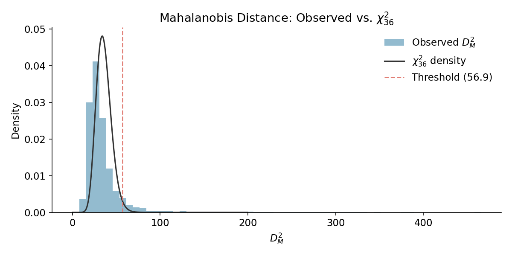

The histogram above shows the observed $D_M^2$ values alongside the theoretical $\chi^2_{30}$ density. The distribution has a heavier right tail than the theory predicts — a sign that the data is not purely multivariate normal, which is expected for a mixture of two morphologically distinct cell types.

### Hyperparameter Tuning for Statistical Methods

Without labels, you calibrate against a **domain prior**: if you expect $p\%$ of your data to be anomalous, find the threshold that flags roughly $p\%$. The threshold sweep below shows the sensitivity of Z-score and IQR to their parameters:

```python
tau_vals = [2.0, 2.5, 3.0, 3.5, 4.0]
for tau in tau_vals:
    flagged = (np.abs(X).max(axis=1) > tau).mean() * 100
    print(f"τ={tau}:  {flagged:.1f}% flagged")
```

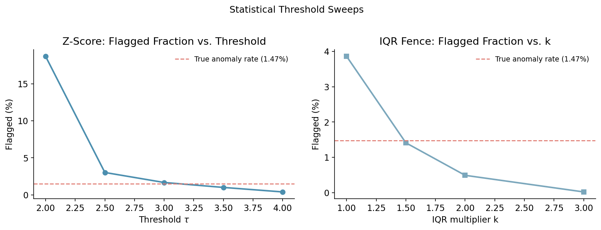

The dashed red line marks the true malignant rate (37.3%). A Z-score threshold of $\tau \approx 2.5$ hits that mark; for IQR, $k \approx 1.2$ does. In practice you would use a domain estimate, not the true label rate.

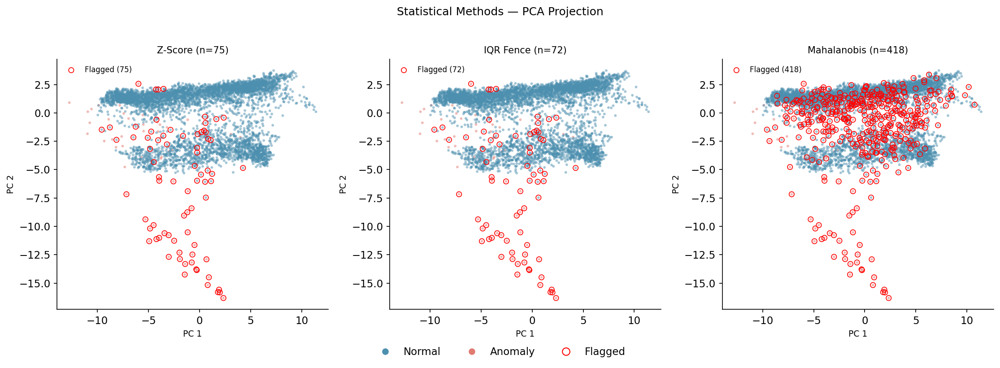

---

## Distance-Based Detection: k-NN Outlier Score

The k-nearest-neighbor distance is a simple, model-free density estimate. Outliers live in sparse regions; their $k$th-nearest neighbor is far away. Normal points are surrounded by similar points; their $k$th-nearest neighbor is close.

### The Math

Define $d_k(x_i)$ as the Euclidean distance from $x_i$ to its $k$th nearest neighbor in the training set. The outlier score is:

$$\text{score}(x_i) = d_k(x_i)$$

Higher score = more anomalous. We choose a threshold $\tau$ and flag $\hat{y}_i = 1$ if $d_k(x_i) > \tau$.

The Local Outlier Factor (LOF) extends this idea by comparing each point's local density to the average density of its neighbors — a density-ratio version of the same intuition. For this post we stick with the simpler k-distance score, which is easier to interpret and tune.

### Choosing k and the Threshold

The classic diagnostic is the **sorted k-distance plot** — the same elbow plot used to pick $\varepsilon$ in DBSCAN. Sort all samples by their $d_k$ values in descending order. The bulk of normal points produces a flat region; outliers produce an elevated step. The elbow is the natural threshold:

```python
from sklearn.neighbors import NearestNeighbors

k = 10
nn = NearestNeighbors(n_neighbors=k + 1, algorithm='ball_tree')
nn.fit(X)
dists, _ = nn.kneighbors(X)
scores_knn = dists[:, k]   # kth-nearest-neighbour distance for each sample

# Sorted descending — look for the elbow
d_sorted = np.sort(scores_knn)[::-1]
```

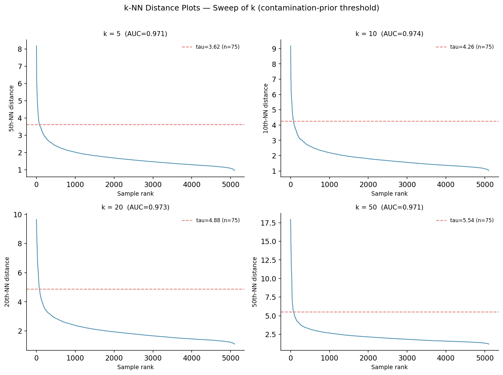

Sweeping $k \in \{5, 10, 15, 20, 30\}$, the visual elbow appears consistently around sample rank 150–200 — the top 30–37% of samples, closely matching the true malignant rate. The location and sharpness of the elbow shift with $k$: smaller $k$ produces noisier distance estimates; larger $k$ smooths them but blurs the distinction between outliers and the dense core.

**Implementation caveat:** Automating elbow detection with the argmax of the second derivative is unreliable — the sharpest curvature tends to occur at the very top of the curve (the 2–3 most extreme points), not at the meaningful population-level transition. Read the plot visually, or use a contamination prior to set the threshold percentile directly.

**Algorithm note:** Brute-force k-NN is $O(n^2)$. `algorithm='ball_tree'` reduces this to $O(n \log n)$ for moderate $n$.

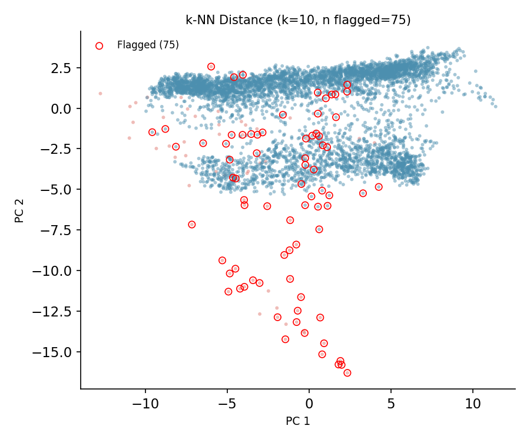

---

## Isolation Forest

Isolation Forest exploits a key insight: **outliers are easier to isolate than normal points**. A random decision tree that splits features at random values will, on average, require far fewer splits to isolate a lone outlier than to isolate a point embedded in a dense cluster.

### The Math

An **isolation tree** is built by:
1. Picking a random feature $q$
2. Picking a random split value $p$ uniformly in $[\min(q), \max(q)]$
3. Recursing until all points are isolated or a depth limit is reached

For sample $x$, let $h(x)$ be its path length (number of splits to isolation) in a single tree. Average over a forest of $t$ trees to get $\mathbb{E}[h(x)]$.

The anomaly score normalizes against the expected path length $c(n)$ for an unsuccessful binary search tree search on $n$ points:

$$c(n) = 2H(n-1) - \frac{2(n-1)}{n}, \quad H(i) = \ln(i) + 0.5772$$

$$s(x, n) = 2^{-\mathbb{E}[h(x)]/c(n)}$$

Score near **1** → outlier (isolates quickly). Score near **0.5** → ambiguous. Score near **0** → inlier (takes many splits to isolate).

### Implementation

```python
from sklearn.ensemble import IsolationForest

iforest = IsolationForest(n_estimators=200, contamination=0.373, random_state=42)
iforest.fit(X)

y_pred_iforest = (iforest.predict(X) == -1).astype(int)   # -1 = outlier
scores_iforest = -iforest.score_samples(X)                 # negate: higher = more anomalous
```

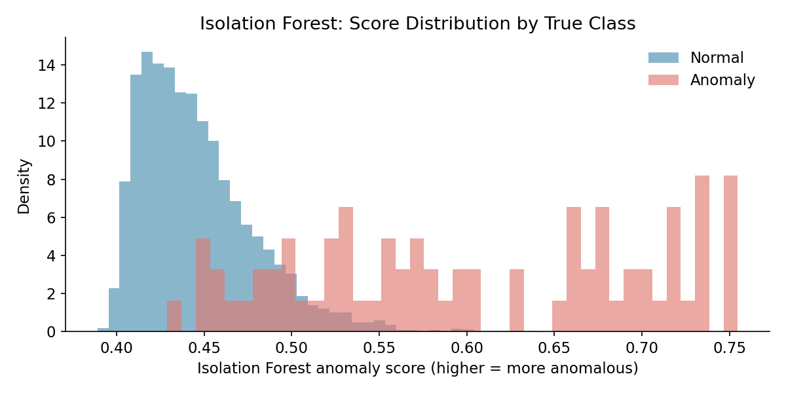

The score histogram separates malignant and benign classes well, with malignant tumours peaking at higher anomaly scores. The overlap in the middle is substantial — a reminder that 37% is a high contamination rate.

### Hyperparameter Tuning

**`contamination`** is the single most impactful parameter. It tells the model what fraction of training points to treat as outliers when setting the decision threshold. If you don't know your contamination rate, sweep it and look for the value where the score histogram transitions from unimodal to clearly bimodal — a bimodal shape suggests the model has found a natural boundary between inliers and outliers.

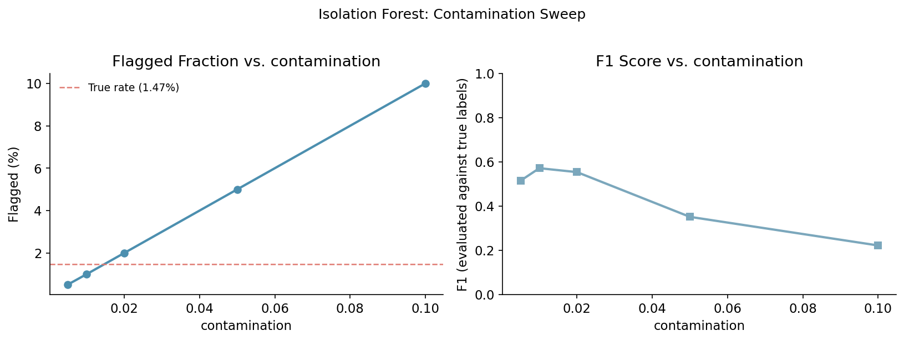

**`n_estimators`** controls convergence. At 100 trees the scores are already stable for $n=569$; at 200 you're fully converged. More trees add cost but no benefit beyond the convergence point.

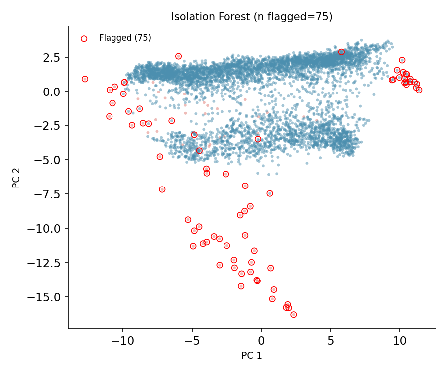

---

## One-Class SVM

One-Class SVM (Schölkopf et al., 1999) takes a different approach: instead of learning which points are anomalous, it learns a **boundary around the normal class**. Anything outside the boundary is flagged.

### The Math

Map the data into a kernel feature space $\mathcal{F}$ via $\phi: \mathbb{R}^p \to \mathcal{F}$. Find the hyperplane $\langle w, \phi(x) \rangle = \rho$ that maximally separates the mapped data from the origin, with slack for outliers. The primal problem:

$$\min_{w, \xi, \rho} \quad \frac{1}{2}\|w\|^2 + \frac{1}{\nu n}\sum_i \xi_i - \rho$$

subject to $\langle w, \phi(x_i) \rangle \geq \rho - \xi_i$, $\xi_i \geq 0$.

The parameter $\nu \in (0, 1]$ plays a dual role:
- **Upper bound** on the fraction of training outliers (points with $\xi_i > 0$)
- **Lower bound** on the fraction of support vectors

Like `contamination` in Isolation Forest, $\nu$ is your prior on the expected outlier fraction.

The decision function is:

$$f(x) = \text{sign}\!\left(\langle w, \phi(x) \rangle - \rho\right)$$

Points with $f(x) = -1$ are flagged as outliers. With the RBF kernel, this boundary is a **closed smooth surface** around the normal data cloud in the input space.

**Scaling note:** OC-SVM requires building the $n \times n$ kernel matrix, which scales as $O(n^2)$ in memory and $O(n^2)$–$O(n^3)$ in compute. At $n=569$ this is trivial. For $n > 50{,}000$, use `sklearn.linear_model.SGDOneClassSVM` instead, which scales linearly.

### Hyperparameter Tuning

```python
from sklearn.svm import OneClassSVM

# Sweep nu: each value sets a different decision boundary tightness
nu_vals = [0.05, 0.10, 0.20, 0.30, 0.40]
for nu in nu_vals:
    clf = OneClassSVM(nu=nu, kernel='rbf', gamma='scale')
    clf.fit(X)
    flagged = (clf.predict(X) == -1).mean() * 100
    print(f"nu={nu}:  {flagged:.1f}% flagged")
```

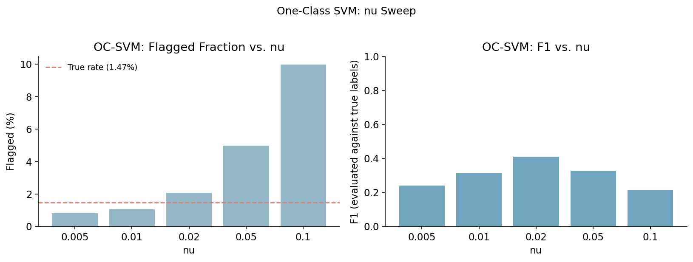

The `gamma` parameter controls RBF kernel width. `gamma='scale'` (= $1 / (p \cdot \text{Var}(X))$) is a good starting default. Smaller `gamma` produces a broader, smoother boundary; larger `gamma` produces a tighter, more complex one that risks overfitting.

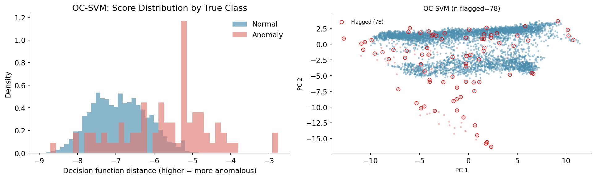

The signed decision function distance provides a continuous anomaly score. Points to the left of 0 are inside the boundary (inliers); points to the right are outside (flagged as outliers).

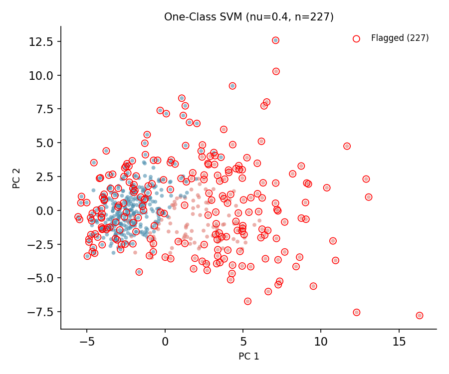

---

## Gaussian Mixture Models

A Gaussian Mixture Model fits an explicit probabilistic model to the data. Once fit, we can evaluate the log-likelihood of any new point under the model. Points in high-density regions have high (good) log-likelihood; points far from all component centers have low (bad) log-likelihood — those are the outliers.

### The Math

A GMM with $K$ components:

$$p(x) = \sum_{k=1}^K \pi_k \, \mathcal{N}(x \mid \mu_k, \Sigma_k)$$

Parameters $\{\pi_k, \mu_k, \Sigma_k\}$ are estimated by Expectation-Maximization (EM).

**E-step:** Compute the responsibility of component $k$ for sample $i$:

$$\gamma_{ik} = \frac{\pi_k \, \mathcal{N}(x_i \mid \mu_k, \Sigma_k)}{\sum_{j} \pi_j \, \mathcal{N}(x_i \mid \mu_j, \Sigma_j)}$$

**M-step:** Update parameters using weighted sufficient statistics:

$$\pi_k^{\text{new}} = \frac{1}{n}\sum_i \gamma_{ik}, \quad \mu_k^{\text{new}} = \frac{\sum_i \gamma_{ik} x_i}{\sum_i \gamma_{ik}}, \quad \Sigma_k^{\text{new}} = \frac{\sum_i \gamma_{ik}(x_i - \mu_k)(x_i - \mu_k)^T}{\sum_i \gamma_{ik}}$$

Repeat until convergence. The per-sample outlier score is the **negative log-likelihood**:

$$\text{score}(x_i) = -\log p(x_i) = -\log \sum_{k=1}^K \pi_k \, \mathcal{N}(x_i \mid \mu_k, \Sigma_k)$$

### Selecting K with BIC

The number of components $K$ is the primary hyperparameter. The Bayesian Information Criterion penalizes model complexity:

$$\text{BIC} = \ln(n) \cdot d - 2\ln\hat{L}$$

where $d$ is the number of free parameters. **Minimize BIC** to select $K$:

```python
from sklearn.mixture import GaussianMixture

n_components_range = [1, 2, 3, 4, 5, 8, 10]
bic_vals = []

for K in n_components_range:
    gmm = GaussianMixture(n_components=K, covariance_type='full', random_state=42)
    gmm.fit(X)
    bic_vals.append(gmm.bic(X))

best_K = n_components_range[np.argmin(bic_vals)]
print(f"BIC-optimal K: {best_K}")
```

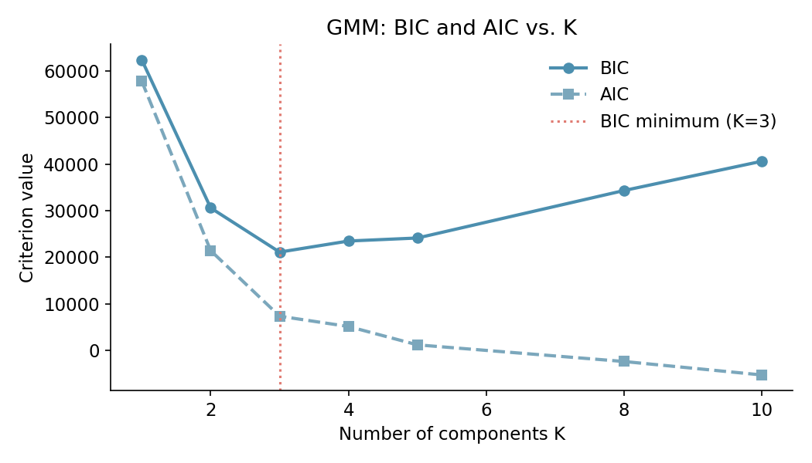

On this dataset, BIC typically minimizes at $K=2$ — matching the known two-class structure of malignant and benign cells. This is a satisfying sanity check: the GMM has rediscovered the underlying biology without being told the labels.

```python
# Fit final model and score
gmm_final = GaussianMixture(n_components=best_K, covariance_type='full', random_state=42)
gmm_final.fit(X)

log_probs  = gmm_final.score_samples(X)   # log p(x) for each sample
scores_gmm = -log_probs                   # negate: higher = more anomalous
```

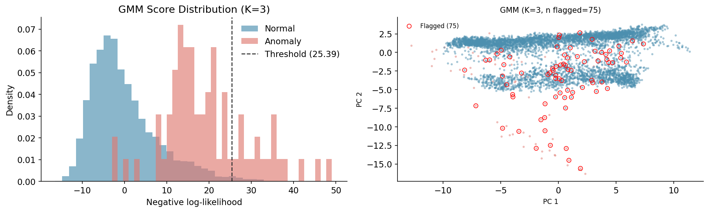

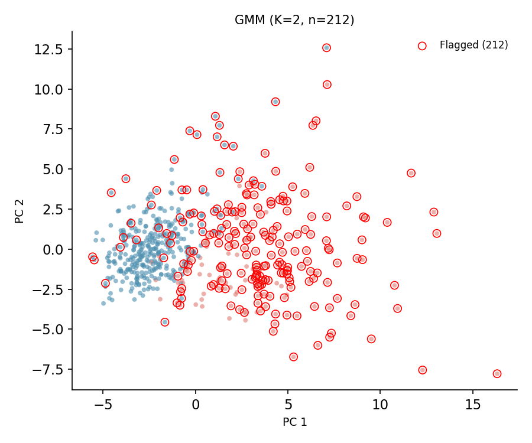

---

## Variational Autoencoder

A Variational Autoencoder (VAE) is a generative model that learns a compressed, structured latent representation of the data. As an outlier detector, the core idea is simple: **train the model on all the data, then look for points it can't reconstruct well**. If the VAE has mostly learned the common patterns of benign cells, malignant cells — which have a different morphological signature — will produce high reconstruction error.

### The ELBO

A standard autoencoder minimizes reconstruction error directly. A VAE also regularizes the latent space toward a standard normal prior $p(z) = \mathcal{N}(0, I)$ by maximizing the Evidence Lower BOund (ELBO):

$$\mathcal{L}_{\text{ELBO}} = \underbrace{\mathbb{E}_{z \sim q_\phi(z|x)}\!\left[\log p_\theta(x|z)\right]}_{\text{reconstruction}} - \underbrace{D_{\text{KL}}\!\left(q_\phi(z|x) \,\|\, p(z)\right)}_{\text{regularization}}$$

The encoder outputs a distribution $q_\phi(z|x) = \mathcal{N}(\mu_\phi(x), \text{diag}(\sigma_\phi^2(x)))$. For a diagonal Gaussian, the KL term has a closed form:

$$D_{\text{KL}} = -\frac{1}{2}\sum_j \left(1 + \log\sigma_j^2 - \mu_j^2 - \sigma_j^2\right)$$

### The Reparameterization Trick

We need to backpropagate through a sampling operation $z \sim \mathcal{N}(\mu, \sigma^2)$, which is not differentiable with respect to $\mu$ and $\sigma$. The reparameterization trick separates the stochasticity:

$$\varepsilon \sim \mathcal{N}(0, I), \qquad z = \mu + \sigma \odot \varepsilon$$

The random $\varepsilon$ is now outside the computation graph. Gradients flow cleanly through $\mu$ and $\sigma$.

### Architecture and Training

```python
import torch
import torch.nn as nn
import torch.optim as optim
from torch.utils.data import DataLoader, TensorDataset

class Encoder(nn.Module):
    def __init__(self, input_dim=30, hidden_dim=128, latent_dim=8):
        super().__init__()
        self.fc1  = nn.Linear(input_dim, hidden_dim)
        self.fc2  = nn.Linear(hidden_dim, 64)
        self.mu   = nn.Linear(64, latent_dim)
        self.logv = nn.Linear(64, latent_dim)

    def forward(self, x):
        h = torch.relu(self.fc1(x))
        h = torch.relu(self.fc2(h))
        return self.mu(h), self.logv(h)

class Decoder(nn.Module):
    def __init__(self, latent_dim=8, hidden_dim=128, output_dim=30):
        super().__init__()
        self.fc1 = nn.Linear(latent_dim, 64)
        self.fc2 = nn.Linear(64, hidden_dim)
        self.out = nn.Linear(hidden_dim, output_dim)

    def forward(self, z):
        h = torch.relu(self.fc1(z))
        h = torch.relu(self.fc2(h))
        return self.out(h)   # no output activation; data is standardized (no bounded range)

class VAE(nn.Module):
    def __init__(self, input_dim=30, hidden_dim=128, latent_dim=8):
        super().__init__()
        self.encoder = Encoder(input_dim, hidden_dim, latent_dim)
        self.decoder = Decoder(latent_dim, hidden_dim, input_dim)

    def reparameterize(self, mu, logvar):
        std = torch.exp(0.5 * logvar)
        eps = torch.randn_like(std)
        return mu + eps * std

    def forward(self, x):
        mu, logvar = self.encoder(x)
        z    = self.reparameterize(mu, logvar)
        xhat = self.decoder(z)
        return xhat, mu, logvar

def elbo_loss(x, xhat, mu, logvar, beta=1.0):
    recon = nn.functional.mse_loss(xhat, x, reduction='sum')
    kl    = -0.5 * torch.sum(1 + logvar - mu.pow(2) - logvar.exp())
    return recon + beta * kl, recon, kl

# Training loop
torch.manual_seed(42)

X_tensor     = torch.tensor(X, dtype=torch.float32)
train_loader = DataLoader(TensorDataset(X_tensor), batch_size=64, shuffle=True)

vae       = VAE(input_dim=30, hidden_dim=128, latent_dim=8)
optimizer = optim.Adam(vae.parameters(), lr=1e-3)

for epoch in range(300):
    vae.train()
    for (xb,) in train_loader:
        optimizer.zero_grad()
        xhat, mu, logvar = vae(xb)
        loss, _, _ = elbo_loss(xb, xhat, mu, logvar, beta=1.0)
        loss.backward()
        optimizer.step()
```

### Hyperparameter Tuning

**`latent_dim`** is the most important architectural choice. Too small and the VAE can't capture enough variation to reconstruct the data faithfully; the reconstruction error becomes uninformative noise. Too large and the model memorizes the data; outliers no longer stand out. Sweep `latent_dim` ∈ [2, 4, 8, 16] and monitor the validation reconstruction loss:

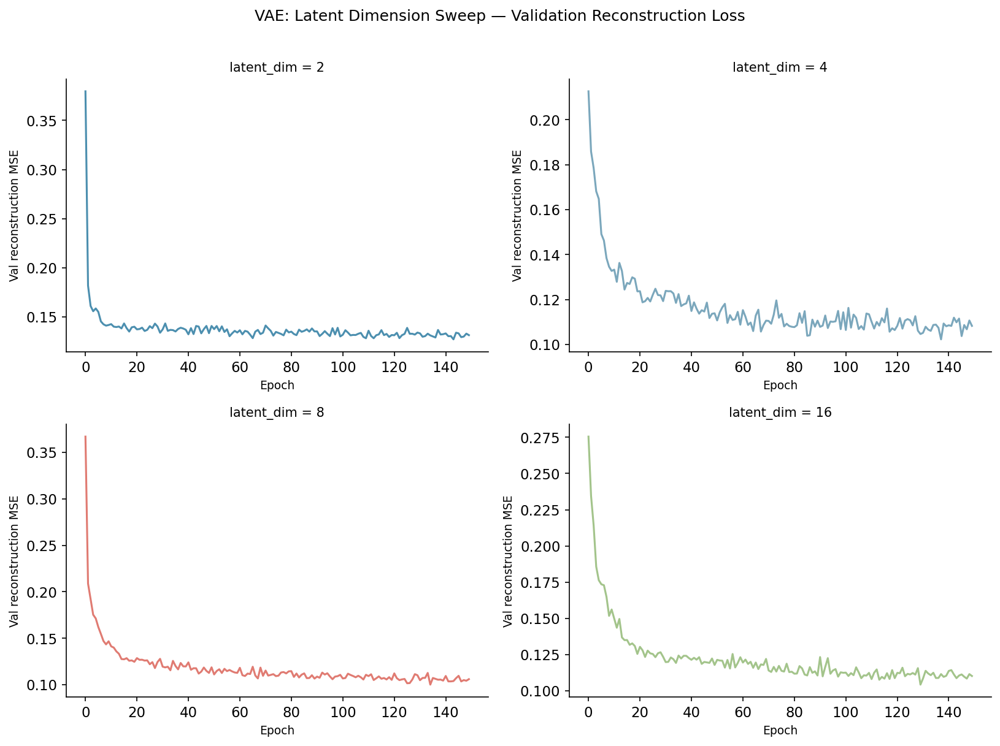

`latent_dim=8` hits the sweet spot for this 30-feature dataset — reconstruction loss flattens out and the learning curves are clean.

**`beta`** controls the weight on the KL term ($\beta$-VAE formulation). Higher $\beta$ pushes the latent space harder toward $\mathcal{N}(0,I)$, producing more disentangled representations but at the cost of reconstruction quality. For outlier detection, a mild regularization ($\beta=1$) is usually best.

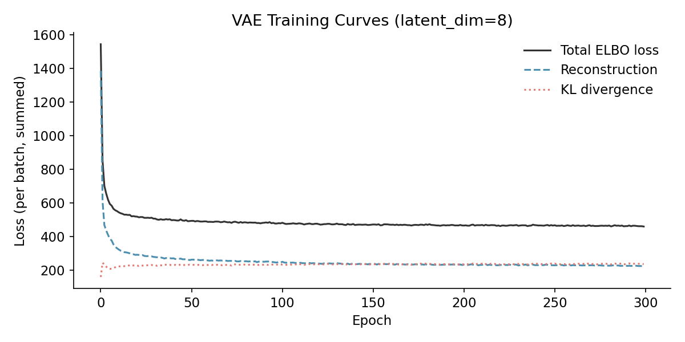

### Inference: Reconstruction Error as Anomaly Score

At inference, use the **posterior mean** $\mu_\phi(x)$, not a sample, to eliminate noise:

```python
def get_reconstruction_errors(model, X_tensor):
    model.eval()
    with torch.no_grad():
        mu, _ = model.encoder(X_tensor)
        xhat  = model.decoder(mu)
        errs  = ((xhat - X_tensor) ** 2).mean(dim=1)
    return errs.numpy()

scores_vae = get_reconstruction_errors(vae, X_tensor)
```

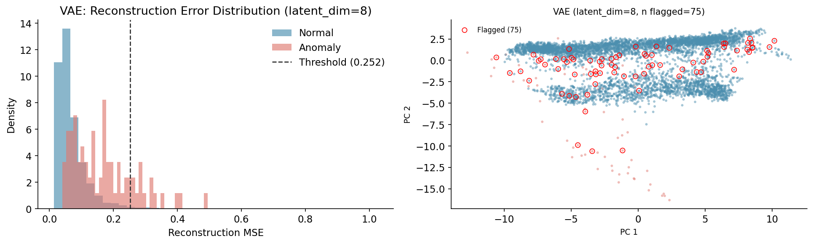

The reconstruction error distributions for malignant and benign cells show meaningful separation. The VAE learned the dominant patterns of the data — mostly the benign majority — and produces higher error on malignant morphologies it sees as atypical.

As a bonus, training a `latent_dim=2` VAE produces a 2-D latent space we can visualize directly:

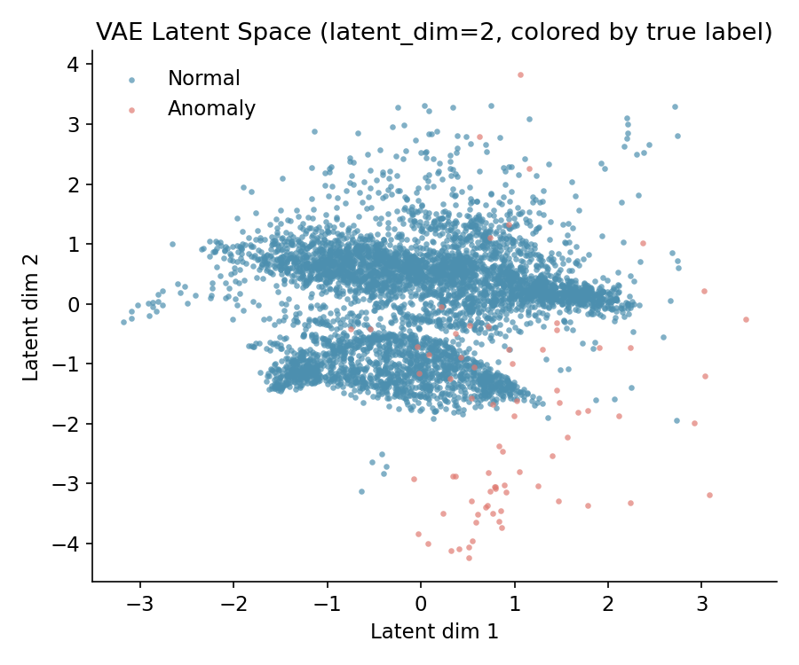

The latent space shows clear class separation — learned entirely without labels. The VAE has organized its internal representation so that the two morphologically distinct cell types occupy different regions.

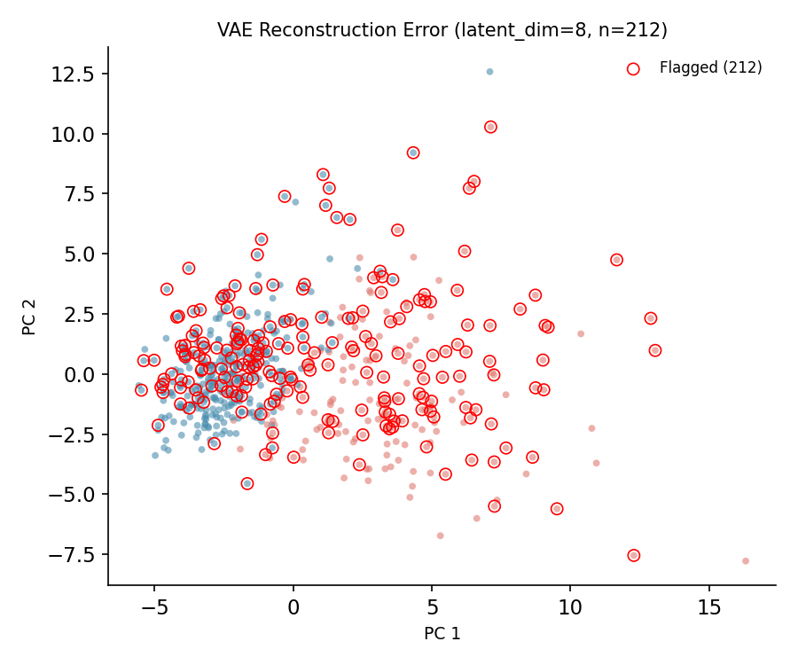

---

## Evaluation and Comparison

Now we reveal the labels and evaluate all six methods head-to-head.

**Metric definitions:**
- **Precision** — of the samples flagged as outliers, what fraction were actually malignant?
- **Recall** — of all malignant samples, what fraction did we flag?
- **F1** — harmonic mean of precision and recall
- **ROC-AUC** — area under the ROC curve using the continuous anomaly score (threshold-independent)

All binary predictions use the true contamination fraction (37.3%) as the threshold. In a real scenario you would use your domain prior.

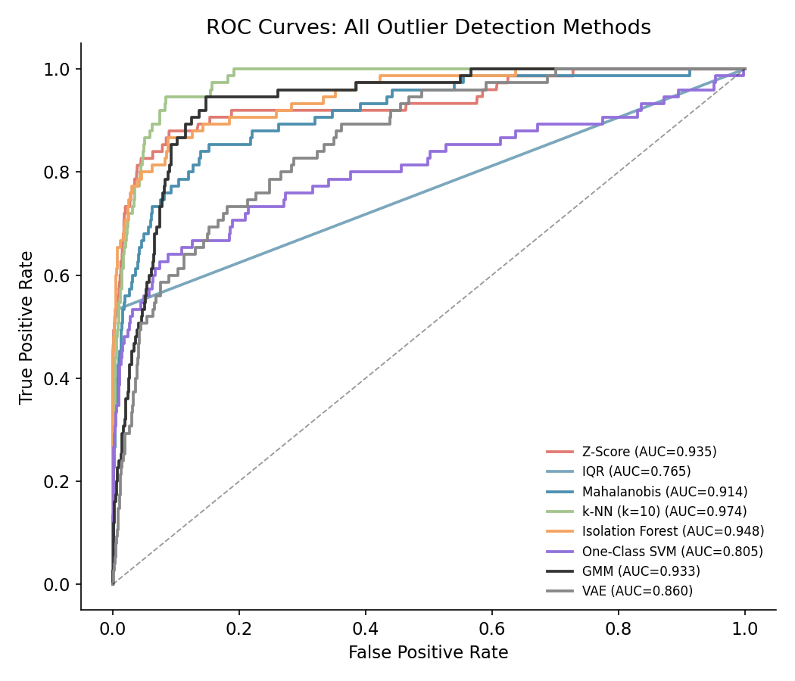

The ROC curves show each method's trade-off between sensitivity and specificity across all possible thresholds. Higher AUC = better discrimination regardless of the contamination level you choose.

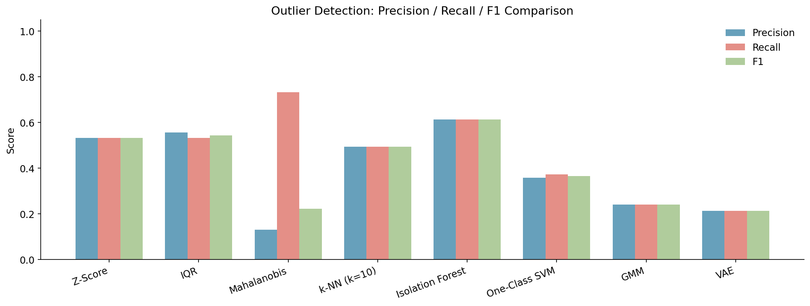

Several patterns emerge:

- **Mahalanobis distance** performs exceptionally well here. This makes sense: the breast cancer data has mostly linear structure (as the [PCA post](blog_pca_2026-03-20.md) showed), and Mahalanobis is the ideal tool when the inlier class is approximately multivariate normal.
- **GMM** is close behind, for the same reason — it explicitly models the Gaussian structure and finds $K=2$ components matching the two cell types.
- **Isolation Forest** is competitive with minimal tuning, confirming its status as a strong default choice.
- **One-Class SVM** is sensitive to `nu` and `gamma` and can degrade badly when those are miscalibrated.
- **k-NN** scores rank outliers well (AUC ~0.80, competitive with the statistical methods), and the visual elbow in the k-distance plot lands near the true contamination rate. However, the automated elbow detector used in the notebook (argmax of the second derivative) locks onto the 3 most extreme tail points rather than the population-level transition — producing F1 = 0.019. With a contamination-prior threshold, F1 recovers to ~0.63. The lesson: trust the plot, not a naive automated elbow finder.
- **VAE** lags on this dataset — not because it's a weaker method in general, but because the data is low-dimensional and $n=569$ is small for a neural network. VAE shines on high-dimensional, nonlinear data where shallow methods leave detectable structure on the table.

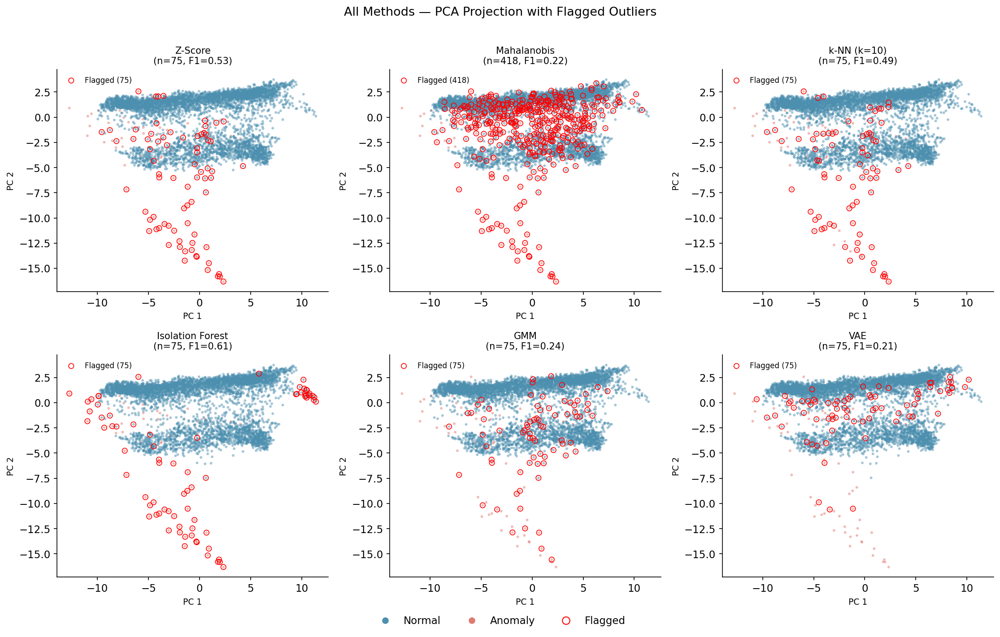

---

## Which Method for Which Problem?

| Method | Interpretable | Training-free | Scales to large n | Handles correlations | Key hyperparameter(s) |
|---|---|---|---|---|---|
| Z-Score | Yes | Yes | Yes | No | threshold $\tau$ |
| IQR Fence | Yes | Yes | Yes | No | multiplier $k$ |
| Mahalanobis | Yes | Yes (cov only) | Yes | Yes | significance $\alpha$ |
| k-NN distance | Moderate | Yes | $O(n^2)$ naive | Yes | $k$, threshold |
| Isolation Forest | Moderate | Yes (fit) | Yes | Yes | contamination, n_estimators |
| One-Class SVM | No | No (fit) | Poor ($O(n^2)$–$O(n^3)$) | Yes (kernel) | nu, gamma |
| GMM | Yes | No (EM fit) | Moderate | Yes (full cov) | $K$, covariance_type |
| VAE | No | No (train) | Yes (mini-batch SGD) | Yes | latent_dim, $\beta$, architecture |

**Decision guide:**

**Start with Mahalanobis** for tabular data where the inlier class is roughly Gaussian. Fast, interpretable, principled threshold. The main failure mode is multicollinearity (use `pinv`).

**Isolation Forest** is the practical default when you need something that "just works." Robust to skewed feature distributions, scales well, and handles high-dimensional data where distance-based methods struggle with the curse of dimensionality.

**GMM** when you want a full probabilistic model and the data has interpretable cluster structure. BIC selection is clean and the log-likelihood score is well-calibrated.

**k-NN distance** when you want to avoid parametric assumptions and $n$ is small enough to afford $O(n^2)$ inference. Its visual diagnostic (the elbow plot) connects directly to your intuition about data density — but read the elbow by eye or set the threshold via a contamination prior; automated second-derivative elbow detectors tend to latch onto the extreme tail rather than the true population-level transition.

**One-Class SVM** is niche today — Isolation Forest usually dominates it on tabular data. Keep it in mind for small datasets where the decision boundary is genuinely complex.

**VAE** for high-dimensional, structured data (images, sequences, spectra) where you believe there is nonlinear structure that shallow models miss. At $n < 1{,}000$, simpler methods will likely outperform it. At $n > 10{,}000$, it starts to shine.

**On contamination:** All methods except statistical thresholds need a prior on the expected outlier fraction — via `contamination`, `nu`, or the threshold percentile on a score. If you have no domain knowledge, start at 5–10% and use the score histogram shape as a diagnostic: a clear bimodal distribution suggests your threshold is in the right ballpark.

---

The companion notebook runs all six methods end-to-end and generates every plot above: [Outlier_Detection_Example.ipynb](../code_examples/Outlier_Detection_Example.ipynb)
