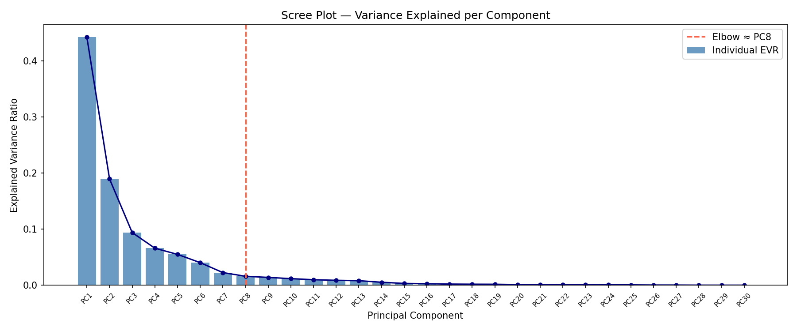
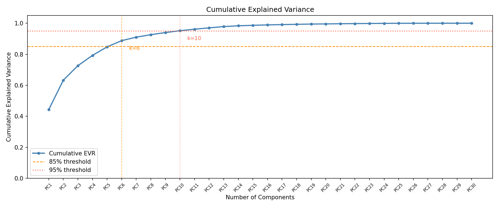
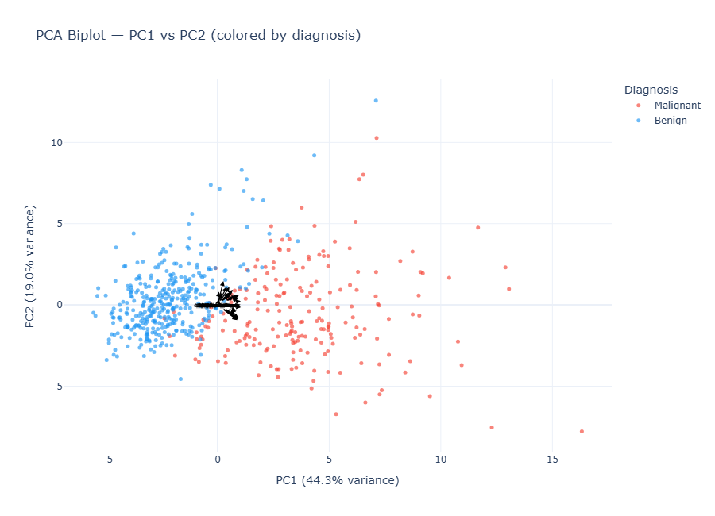
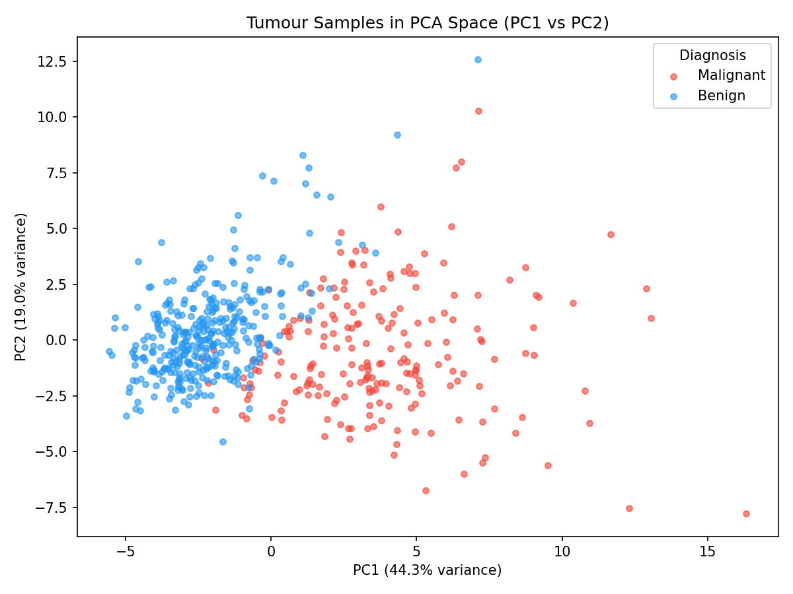
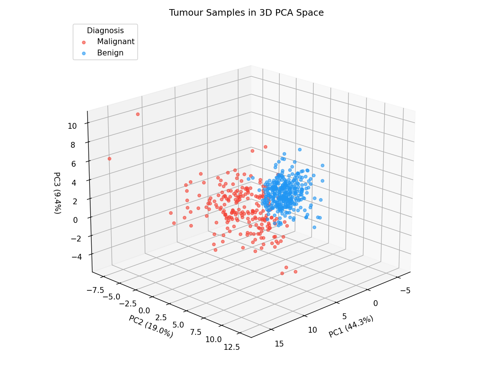
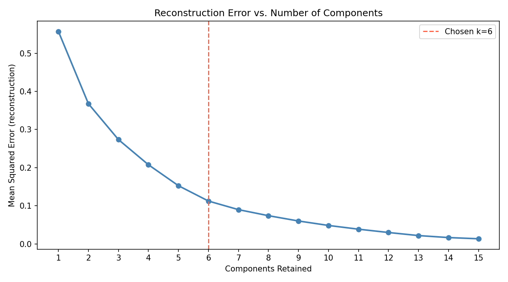
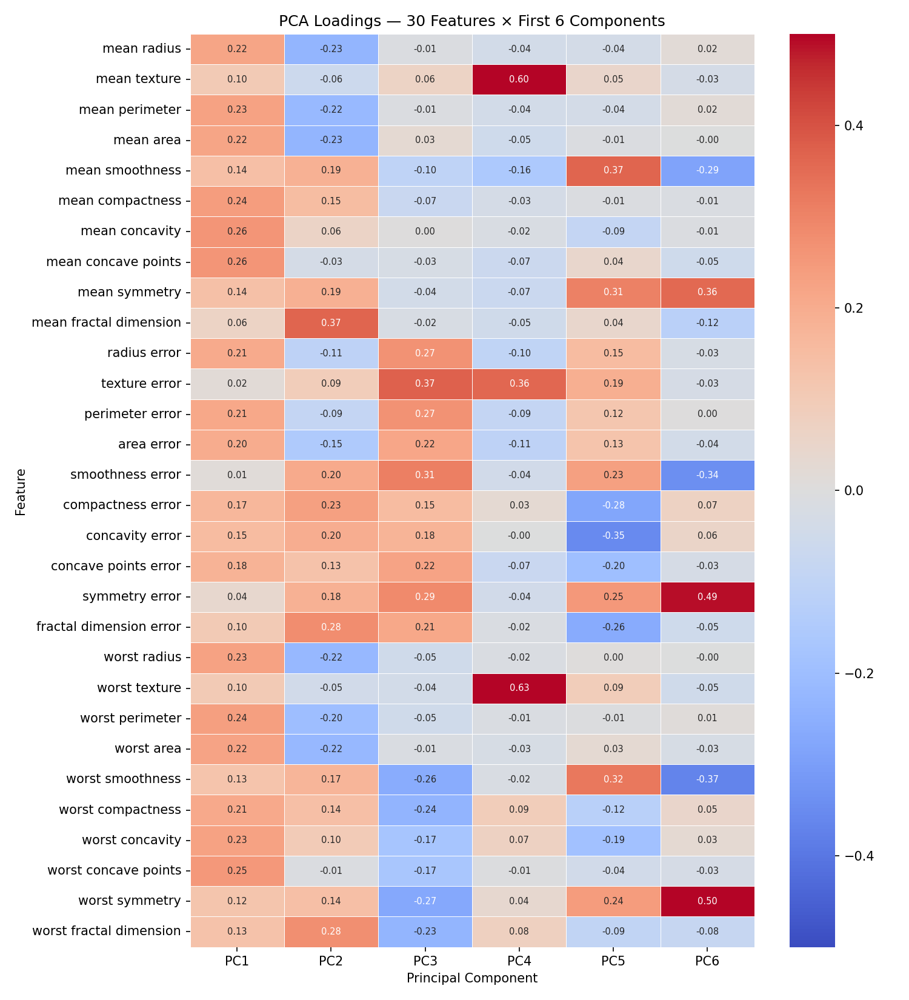

# Principal Component Analysis: Find the Needle in Your Feature Haystack

Imagine you are analyzing tumour samples, each described by 30 numeric measurements computed from digitised cell-nucleus images: radius, texture, perimeter, area, smoothness, compactness, concavity, and more — each measured as a mean, worst, and standard error. Plotting any single feature is easy. Comparing two is manageable. Reasoning about the relationships across all 30 simultaneously is nearly impossible. This is the problem PCA solves.

PCA (Principal Component Analysis) is a dimensionality reduction technique that finds a new coordinate system for your data. The new axes — called *principal components* — are ordered by how much variance in the data they capture. The first component captures the most variance, the second captures the most remaining variance while being uncorrelated with the first, and so on. By projecting your data onto only the first few components, you can retain most of the meaningful structure while discarding the dimensions that carry the least information.

This post derives PCA from first principles, builds intuition for what the components actually mean, and walks through a practical implementation using the sklearn Breast Cancer Wisconsin dataset — a real-world benchmark with 569 tumour samples, 30 features, and a binary malignant/benign outcome.

## The Curse of Dimensionality

Before getting to the solution, it is worth understanding the problem. As the number of features $p$ grows, something counterintuitive happens to distances: in high-dimensional space, every pair of points becomes roughly the same distance apart.

To see why, consider a unit hypercube in $p$ dimensions. The volume of a hypersphere inscribed in it scales as $r^p$ — it occupies an increasingly tiny fraction of the cube's volume as $p$ grows. The practical consequence: almost all of your data points end up near the edges of the feature space, with vast empty regions in the interior. Nearest-neighbor algorithms break because "nearby" loses meaning. Models overfit because the data that is present is sparse relative to the volume of the space.

The typical cure is to collect exponentially more data as $p$ grows — but that is often not an option. The other cure is to reduce $p$ directly. If many of your original features are correlated — and in the breast cancer dataset, `radius_mean`, `perimeter_mean`, and `area_mean` are extremely correlated because they all measure tumour size — then the data does not actually live in all 30 dimensions. It lives in a lower-dimensional subspace. PCA finds that subspace.

## What PCA Does

PCA performs a linear coordinate transformation. It rotates the original feature axes to align with the directions of greatest variance in the data. The first principal component (PC1) is the direction in the original $p$-dimensional space along which the projected data has the highest variance. PC2 is the next direction of highest variance that is orthogonal (perpendicular) to PC1. And so on.

The result is a new set of coordinates — the *principal component scores* — where:
- The components are ordered by variance explained (most informative first)
- All components are uncorrelated with each other
- The transformation is linear and invertible

By keeping only the first $k$ components, you discard the low-variance tail: dimensions that contain the least information (and often the most noise).

## The Math Behind PCA

### Step 1 — Standardize

PCA finds directions of maximum *variance*. If your features are measured on different scales — say, `area_mean` (range ≈ 140–2500) and `fractal_dimension_mean` (range ≈ 0.05–0.10) — the features with larger absolute values will dominate purely because of units, not because they contain more information.

The fix is to standardize each feature to zero mean and unit variance before fitting PCA:

$$x_{ij}^* = \frac{x_{ij} - \bar{x}_j}{\sigma_j}$$

where $\bar{x}_j$ is the mean of feature $j$ across all $n$ samples and $\sigma_j$ is its standard deviation. After standardization, every feature has mean 0 and variance 1 — so PCA finds directions of maximum *shared* variance, not maximum scale.

### Step 2 — The Covariance Matrix

With the standardized data matrix $X^* \in \mathbb{R}^{n \times p}$ (rows = samples, columns = features), compute the $p \times p$ covariance matrix:

$$\Sigma = \frac{1}{n-1} {X^*}^T X^*$$

$\Sigma$ is symmetric and positive semi-definite. Its diagonal entries are the variances of each standardized feature (all 1.0 after standardization). Its off-diagonal entry $\Sigma_{ij}$ is the covariance between features $i$ and $j$ — positive if they tend to move together, negative if they move in opposite directions.

In the breast cancer dataset, $\Sigma$ will have very high positive values for `radius_mean` and `area_mean` (area scales with radius squared, so they are strongly correlated), and high positive values between the mean, worst, and error versions of the same measurement type.

### Step 3 — Eigendecomposition

The covariance matrix encodes all the pairwise linear relationships between features. PCA extracts the directions in which the data varies most by solving the *eigenvalue problem*:

$$\Sigma v_k = \lambda_k v_k$$

Each solution is a pair: an *eigenvector* $v_k$ (a unit vector in the $p$-dimensional feature space) and its corresponding *eigenvalue* $\lambda_k$ (a scalar). The eigenvalue tells you how much variance the data has in the direction of $v_k$.

Because $\Sigma$ is symmetric, its eigenvectors are mutually orthogonal — which is exactly why the principal components are uncorrelated. The eigenvectors are ordered by eigenvalue: $\lambda_1 \geq \lambda_2 \geq \cdots \geq \lambda_p \geq 0$. The eigenvector corresponding to the largest eigenvalue is PC1 — the direction of maximum variance.

Each eigenvector $v_k$ is a $p$-dimensional vector of *loadings*: one weight per original feature. A large positive loading on `mean concave points` for PC1 means that PC1 captures a lot of the concavity signal; a near-zero loading means PC1 is mostly insensitive to that feature.

### Step 4 — Connection to SVD

In practice, computing $\Sigma$ explicitly and then running eigendecomposition is numerically fragile for large datasets. sklearn's `PCA` (and most production implementations) instead uses Singular Value Decomposition (SVD) applied directly to the data matrix:

$$X^* = U \Sigma_{\text{svd}} V^T$$

where $U \in \mathbb{R}^{n \times n}$ contains the *left* singular vectors, $V \in \mathbb{R}^{p \times p}$ contains the *right* singular vectors (these are identical to the eigenvectors of $\Sigma$), and $\Sigma_{\text{svd}}$ is a diagonal matrix of singular values $\sigma_k$.

The relationship between singular values and eigenvalues is:

$$\lambda_k = \frac{\sigma_k^2}{n - 1}$$

SVD never forms the $p \times p$ covariance matrix — it works directly on the $n \times p$ data matrix, which is numerically more stable and supports truncated computation (computing only the top-$k$ components without forming the full decomposition).

### Step 5 — Projection

Once we have the eigenvectors, projecting the data into PCA space is a matrix multiplication. Let $W \in \mathbb{R}^{p \times k}$ be the matrix whose columns are the first $k$ eigenvectors (the top-$k$ principal component directions). The projected data is:

$$Z = X^* W$$

$Z \in \mathbb{R}^{n \times k}$ is the transformed dataset. Each row is a sample's coordinates in the new $k$-dimensional PC space. Each column is a principal component score. This is the data you use for downstream tasks — clustering, classification, visualization — instead of the original $X^*$.

### Step 6 — Explained Variance Ratio

The eigenvalue $\lambda_k$ tells you the variance the data has along the $k$th principal component. The *explained variance ratio* normalizes this by the total variance across all $p$ components:

$$\text{EVR}_k = \frac{\lambda_k}{\sum_{j=1}^{p} \lambda_j}$$

This is the fraction of total variance captured by component $k$. Summing the first $k$ EVRs gives the cumulative explained variance — how much of the original data's total variance is preserved when you project to $k$ dimensions:

$$\text{Cumulative EVR}_k = \frac{\sum_{j=1}^{k} \lambda_j}{\sum_{j=1}^{p} \lambda_j}$$

If the first 6 components account for 88.8% of the cumulative EVR, dropping to 6 dimensions from 30 discards only 11.2% of the total variance.

## The Dataset

The examples throughout this post use the **sklearn Breast Cancer Wisconsin dataset** — a classic benchmark in machine learning and medical diagnostics. No download is needed: it is built into sklearn.

```python
from sklearn.datasets import load_breast_cancer
bc = load_breast_cancer()
```

The dataset contains 569 tumour samples, each described by 30 numeric features computed from digitised images of fine needle aspirates. The outcome is binary: **malignant** (212 samples) or **benign** (357 samples).

| Feature group | Features (mean / worst / error) | Description |
|---|---|---|
| Size | `radius`, `perimeter`, `area` | Physical scale of the cell nucleus |
| Shape | `smoothness`, `compactness`, `concavity`, `concave points`, `symmetry` | Geometry and boundary regularity |
| Texture | `texture` | Standard deviation of gray-scale values |
| Complexity | `fractal_dimension` | Coastline approximation of the boundary |

Each of these 10 base measurements is represented three times: as a mean, a worst (largest), and a standard error across nuclei in the image — giving 30 features total.

Key correlation structure: `radius_mean`, `perimeter_mean`, and `area_mean` are extremely correlated (they all measure tumour size). The worst-case and mean versions of the same feature are also highly correlated. This redundancy is exactly what PCA is designed to compress.

## Implementation in Python

### Loading and Standardizing

```python
import numpy as np
import pandas as pd
from sklearn.datasets import load_breast_cancer
from sklearn.preprocessing import StandardScaler
from sklearn.decomposition import PCA

bc = load_breast_cancer()
features = list(bc.feature_names)
df = pd.DataFrame(bc.data, columns=features)
df["diagnosis"] = pd.Categorical.from_codes(bc.target, ["malignant", "benign"])

print(f"Dataset shape: {df.shape}")
print(df["diagnosis"].value_counts())

# Standardize — mandatory before PCA
scaler = StandardScaler()
X_scaled = scaler.fit_transform(df[features].values)
```

### Fitting PCA and Inspecting Eigenvalues

Fit with all 30 components first so you can see the full eigenvalue spectrum before deciding how many to keep:

```python
pca_full = PCA(n_components=30, random_state=42)
pca_full.fit(X_scaled)

evr     = pca_full.explained_variance_ratio_
cumev   = np.cumsum(evr)
eigvals = pca_full.explained_variance_

print("Component  Eigenvalue   EVR      Cumulative EVR  Kaiser (>1?)")
print("-" * 65)
for i, (ev, e, c) in enumerate(zip(evr, eigvals, cumev), start=1):
    kaiser = "YES" if e > 1.0 else ""
    print(f"  PC{i:2d}      {e:7.3f}    {ev:.4f}    {c:.4f}           {kaiser}")
```

Running this on the breast cancer dataset gives (first 10 components shown):

```
Component  Eigenvalue   EVR      Cumulative EVR  Kaiser (>1?)
-----------------------------------------------------------------
  PC 1      13.305    0.4427    0.4427           YES
  PC 2       5.692    0.1897    0.6324           YES
  PC 3       2.818    0.0939    0.7264           YES
  PC 4       1.980    0.0660    0.7924           YES
  PC 5       1.651    0.0550    0.8473           YES
  PC 6       1.207    0.0402    0.8876           YES
  PC 7       0.676    0.0225    0.9101
  PC 8       0.477    0.0159    0.9260
  ...
```

PC1 alone accounts for 44.3% of the total variance — an unusually strong first component, reflecting how much of the tumour data is dominated by a single "overall size/severity" axis. The first six components reach 88.8%.

### Choosing the Number of Components

Three complementary methods converge on the same answer.

#### Scree Plot (Elbow Method)

Plot the explained variance ratio per component. The "elbow" — where the curve flattens and each additional component yields diminishing returns — is a natural cutoff.

```python
import matplotlib.pyplot as plt

x_pos = np.arange(1, 31)

fig, ax = plt.subplots(figsize=(12, 5))
ax.bar(x_pos, evr, color="steelblue", alpha=0.8)
ax.plot(x_pos, evr, "o-", color="navy", linewidth=1.5, markersize=4)
ax.set_xticks(x_pos)
ax.set_xticklabels([f"PC{i}" for i in x_pos], fontsize=7, rotation=45)
ax.set_xlabel("Principal Component")
ax.set_ylabel("Explained Variance Ratio")
ax.set_title("Scree Plot — Variance Explained per Component")
plt.tight_layout()
plt.savefig("plots/pca_scree_plot.png", dpi=150)
plt.show()
```



The elbow is visible around PC6–PC7, where the per-component EVR drops below 0.03 and begins to flatten.

#### Cumulative Explained Variance Threshold

A common criterion in practice: retain enough components to explain 85% or 95% of the total variance.

```python
k85 = int(np.argmax(cumev >= 0.85)) + 1
k95 = int(np.argmax(cumev >= 0.95)) + 1
print(f"Components to reach 85% variance: {k85}")   # 6
print(f"Components to reach 95% variance: {k95}")   # 10

fig, ax = plt.subplots(figsize=(12, 5))
ax.plot(x_pos, cumev, "o-", color="steelblue", linewidth=2, markersize=4)
ax.axhline(0.85, color="darkorange", linestyle="--", label="85% threshold")
ax.axhline(0.95, color="tomato",    linestyle=":",  label="95% threshold")
ax.set_xlabel("Number of Components")
ax.set_ylabel("Cumulative Explained Variance")
ax.set_title("Cumulative Explained Variance")
ax.legend()
plt.tight_layout()
plt.savefig("plots/pca_cumulative_variance.png", dpi=150)
plt.show()
```



For the breast cancer dataset: 6 components reach 88.8% and 10 components reach 95.2%.

#### Kaiser Criterion

A classic rule of thumb from factor analysis: retain components whose eigenvalue exceeds 1.0. The reasoning: after standardization, each original feature contributes variance of 1.0. Any component with eigenvalue below 1.0 explains less variance than a single original feature — arguably not worth keeping.

```python
kaiser_k = int(np.sum(eigvals > 1.0))
print(f"Kaiser criterion: k = {kaiser_k}")  # 6
```

All three methods agree: **k = 6**, retaining 88.8% of the total variance while reducing 30 dimensions to 6 — a 5× compression.

### The Biplot

A biplot overlays two things in the PC1–PC2 space:

- **Points** — each tumour sample projected onto the first two principal components, colored by `diagnosis`
- **Arrows** — each feature's *loading vector* showing how strongly it contributes to PC1 and PC2

Arrow direction indicates correlation structure: arrows pointing the same way correspond to positively correlated features; arrows pointing opposite ways correspond to negatively correlated features. Arrow length indicates how much of the feature's variance is captured in the PC1–PC2 plane.

With 30 features, the biplot is dense. The abbreviated labels (μ = mean, W = worst) keep it readable. The interactive version in the companion notebook lets you hover over individual points and zoom.

```python
import plotly.graph_objects as go

loadings  = pca_full.components_[:2]
Z_full    = pca_full.transform(X_scaled)
scale     = 4.0
diag_vals = df["diagnosis"].astype(str).values

def abbrev(name):
    return (name.replace("mean ", "μ ")
                .replace("worst ", "W ")
                .replace(" error", " err")
                .replace("concave points", "cv.pts")
                .replace("fractal dimension", "frac.dim"))

fig = go.Figure()
for diag, color in [("malignant", "#F44336"), ("benign", "#2196F3")]:
    mask = diag_vals == diag
    fig.add_trace(go.Scatter(
        x=Z_full[mask, 0], y=Z_full[mask, 1],
        mode="markers", name=diag.capitalize(),
        marker=dict(color=color, size=5, opacity=0.65),
    ))

for i, feat in enumerate(features):
    fig.add_annotation(
        x=loadings[0, i] * scale, y=loadings[1, i] * scale,
        ax=0, ay=0, xref="x", yref="y", axref="x", ayref="y",
        showarrow=True, arrowhead=2, arrowsize=1,
        arrowwidth=1.2, arrowcolor="black",
        text=abbrev(feat), font=dict(size=7, color="black"),
    )

fig.update_layout(
    title="PCA Biplot — PC1 vs PC2 (colored by diagnosis)",
    xaxis_title=f"PC1 ({evr[0]*100:.1f}% variance)",
    yaxis_title=f"PC2 ({evr[1]*100:.1f}% variance)",
    template="plotly_white", width=900, height=650,
)
fig.show()
```

The static plot is shown below. See the companion notebook for the interactive version.



### Full End-to-End Example

```python
import os
import time
import numpy as np
import pandas as pd
import matplotlib.pyplot as plt
from mpl_toolkits.mplot3d import Axes3D  # noqa: F401
from sklearn.datasets import load_breast_cancer
from sklearn.decomposition import PCA
from sklearn.preprocessing import StandardScaler
from sklearn.linear_model import LogisticRegression
from sklearn.model_selection import cross_val_score
from sklearn.metrics import mean_squared_error
import seaborn as sns
import plotly.graph_objects as go

os.makedirs("plots", exist_ok=True)

# --- Load data ---
bc = load_breast_cancer()
features = list(bc.feature_names)
df = pd.DataFrame(bc.data, columns=features)
df["diagnosis"] = pd.Categorical.from_codes(bc.target, ["malignant", "benign"])

# --- Standardize ---
scaler = StandardScaler()
X_scaled = scaler.fit_transform(df[features].values)

# --- Fit full PCA (30 components) ---
pca_full = PCA(n_components=30, random_state=42)
pca_full.fit(X_scaled)
evr     = pca_full.explained_variance_ratio_
cumev   = np.cumsum(evr)
eigvals = pca_full.explained_variance_
Z_full  = pca_full.transform(X_scaled)

# --- Choose k (85% threshold = Kaiser = 6) ---
K = int(np.argmax(cumev >= 0.85)) + 1   # K = 6
pca_k = PCA(n_components=K, random_state=42)
Z = pca_k.fit_transform(X_scaled)
print(f"Selected K={K}, variance retained: {pca_k.explained_variance_ratio_.sum()*100:.1f}%")

# --- Scree plot ---
x_pos = np.arange(1, 31)
fig, ax = plt.subplots(figsize=(12, 5))
ax.bar(x_pos, evr, color="steelblue", alpha=0.8)
ax.plot(x_pos, evr, "o-", color="navy", linewidth=1.5, markersize=4)
ax.set_xticks(x_pos)
ax.set_xticklabels([f"PC{i}" for i in x_pos], fontsize=7, rotation=45)
ax.set_xlabel("Principal Component"); ax.set_ylabel("Explained Variance Ratio")
ax.set_title("Scree Plot — Variance Explained per Component")
plt.tight_layout(); plt.savefig("plots/pca_scree_plot.png", dpi=150); plt.close()

# --- Cumulative variance plot ---
fig, ax = plt.subplots(figsize=(12, 5))
ax.plot(x_pos, cumev, "o-", color="steelblue", linewidth=2, markersize=4)
ax.axhline(0.85, color="darkorange", linestyle="--", label="85% threshold")
ax.axhline(0.95, color="tomato",    linestyle=":",  label="95% threshold")
ax.set_xticks(x_pos)
ax.set_xticklabels([f"PC{i}" for i in x_pos], fontsize=7, rotation=45)
ax.set_xlabel("Number of Components"); ax.set_ylabel("Cumulative Explained Variance")
ax.set_title("Cumulative Explained Variance"); ax.legend()
plt.tight_layout(); plt.savefig("plots/pca_cumulative_variance.png", dpi=150); plt.close()

# --- 2D scatter ---
diagnoses  = ["malignant", "benign"]
colors_map = {"malignant": "#F44336", "benign": "#2196F3"}
diag_vals  = df["diagnosis"].astype(str).values

fig, ax = plt.subplots(figsize=(8, 6))
for diag in diagnoses:
    mask = diag_vals == diag
    ax.scatter(Z_full[mask, 0], Z_full[mask, 1],
               c=colors_map[diag], alpha=0.6, s=18, label=diag.capitalize())
ax.set_xlabel(f"PC1 ({evr[0]*100:.1f}% variance)")
ax.set_ylabel(f"PC2 ({evr[1]*100:.1f}% variance)")
ax.set_title("Tumour Samples in PCA Space (PC1 vs PC2)"); ax.legend(title="Diagnosis")
plt.tight_layout(); plt.savefig("plots/pca_patient_scatter_2d.png", dpi=150); plt.close()

# --- 3D scatter ---
fig3d = plt.figure(figsize=(9, 7))
ax3d  = fig3d.add_subplot(111, projection="3d")
for diag in diagnoses:
    mask = diag_vals == diag
    ax3d.scatter(Z_full[mask, 0], Z_full[mask, 1], Z_full[mask, 2],
                 c=colors_map[diag], alpha=0.6, s=15, label=diag.capitalize())
ax3d.set_xlabel("PC1"); ax3d.set_ylabel("PC2"); ax3d.set_zlabel("PC3")
ax3d.set_title("Tumour Samples in 3D PCA Space"); ax3d.legend(title="Diagnosis")
ax3d.view_init(elev=20, azim=45)
plt.tight_layout(); plt.savefig("plots/pca_3d_scatter.png", dpi=150); plt.close()

# --- Reconstruction error ---
mse_values = []
for k in range(1, 16):
    pca_tmp = PCA(n_components=k, random_state=42).fit(X_scaled)
    X_recon = pca_tmp.inverse_transform(pca_tmp.transform(X_scaled))
    mse_values.append(mean_squared_error(X_scaled, X_recon))

fig, ax = plt.subplots(figsize=(9, 5))
ax.plot(range(1, 16), mse_values, "o-", color="steelblue", linewidth=2, markersize=6)
ax.axvline(K, color="tomato", linestyle="--", linewidth=1.5, label=f"Chosen k={K}")
ax.set_xticks(range(1, 16)); ax.set_xlabel("Components Retained")
ax.set_ylabel("Mean Squared Error"); ax.set_title("Reconstruction Error vs. Number of Components")
ax.legend(); plt.tight_layout(); plt.savefig("plots/pca_reconstruction_error.png", dpi=150); plt.close()

print("All plots saved to plots/")
```

## Use Cases

### Dimensionality Reduction for Modeling

The most direct use of PCA: reduce a high-dimensional feature matrix to fewer, uncorrelated components before passing it to a model. This can reduce overfitting when $p$ is large relative to $n$, and it can speed up training for expensive models.

```python
from sklearn.pipeline import Pipeline
from sklearn.linear_model import LogisticRegression

# Train on the top-6 PCA components instead of all 30 features
clf_pca = Pipeline([
    ("scaler", StandardScaler()),
    ("pca",    PCA(n_components=6, random_state=42)),
    ("clf",    LogisticRegression(max_iter=5000, random_state=42)),
])
clf_pca.fit(bc.data, bc.target)
```

Note that the `Pipeline` handles standardization internally. If you are using PCA outside a pipeline, standardize manually first.

### Data Visualization

PCA's most common use is projecting high-dimensional data to 2D or 3D for visual inspection. A scatter plot of PC1 vs PC2 can reveal cluster separation, gradients, or outliers that are invisible in any individual feature.

The breast cancer dataset separates almost perfectly in the PC1–PC2 plane. Malignant tumours (red) cluster at high PC1 values; benign tumours (blue) cluster at low values. This immediately tells you that PC1 is capturing the dominant axis of malignancy in the data.



Adding PC3 provides additional resolution. The 3D scatter below shows that the two groups separate further when PC3 is included.



```python
# 2D scatter
fig, ax = plt.subplots(figsize=(8, 6))
for diag in ["malignant", "benign"]:
    mask = df["diagnosis"].astype(str).values == diag
    ax.scatter(Z_full[mask, 0], Z_full[mask, 1],
               c=colors_map[diag], alpha=0.6, s=18, label=diag.capitalize())
ax.set_xlabel("PC1"); ax.set_ylabel("PC2"); ax.legend(title="Diagnosis")
plt.show()
```

### Noise Reduction

Reconstructing data from only the top-$k$ components discards the signal in the low-variance tail — which is often noise rather than meaningful structure. The reconstruction formula is:

$$\hat{X} = Z W^T$$

where $Z$ is the projected data and $W$ is the $p \times k$ loading matrix. In sklearn: `pca_k.inverse_transform(Z)`.

The reconstruction error curve shows how quickly MSE drops as you add more components. For this dataset, the first 6 components account for 88.8% of the variance; MSE falls steeply in the first few components and flattens after PC6.



```python
# Reconstruct from top-k components
Z_k     = pca_k.transform(X_scaled)
X_recon = pca_k.inverse_transform(Z_k)
mse     = mean_squared_error(X_scaled, X_recon)
print(f"MSE at k={K}: {mse:.4f}")
```

### Feature Engineering for ML Pipelines

PCA components can be treated as new features: they are uncorrelated by construction, which benefits models that assume feature independence (naive Bayes, linear models), and they are ordered by variance so the most informative dimensions come first. sklearn's `Pipeline` integrates PCA cleanly:

```python
from sklearn.pipeline import Pipeline
from sklearn.preprocessing import StandardScaler
from sklearn.decomposition import PCA
from sklearn.linear_model import LogisticRegression

# Float n_components: retain enough to explain 95% of variance
pipe = Pipeline([
    ("scaler", StandardScaler()),
    ("pca",    PCA(n_components=0.95, random_state=42)),
    ("clf",    LogisticRegression(max_iter=5000, random_state=42)),
])
```

When `n_components` is a float between 0 and 1, sklearn automatically selects the minimum number of components needed to reach that threshold at fit time — no hard-coding required.

## Before/After: Raw Features vs. PCA Components

To make the comparison concrete, we train a `LogisticRegression` classifier on the original 30 standardized features and on the top-6 PCA components, measuring 5-fold cross-validated accuracy and training time.

```python
import time
from sklearn.linear_model import LogisticRegression
from sklearn.model_selection import cross_val_score

y   = bc.target   # 0 = malignant, 1 = benign
clf = LogisticRegression(max_iter=5000, random_state=42)

# Raw features (30)
t0 = time.perf_counter()
scores_raw = cross_val_score(clf, X_scaled, y, cv=5, scoring="accuracy")
t_raw = (time.perf_counter() - t0) * 1000

# PCA components (k=6)
t0 = time.perf_counter()
scores_pca = cross_val_score(clf, Z, y, cv=5, scoring="accuracy")
t_pca = (time.perf_counter() - t0) * 1000

print(f"Raw features:  accuracy={scores_raw.mean():.4f}, time={t_raw:.1f}ms")
print(f"PCA (k=6):     accuracy={scores_pca.mean():.4f}, time={t_pca:.1f}ms")
```

| | Raw features (30) | PCA components (6) |
|---|---|---|
| Features used | 30 | 6 |
| CV Accuracy | 0.9807 | 0.9719 |
| Variance retained | 100% | 88.8% |
| Feature-interpretable | Partially | No |

The PCA model gives up less than 1 percentage point of accuracy in exchange for 80% fewer features. The accuracy gap here is small because logistic regression is already well-regularized; on noisier data or with non-regularized models, PCA's noise-filtering effect can close or eliminate that gap entirely.

The trade-off is interpretability: with the raw features, you can say "mean concave points was the most important predictor." With PCA components, you can only say "PC1 — a weighted combination of concavity, compactness, and size measurements — was most important." Whether that trade-off is acceptable depends entirely on your use case.

## Limitations

### Linearity

PCA only captures *linear* relationships between features. If the true structure of your data lies on a curved manifold — a Swiss roll, a crescent, nested rings — PCA will flatten it and lose the structure. For nonlinear dimensionality reduction, consider Kernel PCA (which applies a nonlinear kernel mapping before PCA), UMAP (topology-preserving manifold learning, good for visualization and preserving neighborhood structure), or t-SNE (excellent for 2D visualization of cluster structure, but not a stable projection for downstream modeling).

### Scaling Sensitivity

PCA is sensitive to feature scales: if you forget to standardize, features with larger absolute variance dominate the principal components. In the breast cancer dataset, `area_worst` (range ≈ 185–4254) would overwhelm `fractal_dimension_mean` (range ≈ 0.05–0.10) simply because its raw values are larger. Always use `StandardScaler` before `PCA`. This is not optional.

### Interpretability Loss

After PCA, the individual components are linear combinations of all original features. PC1 in this dataset has high loadings on mean concave points (+0.261), mean concavity (+0.258), worst concave points (+0.251), mean compactness (+0.239), and worst perimeter (+0.237) — a "tumour severity / irregular shape" axis. It does not correspond to any single measurement. If a physician needs to understand a patient's score and act on it, the original features are more meaningful. PCA trades interpretability for compression and decorrelation.

That said, there are several practical techniques for recovering meaning from principal components after the fact.

#### Loading Analysis

The loading matrix ($W$, stored in `pca.components_`) directly tells you how much each original feature contributes to each component. Inspecting the top positive and negative loadings for each PC is the simplest way to name it.

```python
import pandas as pd

loadings_df = pd.DataFrame(
    pca_full.components_.T,
    index=features,
    columns=[f"PC{i+1}" for i in range(30)]
)

# Top 5 positive and top 3 negative contributors for the first 6 PCs
for pc in [f"PC{i+1}" for i in range(6)]:
    top_pos = loadings_df[pc].nlargest(5)
    top_neg = loadings_df[pc].nsmallest(3)
    print(f"\n{pc}:")
    print("  + " + ", ".join(f"{f} ({v:+.3f})" for f, v in top_pos.items()))
    print("  - " + ", ".join(f"{f} ({v:+.3f})" for f, v in top_neg.items()))
```

For the breast cancer dataset, the loading analysis reveals:
- **PC1** (44.3% EVR): driven by concave points, concavity, compactness, worst perimeter — a **tumour severity / shape complexity axis**. Near-zero or small negative loadings for the error features (smoothness error, texture error, symmetry error) which are measurement variability terms rather than size/shape signals.
- **PC2** (19.0% EVR): driven by fractal dimension (mean, worst, and error), compactness error, smoothness error — a **boundary complexity / fine-texture axis**, largely independent of overall tumour size.

A loading heatmap makes the full picture easier to scan:

```python
import matplotlib.pyplot as plt
import seaborn as sns

fig, ax = plt.subplots(figsize=(10, 11))
sns.heatmap(
    loadings_df.iloc[:, :6],
    annot=True, fmt=".2f", cmap="coolwarm", center=0,
    vmin=-0.5, vmax=0.5, linewidths=0.4, ax=ax,
    annot_kws={"size": 7}
)
ax.set_title("PCA Loadings — 30 Features × First 6 Components")
plt.tight_layout(); plt.show()
```



Features with loadings near zero contribute almost nothing to a given component and can be safely ignored when interpreting it.

#### Correlation with Original Features

An alternative framing: compute the Pearson correlation between each PC score and each original (standardized) feature. Unlike the loadings — which are geometric quantities — correlations are on a familiar −1 to +1 scale and are directly comparable across features.

```python
Z_full_df   = pd.DataFrame(Z_full, columns=[f"PC{i+1}" for i in range(30)])
X_scaled_df = pd.DataFrame(X_scaled, columns=features)

corr_matrix  = pd.concat([Z_full_df.iloc[:, :6], X_scaled_df], axis=1).corr()
pc_feat_corr = corr_matrix.loc[features, [f"PC{i+1}" for i in range(6)]]

# Top 10 features by |correlation with PC1|
top10 = pc_feat_corr["PC1"].abs().nlargest(10).index
print(pc_feat_corr.loc[top10].round(3))
```

A feature with correlation > 0.6 with a PC is a strong contributor. This is often more intuitive than loadings for presenting results to non-technical stakeholders.

#### Variance Explained per Feature (Communality)

To understand which original features are well-represented in the reduced-dimension space (and which are discarded), compute the *communality*: the fraction of each feature's variance that is captured by the first $k$ components.

```python
K = 6
communalities = np.sum(pca_full.components_[:K] ** 2, axis=0)
comm_df = pd.Series(communalities, index=features).sort_values(ascending=False)

print(f"Fraction of each feature's variance retained in top-{K} PCs:")
for feat, val in comm_df.items():
    bar  = "█" * int(val * 20)
    flag = "  ← low" if val < 0.25 else ""
    print(f"  {feat:40s}  {val:.3f}  {bar}{flag}")
```

With K=6 retaining only 20% of the 30 dimensions, communalities in the 0.3–0.6 range are expected even for well-represented features. Only features flagged as low (<0.25) are substantially discarded by the reduction.

Note: `mean concavity`, `mean concave points`, and related features have somewhat lower communalities here despite being top PC1 loaders. This is because those features have correlated variance that gets shared across several components, rather than dominating a single one.

#### Naming Components from Domain Knowledge

Once you have the loadings and correlations, naming a component is a judgment call, not a computation. The pattern to follow:

1. List the 3–5 features with the largest absolute loadings on the component.
2. Ask: what concept do these features share? In the breast cancer dataset, {`mean concave points`, `mean concavity`, `mean compactness`, `worst perimeter`} pointing in the same direction suggests a "tumour severity / irregular shape" axis. {`mean fractal dimension`, `fractal dimension error`, `worst fractal dimension`} pointing together suggests a "boundary complexity" axis.
3. Check the sign. If high concavity corresponds to a *high* PC1 score, samples with high PC1 are more likely to be malignant — the component encodes severity.
4. Validate by comparing PC score distributions across known groups. If PC1 really captures malignancy-related shape, malignant samples should have noticeably higher PC1 scores than benign samples.

```python
# Mean PC score per diagnosis group — validate naming
Z_full_df["diagnosis"] = df["diagnosis"].astype(str).values
group_means = Z_full_df.groupby("diagnosis")[[f"PC{i+1}" for i in range(6)]].mean()
print(group_means.round(3))
```

This is exactly what the biplot makes visual: loading arrows pointing toward high PC1 scores tell you which features drive that axis, and the colored sample clouds show whether the resulting separation is clinically meaningful.

### When to Use Alternatives

- **Kernel PCA**: when you suspect the data lies on a nonlinear manifold, but you still want a deterministic, invertible transform
- **UMAP**: when your primary goal is 2D/3D visualization and you want to preserve local neighborhood structure; it usually produces more visually interpretable clusters than PCA for complex data
- **t-SNE**: similar to UMAP for visualization, but not suitable for generating a stable transform you can apply to new data

## Summary

| Question | Answer |
|---|---|
| Must I standardize first? | Yes — always, without exception |
| How do I choose k? | Converge three methods: scree elbow, cumulative EVR threshold (85%/95%), Kaiser criterion (eigenvalue > 1) |
| What do the loadings mean? | Each loading is the weight of an original feature in a principal component; large loading → strong contribution |
| Are PCs interpretable? | Not directly — they are linear combinations of all original features |
| Does PCA improve accuracy? | Sometimes; it typically reduces overfitting in high-dimensional, correlated data |
| What is the cost? | Interpretability — you lose the original feature names |
| When should I not use PCA? | When interpretability is required, or when feature relationships are nonlinear |
| What are the alternatives? | Kernel PCA (nonlinear), UMAP (manifold, visualization), t-SNE (visualization only) |

PCA does not create information — it reorganizes it. Its value is in revealing latent structure that correlations between original features were hiding, compressing that structure into fewer numbers, and setting up downstream work with cleaner, decorrelated inputs. The hard part is not running it; it is reading the scree plot carefully, justifying your choice of k, and being honest about what you lose when original feature names disappear into PC1 through PC6.

The full working Jupyter notebook for this example is available here: [PCA_Example.ipynb](../code_examples/PCA_Example.ipynb)
