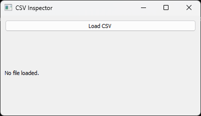
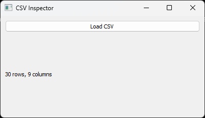

# PyQt for Data Professionals: Wrap Your Scripts in a Real Desktop App

You have a Python script that does something genuinely useful. It loads a CSV, applies some cleaning logic, and outputs a summary. It works great — if *you* run it. Your teammates, the ones who need it most, cannot touch it. They do not know how to activate a virtual environment. They do not know what a terminal is. They email you the file and wait.

This is a gap that GUI frameworks were built to close. And for Python developers, PyQt is one of the best tools for doing it.

This post is not about learning GUI programming as a discipline. It is about taking Python logic you have already written and giving it a front end that a non-technical colleague can use without your help.

## What is PyQt, and Why Not the Alternatives?

PyQt is a set of Python bindings for Qt, a mature, cross-platform C++ application framework. Qt has been the foundation of desktop software for decades. PyQt exposes that entire toolkit to Python.

The most common alternatives are:

- **Tkinter**: Comes bundled with Python, which is convenient. But its widget set looks dated, documentation is thin, and complex layouts become painful fast.
- **wxPython**: Mature and capable, but the community is smaller and the API is less consistent.
- **Dear PyGui / customtkinter**: Newer, more modern-looking options. Worth watching, but less established.

**PyQt5 vs PyQt6 vs PySide6**: PyQt5 is the most widely documented version and has the most Stack Overflow coverage. PyQt6 is newer and tracks Qt6 more closely. PySide6 is the *official* Qt Python binding (maintained by Qt themselves) and is largely API-compatible with PyQt6. For new projects, PySide6 is a reasonable choice since its licensing (LGPL) is more permissive. This post uses PyQt5 syntax because it is what most tutorials and code examples you will find are written in — and the differences are minor.

Install in one line:

```bash
pip install PyQt5
```

---

## Your First PyQt App: A CSV Inspector

Let us build one small, concrete thing and use it throughout this post: a **CSV Inspector** — a window where you pick a file, load it, and see basic information about it.

Here is the minimum viable version:

```python
import sys
import pandas as pd
from PyQt5.QtWidgets import QApplication, QMainWindow, QWidget, QVBoxLayout, QPushButton, QLabel

class CSVInspector(QMainWindow):
    def __init__(self):
        super().__init__()
        self.setWindowTitle("CSV Inspector")
        self.resize(400, 200)

        central = QWidget()
        self.setCentralWidget(central)
        layout = QVBoxLayout(central)

        self.load_btn = QPushButton("Load CSV")
        self.load_btn.clicked.connect(self.load_csv)

        self.info_label = QLabel("No file loaded.")

        layout.addWidget(self.load_btn)
        layout.addWidget(self.info_label)

    def load_csv(self):
        df = pd.read_csv("data.csv")  # hardcoded for now
        self.info_label.setText(f"{len(df):,} rows, {len(df.columns)} columns")

if __name__ == "__main__":
    app = QApplication(sys.argv)
    window = CSVInspector()
    window.show()
    sys.exit(app.exec_())
```

  
This is the entire app. It opens a window, shows a button, and when the button is clicked it runs your pandas code and updates a label.  


The key insight: **the pandas code did not change.** You wrote `pd.read_csv()` and `len(df)` exactly as you would in a script. PyQt is just the layer on top that lets a human trigger it.

## The Widgets That Matter Most for Data Work

You do not need to learn the entire Qt widget catalog. A handful of widgets cover the majority of data-facing use cases.

### File Pickers: `QFileDialog`

Hardcoded paths are a bug waiting to happen. Replace them with a dialog:

```python
from PyQt5.QtWidgets import QFileDialog

def load_csv(self):
    path, _ = QFileDialog.getOpenFileName(self, "Open CSV", "", "CSV Files (*.csv)")
    if not path:
        return
    df = pd.read_csv(path)
    self.info_label.setText(f"{len(df):,} rows, {len(df.columns)} columns")
```

Now the user browses to their file with a standard OS dialog. No hardcoded paths, no `input()` prompts.

### Tables: Displaying DataFrames

For showing tabular data, `QTableWidget` works well for smaller datasets. Add it to `CSVInspector` in two places: create it in `__init__` and populate it in `load_csv`:

```python
from PyQt5.QtWidgets import QTableWidget, QTableWidgetItem

class CSVInspector(QMainWindow):
    def __init__(self):
        super().__init__()
        self.setWindowTitle("CSV Inspector")
        self.resize(800, 500)

        central = QWidget()
        self.setCentralWidget(central)
        layout = QVBoxLayout(central)

        self.load_btn = QPushButton("Load CSV")
        self.load_btn.clicked.connect(self.load_csv)

        self.info_label = QLabel("No file loaded.")

        self.table = QTableWidget()  # create the table widget
        self.table.setEditTriggers(QTableWidget.NoEditTriggers)  # read-only

        layout.addWidget(self.load_btn)
        layout.addWidget(self.info_label)
        layout.addWidget(self.table)  # add it to the layout

    def load_csv(self):
        path, _ = QFileDialog.getOpenFileName(self, "Open CSV", "", "CSV Files (*.csv)")
        if not path:
            return
        df = pd.read_csv(path)
        self.info_label.setText(f"{len(df):,} rows, {len(df.columns)} columns")
        self._populate_table(df)  # create the table widget

    def _populate_table(self, df):  # new internal method
        self.table.setRowCount(len(df))
        self.table.setColumnCount(len(df.columns))
        self.table.setHorizontalHeaderLabels(df.columns.tolist())

        for i, row in df.iterrows():
            for j, value in enumerate(row):
                self.table.setItem(i, j, QTableWidgetItem(str(value)))
```

For larger datasets (tens of thousands of rows), `QTableWidget` becomes slow because it creates a widget object for every cell. `QTableView` with a custom `QAbstractTableModel` is the fix — it only renders the rows currently visible on screen:

```python
from PyQt5.QtCore import Qt, QAbstractTableModel  # note that this is from QtCore, not QTWidgets

class DataFrameModel(QAbstractTableModel):
    def __init__(self, df):
        super().__init__()
        self._df = df

    def rowCount(self, parent=None):
        return len(self._df)

    def columnCount(self, parent=None):
        return len(self._df.columns)

    def data(self, index, role=Qt.DisplayRole):
        if role == Qt.DisplayRole:
            return str(self._df.iloc[index.row(), index.column()])
        return None

    def headerData(self, section, orientation, role=Qt.DisplayRole):
        if role == Qt.DisplayRole:
            if orientation == Qt.Horizontal:
                return self._df.columns[section]
            return str(section)
        return None
```

Swap `QTableWidget` for `QTableView` in `__init__`, and replace `_populate_table` with a single model assignment:

```python
from PyQt5.QtWidgets import QTableView

# In __init__, replace QTableWidget with:
self.table = QTableView()
layout.addWidget(self.table)

# In load_csv, replace _populate_table with:
self.table.setModel(DataFrameModel(df))
```

The DataFrame itself is never copied into widget objects — the model just answers Qt's questions about what to display for whichever row is currently in view.

### Dropdowns and Sliders: Replacing Argparse Flags

Say your original script accepted command-line arguments like this:

```python
import argparse

parser = argparse.ArgumentParser()
parser.add_argument("--method", choices=["mean", "median", "mode"], default="mean")
parser.add_argument("--threshold", type=float, default=0.5)
args = parser.parse_args()

result = example_function(df, method=args.method, threshold=args.threshold)
```

A non-technical user cannot easily run that. Here is the equivalent as UI controls:

```python
from PyQt5.QtWidgets import QComboBox, QSlider, QLabel, QHBoxLayout
from PyQt5.QtCore import Qt

# --- Dropdown (replaces --method) ---
method_row = QHBoxLayout()
method_row.addWidget(QLabel("Fill method:"))
self.method_selector = QComboBox()
self.method_selector.addItems(["mean", "median", "mode"])
method_row.addWidget(self.method_selector)

# --- Slider (replaces --threshold) ---
threshold_row = QHBoxLayout()
threshold_row.addWidget(QLabel("Threshold:"))
self.threshold_slider = QSlider(Qt.Horizontal)
self.threshold_slider.setRange(0, 100)       # store as integer 0–100
self.threshold_slider.setValue(50)           # represents 0.50
self.threshold_value_label = QLabel("0.50")  # live readout
self.threshold_slider.valueChanged.connect(
    lambda v: self.threshold_value_label.setText(f"{v / 100:.2f}")
)
threshold_row.addWidget(self.threshold_slider)
threshold_row.addWidget(self.threshold_value_label)

# Add both rows to the main layout
layout.addLayout(method_row)
layout.addLayout(threshold_row)
```

Then, wherever you previously read `args.method` and `args.threshold`, read from the widgets instead:

```python
def example_method(self):
    method = self.method_selector.currentText()       # "mean", "median", or "mode"
    threshold = self.threshold_slider.value() / 100  # convert back to 0.0–1.0

    result = example_function(self.df, method=method, threshold=threshold)
```

The function `example_function` itself is unchanged — it still receives `method` and `threshold` as plain Python values. The UI is just a more approachable way to collect them.

### Progress Bars: For Long-Running Jobs

ETL jobs, model training, and large file processing all take time. A frozen window with no feedback feels like a crash. A progress bar communicates that work is happening:

```python
from PyQt5.QtWidgets import QProgressBar

self.progress = QProgressBar()
self.progress.setRange(0, 100)
self.progress.setValue(0)
```

You update it periodically from your worker code (more on how to do this safely in the threading section below).

### Embedding Matplotlib Charts

Your existing matplotlib plots can live inside the app window:

```python
from matplotlib.backends.backend_qt5agg import FigureCanvasQTAgg as FigureCanvas
from matplotlib.figure import Figure

class PlotWidget(QWidget):
    def __init__(self, parent=None):
        super().__init__(parent)
        layout = QVBoxLayout(self)
        self.figure = Figure()
        self.canvas = FigureCanvas(self.figure)
        layout.addWidget(self.canvas)

    def plot(self, df, column):
        self.figure.clear()
        ax = self.figure.add_subplot(111)
        df[column].hist(ax=ax, bins=30, color="steelblue")
        ax.set_title(f"Distribution of {column}")
        self.canvas.draw()
```

Add a `PlotWidget` to your layout the same way you add any other widget. Your matplotlib code stays the same.

## Real-World Use Cases

The CSV Inspector pattern generalizes to a range of tools data professionals actually build:

**Data cleaning and validation tools**: Load a raw file, show the first N rows, flag rows that fail validation rules, export the cleaned version. Non-technical data owners can run quality checks themselves.

**Parameter tuning UIs for ML pipelines**: Expose sliders for hyperparameters, show metrics in real time as the user adjusts them, plot the result in the same window.

**Report generation apps**: Two date pickers, a dropdown for report type, an Export button. The app calls your existing pandas/Excel logic and writes the file. No script, no scheduler, no email to you.

**Database query builders**: A form where an analyst fills in filter criteria, the app constructs the SQL and runs it, the result appears in a table. The analyst never writes a query.

---

## The Part Most Tutorials Skip: Threading

This is the section that determines whether your app is usable or not.

When you click a button in PyQt, the handler runs on the **main thread** — the same thread that draws the UI. If your handler takes more than a fraction of a second to finish, the window freezes. It becomes unresponsive. To the user, it looks like the app crashed.

The fix is to move heavy work to a `QThread` that operates in the background while the GUI remains live.

The most robust PyQt5 threading pattern separates concerns into two objects:
- A `QObject` **worker** — holds the logic, emits signals with results/progress
- A `QThread` — provides the thread the worker runs on

You move the worker onto the thread rather than subclassing `QThread` directly. This keeps signal/slot connections clean and avoids lifecycle bugs.


```python
from PyQt5.QtCore import QObject, QThread, pyqtSignal

class Worker(QObject):
    finished = pyqtSignal()
    result = pyqtSignal(object)
    progress = pyqtSignal(int)

    def run(self):
        # Heavy work here — this executes on the background thread
        ...
        self.result.emit(some_value)
        self.finished.emit()
```

In your main window, start the worker and connect its signals to your UI:

```python
self.thread = QThread()
self.worker = Worker()
self.worker.moveToThread(self.thread)        # Move worker to background thread

self.thread.started.connect(self.worker.run) # Start work when thread starts
self.worker.finished.connect(self.thread.quit)
self.worker.finished.connect(self.worker.deleteLater)
self.thread.finished.connect(self.thread.deleteLater)

self.thread.start()
```

### Key Signals

| **Signal** | **Purpose** |
| --- | --- |
| `finished` | Notify the GUI if the task is done |
| `progress` | Send periodic progress updates (e.g. for a progress bar) |
| `result` | Send back computed data to the GUI |
| `error` | Pass exceptions back to the main thread |

Signals are **thread-safe** — they're the only safe way to communicate between a worker thread and the GUI thread. Never update a widget directly from a worker.

### Full QThread Example
This example builds a PyQt5 app that trains a `RandomForestClassifier` on the Iris dataset in the background, streaming progress updates to a progress bar, then displays the final accuracy.

```python
import sys
import time
import numpy as np
from sklearn.datasets import load_iris
from sklearn.ensemble import RandomForestClassifier
from sklearn.model_selection import cross_val_score

from PyQt5.QtCore import QObject, QThread, pyqtSignal
from PyQt5.QtWidgets import (
    QApplication, QMainWindow, QWidget, QVBoxLayout,
    QPushButton, QLabel, QProgressBar
)


# ─── Worker ───────────────────────────────────────────────────────────────────

class ModelTrainer(QObject):
    """Trains a RandomForest on the Iris dataset on a background thread."""

    progress = pyqtSignal(int)          # 0–100
    status   = pyqtSignal(str)          # status messages
    result   = pyqtSignal(float)        # final CV accuracy
    error    = pyqtSignal(str)          # any exception message
    finished = pyqtSignal()

    def run(self):
        try:
            self.status.emit("Loading dataset…")
            self.progress.emit(10)
            X, y = load_iris(return_X_y=True)
            time.sleep(0.5)             # simulate I/O latency

            self.status.emit("Building model…")
            self.progress.emit(30)
            model = RandomForestClassifier(n_estimators=200, random_state=42)
            time.sleep(0.5)

            self.status.emit("Running 5-fold cross-validation…")
            self.progress.emit(50)
            scores = cross_val_score(model, X, y, cv=5, scoring="accuracy")
            time.sleep(0.5)

            self.status.emit("Computing statistics…")
            self.progress.emit(85)
            mean_acc = float(np.mean(scores))
            time.sleep(0.3)

            self.progress.emit(100)
            self.result.emit(mean_acc)

        except Exception as e:
            self.error.emit(str(e))

        finally:
            self.finished.emit()


# ─── Main Window ──────────────────────────────────────────────────────────────

class MainWindow(QMainWindow):
    def __init__(self):
        super().__init__()
        self.setWindowTitle("QThread — Model Trainer")
        self.setMinimumWidth(380)

        # Widgets
        self.status_label   = QLabel("Press 'Train' to start.")
        self.progress_bar   = QProgressBar()
        self.result_label   = QLabel("")
        self.train_button   = QPushButton("Train Model")

        self.progress_bar.setValue(0)

        layout = QVBoxLayout()
        for w in (self.status_label, self.progress_bar,
                  self.result_label, self.train_button):
            layout.addWidget(w)

        container = QWidget()
        container.setLayout(layout)
        self.setCentralWidget(container)

        self.train_button.clicked.connect(self.start_training)

    # ── Thread setup ──────────────────────────────────────────────────────────

    def start_training(self):
        self.train_button.setEnabled(False)
        self.result_label.setText("")
        self.progress_bar.setValue(0)

        self.thread = QThread()
        self.worker = ModelTrainer()
        self.worker.moveToThread(self.thread)

        # Connect worker signals → GUI slots (safe cross-thread updates)
        self.worker.progress.connect(self.progress_bar.setValue)
        self.worker.status.connect(self.status_label.setText)
        self.worker.result.connect(self.show_result)
        self.worker.error.connect(self.show_error)

        # Lifecycle cleanup
        self.thread.started.connect(self.worker.run)
        self.worker.finished.connect(self.thread.quit)
        self.worker.finished.connect(self.worker.deleteLater)
        self.thread.finished.connect(self.thread.deleteLater)
        self.thread.finished.connect(lambda: self.train_button.setEnabled(True))

        self.thread.start()

    # ── Slots (run on GUI thread) ──────────────────────────────────────────────

    def show_result(self, accuracy: float):
        self.result_label.setText(
            f"✅ Cross-validated accuracy: {accuracy:.2%}"
        )
        self.status_label.setText("Training complete.")

    def show_error(self, message: str):
        self.status_label.setText(f"❌ Error: {message}")


# ─── Entry point ──────────────────────────────────────────────────────────────

if __name__ == "__main__":
    app = QApplication(sys.argv)
    window = MainWindow()
    window.show()
    sys.exit(app.exec_())
```

### Things to Watch Out For
**Never update widgets from the worker.** Always emit a signal and connect it to a GUI slot. Directly calling `self.label.setText(...)` from a worker thread causes undefined behavior.  

**Hold references to your thread and worker.** Assigning them to `self.thread` and `self.worker` keeps Python's garbage collector from deleting them mid-run.  

**Don't re-use a finished `QThread`.** Create fresh `QThread` and worker instances each time you need to run background work.  

**Propagate exceptions via signals.** Since exceptions on a background thread won't surface in the GUI automatically, wrap `worker.run` in a `try/except` and emit an `error` signal, as shown above.

---

Executed correctly, the threading GUI design pattern is what separates apps that feel professional from apps that freeze.

## Keep Logic Separate from UI

A habit worth forming early: **do not put your pandas code inside button handlers.** Put it in a separate module or class.

```python
# data_utils.py
def summarize_csv(path):
    df = pd.read_csv(path)
    return {
        "rows": len(df),
        "columns": len(df.columns),
        "nulls": df.isnull().sum().sum(),
        "dtypes": df.dtypes.value_counts().to_dict(),
    }
```

```python
# In your PyQt window
from data_utils import summarize_csv

def load_csv(self):
    path, _ = QFileDialog.getOpenFileName(...)
    summary = summarize_csv(path)
    self.info_label.setText(f"{summary['rows']:,} rows, {summary['nulls']} nulls")
```

Now your data logic is testable without a UI, and your UI code is readable without wading through pandas operations. The separation also makes it straightforward to move `summarize_csv` into a `QThread` when you need to.

## Distributing to Colleagues Without Python

Building a tool only you can run defeats the purpose. **PyInstaller** packages your app and its dependencies into a standalone executable:

```bash
pip install pyinstaller
pyinstaller --onefile --windowed your_app.py
```

The `--windowed` flag suppresses the terminal window on Windows. The output is a single `.exe` (on Windows) or binary (on macOS/Linux) that runs without Python installed. You can drop it in a shared folder or email it.

A few caveats: the resulting file is large (often 50–150 MB), and you may need to explicitly tell PyInstaller about data files your app uses. But for internal tools, it is usually the simplest distribution path.

## When Not to Use PyQt

PyQt is not always the right answer.

**Use Streamlit or Dash instead** when your audience lives in a browser, when you need the tool accessible from multiple machines without installation, or when your output is primarily charts and the interaction model is simple. Streamlit in particular is faster to build with for read-heavy dashboards.

**Stay in notebooks** when the audience is technical, when the exploratory process itself is the deliverable, or when you are iterating quickly and do not need a stable interface.

**PyQt's real tradeoffs**: It has more boilerplate than Streamlit. The layout system takes time to learn. Debugging UI issues is less intuitive than debugging pure Python. The right moment to reach for it is when you need a *desktop application* — one that works offline, has complex interactions, or needs to feel like a real piece of software rather than a web page.

## Where to Go From Here

Pick one script you have written that someone else should be using but cannot. It does not need to be complicated. A window with a file picker, a button, and a label that shows the result is enough to be genuinely useful.

The code you have already written does not change. You are just adding a front end. That is the point.

**A minimal starting checklist:**
1. `pip install PyQt5`
2. Create a `QMainWindow` with a central widget and a `QVBoxLayout`
3. Add a `QPushButton` and connect it to a function that calls your existing code
4. Add a `QLabel` to show the result
5. If the function takes more than a second, move it to a `QThread`

That is a working desktop GUI app. Everything else — tables, charts, dialogs, progress bars — is additive from there.