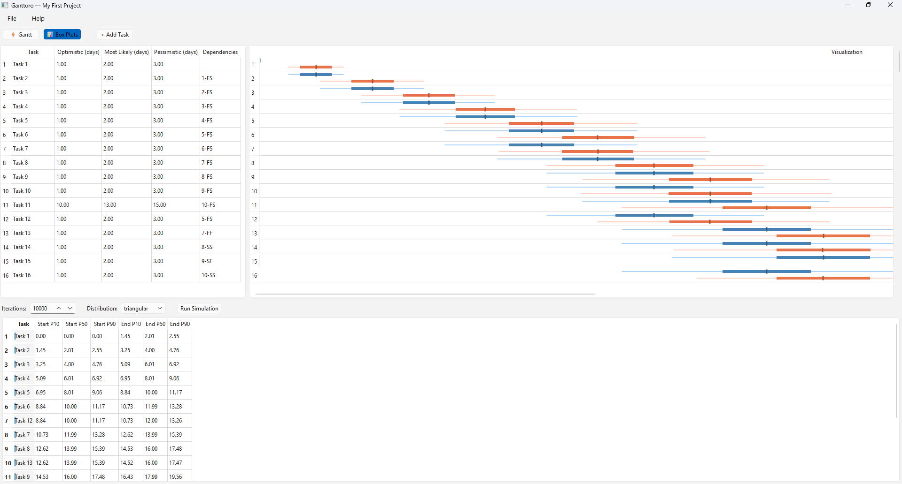

## Problem Statement
Traditional Gantt charts lie to you. They show a single timeline as if task durations are perfectly predictable. In reality:
- "This will take 3-7 days" is more honest than "This will take 5 days".
- Dependencies amplify uncertainty (when Task A is late, everything downstream shifts).
- You need to know your P50, P90, and worst-case completion dates.

## My Approach
Ganttoro is intended to model *reality*. Define task duration ranges, set up dependencies, and run thousands of simulations to see the true distribution of possible outcomes.

### Planned Features
- [x] **Monte Carlo Simulation** -- Run thousands of schedule simulations based on probabilistic task durations (triangular, PERT, or normal distributions)
- [x] **Box Plot Timelines** -- Visualize start and end date distributions for each task as elegant box plots, not misleading single bars
- [x] **Dependency Management** -- Full support for task dependencies (finish-to-start, start-to-start, etc.) with uncertainty propagation through the chain
- [x] **Fast NumPy-Powered Engine** -- 10,000+ simulations complete in seconds thanks to vectorized computation
- [x] **Confidence Intervals** -- See P10, P50, P90 completion dates to plan conservatively or optimistically
- [ ] **Critical Chain Analysis** -- Identify which tasks most frequently impact your project deadline across simulations

### Tech Stack
- **Python 3.10+** - Core language
- **PySide6** - Cross-platform desktop UI
- **NumPy** - Vectorized Monte Carlo simulation
- **SciPy** - Statistical distributions
- **NetworkX** - Dependency graph management
- **Matplotlib** - Box plot visualization
- **PyQtGraph** - Interactive Gantt chart rendering

### Prototype UI
