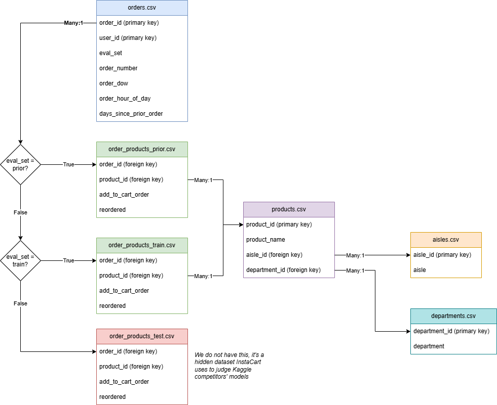
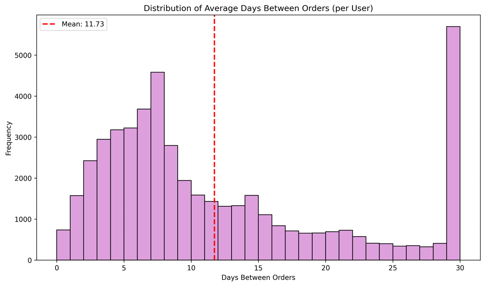
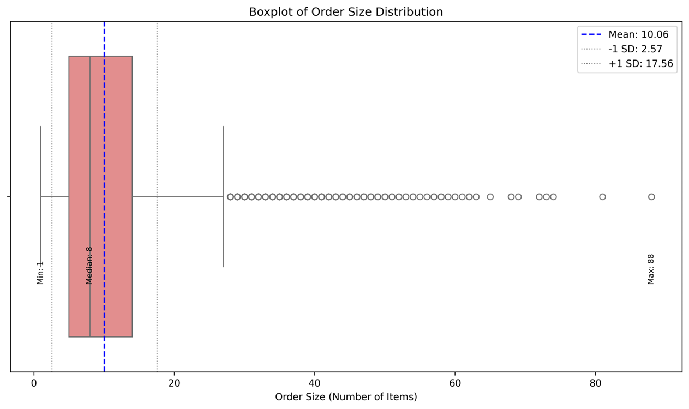

## Problem Statement
InstaCart has a massive historical database containing 33M+ rows of purchase line items, corresponding to orders from over 200K users. The question this project seeks to answer is how that data can be used to inform predictions of customer behavior -- namely what customers are likely to order next. This information could be used to develop better recommendation systems that enhance InstaCart's value proposition and competitive edge as an online groceries retailer.

## My Approach
I am leading a project group that intends to use the following methods to explore the InstaCart dataset and find exploitable patterns:
- [x] Exploratory Data Analysis
- [x] Summary Statistics
- [x] Data Visualization
- [x] Pattern Mining (Apriori and FPGrowth Algorithms)
- [ ] Clustering
- [ ] Dimensionality Reduction
- [ ] Principal Component Analysis (PCA)
- [ ] Supervised Learning

To facilitate this analysis, I developed a Python script that creates a SQLite3 database, defines the desired schema, and then loads the data from several large CSV files. I also developed subsequent scripts that perform missing value checks, one-hot encoding, data summarization, visualizations, and pattern mining.

Our 1st Mid-Term Report (January 22, 2026) can be found here: [Mid-Term Report 1](./Mid-Report_1.pdf)

## Gallery
### Data Structure

### Days Between Orders

### Basket Size Distribution

### Order Volume By Hour (Full Week)
