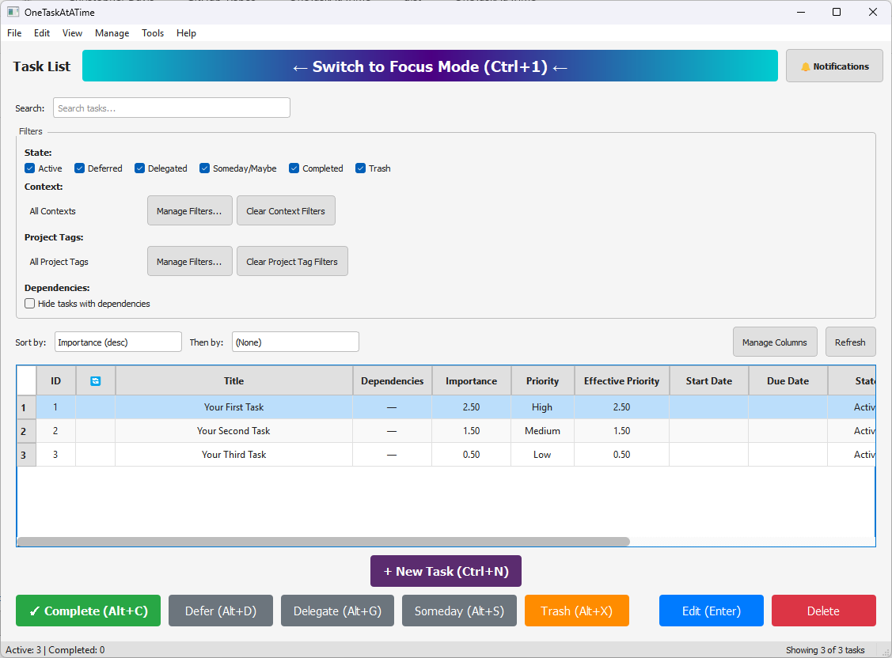

## Problem Statement
There are multiple problems that this application seeks to solve:
- Many to-do apps allow users to rank priority and urgency in an attempt to enforce a logical order of presentation, but in practice users often end up with a lot of high-priority / high-urgency tasks, defeating the purpose of ranking tasks in the first place. 
- Tasks that are not immediately actionable or low-priority/low-urgency tend to end up in a purgatory state, left to rot and fester. 
- Tasks can be difficult to complete due to various blockers and/or dependencies on other tasks. In failing to confront users when they delay a task, most to-do list apps fail to capture the user's reason for doing so.

## My Approach
- Within Focus Mode, the app presents "one task a time" -- the next actionable task of highest importance, a composite multiple of urgency (based on due date) and effective priority.
- The app resolves prioritization conflicts by presenting lists of tasks with equal importance for ranking comparisons. When users rank listed tasks, the tasks' effective priority ratings are updated, following an Elo ranking algorithm popularized by international chess players.
- When users choose to delay tasks, they are prompted to provide an explanatory reason, which is used for delay trend analysis. To prevent tasks from slipping through the cracks, the app periodically resurfaces tasks in holding states (i.e. Deferred, Delegated, Someday/Maybe) based on user preferences. When tasks are resurfaced, the app presents notifications that display within the app and via configurable Windows Toast popups.
- The app provides users with the options to declare blockers (which create upstream task dependencies) and break a large task down into smaller tasks. This encourages users to tackle complex projects in a logical, piece-by-piece order, adapting their plans with flexibility.

## Screenshots
### Focus Mode:

### Task List:
